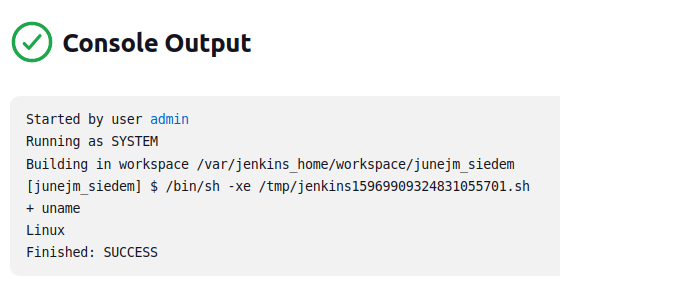

## Zajęcia 3/4
2022-12-10/2022-12-11
## Pipeline, Jenkins, izolacja etapów

### Przygotowanie
* Upewnij się, że na pewno działają kontenery budujące i testujące, stworzone na poprzednich zajęciach
* Zapoznaj się z instrukcją instalacji Jenkinsa: https://www.jenkins.io/doc/book/installing/docker/
  * Uruchom obraz Dockera który eksponuje środowisko zagnieżdżone
  
  * Przygotuj obraz blueocean na podstawie obrazu Jenkinsa (czym się różnią?)
  
  
  * Uruchom Blueocean
  
  * Zaloguj się i skonfiguruj Jenkins
  
  * Zadbaj o archiwizację i zabezpieczenie logów

### Uruchomienie 
* Konfiguracja wstępna i pierwsze uruchomienie
  * Utwórz projekt, który wyświetla uname
  
  * Utwórz projekt, który zwraca błąd, gdy... godzina jest nieparzysta
  
  
* Utwórz "prawdziwy" projekt, który:
  * klonuje nasze repozytorium
  
  * przechodzi na osobistą gałąź
  
  * buduje obrazy z dockerfiles i/lub komponuje via docker-compose
  
  
### Sprawozdanie (wstęp)
* Opracuj dokument z diagramami UML, opisującymi proces CI. Opisz:
  * Wymagania wstępne środowiska
  * Diagram aktywności, pokazujący kolejne etapy (collect, build, test, report)
  
  * Diagram wdrożeniowy, opisujący relacje między składnikami, zasobami i artefaktami
  
  
### Pipeline
* Definiuj pipeline korzystający z kontenerów celem realizacji kroków `build -> test`
* Może, ale nie musi, budować się na dedykowanym DIND, ale może się to dziać od razu na kontenerze CI. Należy udokumentować funkcjonalną różnicę między niniejszymi podejściami
* Docelowo, Jenkinsfile definiujący pipeline powinien być umieszczony w repozytorium. Optymalnie: w sforkowanym repozytorium wybranego oprogramowania

### Szczegóły
#### Wymagane składniki
*  Kontener Jenkins i DIND skonfigurowany według instrukcji dostawcy oprogramowania
*  Pliki Dockerfile wdrażające instancję Jenkinsa załączone w repozytorium przedmiotowym pod ścieżką i na gałęzi według opisu z poleceń README
*  Zdefiniowany wewnątrz Jenkinsa obiekt projektowy „pipeline”, realizujący następujące kroki:
  * Kontener Builder, który powinien bazować na obrazie zawierającym dependencje (Dependencies). Obrazem tym może być np. baza pobrana z Docker Hub (jak obraz node lub 
dotnet) lub obraz stworzony samodzielnie i zarejestrowany/widoczny w DIND (jak np. obraz oparty o Fedorę, doinstalowujący niezbędne zależności, nazwany Dependencies). Jeżeli, jak często w przypadku Node, nie ma różnicy między runtimowym obrazem a obrazem z dependencjami, proszę budować się w oparciu nie o latest, ale o **świadomie wybrany tag z konkretną wersją**
  * Obraz testujący zbudowany poprzednim kontenerem kod, wykorzystujący w tym celu testy obecne w repozytorium programu
  * Deploy
    *  Krok uruchamiający aplikację na kontenerze docelowym
    *  Jeżeli kontener buildowy i docelowy wydają się być te same - być może warto zacząć od kroku `Publish` poniżej
    *  Proszę opisać szczegółowo proces który zostanie opisany jako Deploy, ze względu na mnogość podejść
  * Publish
    * Przygotowanie wersjonowanego artefaktu, na przykład:
      * Instalator
      * NuGet/Maven/NPM/JAR
      * ZIP ze zbudowanym runtimem
    * Opcjonalnie, krok publish (w przypadku podania parametru) może dokonywać promocji artefaktu na zewnętrzne registry
  
  
  
#### Oczekiwana postać sprawozdania
* Sprawozdanie nie powinno być jedynie enumeracją wykonanych kroków.
* Sprawozdanie musi zawierać na wstępie opis celu wykonywanych czynności oraz streszczenie przeprowadzonego projektu.
* Każdy z kroków powinien zostać opisany (nie tylko zrzut i/lub polecenie)
* Proszę zwrócić uwagę na to, czy dany etap nie jest „self explanatory” tylko dla autora: czy zrozumie go osoba czytająca dokument pierwszy raz. Odtwarzalność przeprowadzonych operacji jest kluczowo istotna w przypadku dokumentowania procesu
* Każda podjęta decyzja musi zostać opisana, umotywowana. Na przykład jasne musi być:
  * Dlaczego wybrano taki, a nie inny obraz bazowy
  * Dlatego publikowany artefakt ma taką postać? Dlaczego ma taki format instalatora lub nie zawiera instalatora
* Napotykane problemy również należy dokumentować. Pozwala to mierzyć się z potencjalnymi trudnościami osobom, które będą implementować pipeline na podstawie sprawozdania. Z punktu widzenia zadania, nie ma sensu ani potrzeby udawać, że przebiegło ono bez problemów.
* Krótko mówiąc, sprawozdanie powinno być sformułowane w sposób, który umożliwi dotarcie do celu i identycznych rezultatów osobie, która nie brała udziału w przygotowaniu pipeline’u.

