1.  Wykaż możliwość komunikacji ze środowiskiem linuksowym (powłoka oraz przesyłanie plików)  
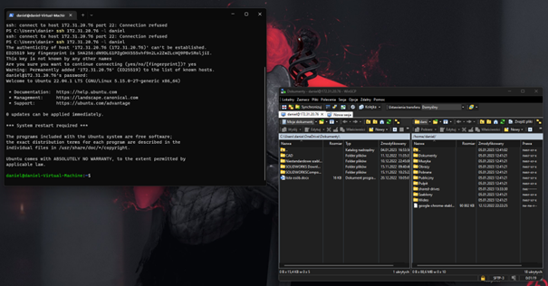  
2.  Zainstaluj klienta Git i obsługę kluczy SSH  
  
3.  Sklonuj repozytorium https://github.com/InzynieriaOprogramowaniaAGH/MDO2023 za pomocą HTTPS  
  
4.  Upewnij się w kwestii dostępu do repozytorium jako uczestnik i sklonuj je za pomocą utworzonego klucza  SSH
	- Utwórz dwa klucze SSH, inne niż RSA, w tym co najmniej jeden zabezpieczony hasłem  
	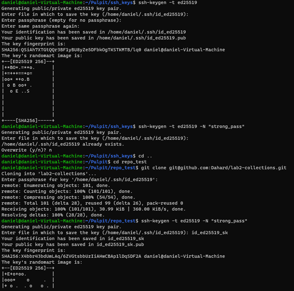  
    - Skonfiguruj klucz SSH jako metodę dostępu  
	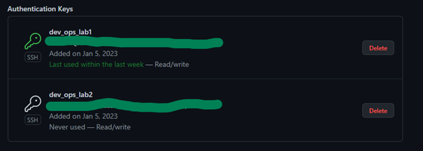  
      
	- Sklonuj repozytorium z wykorzystaniem protokołu SSH  
	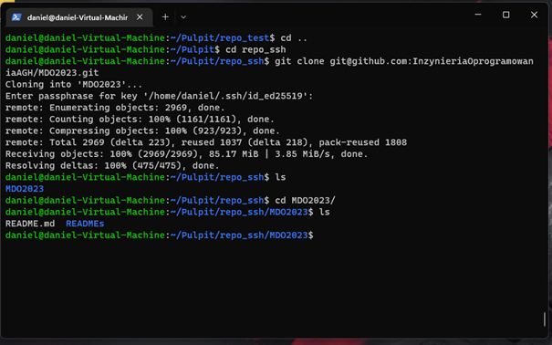  
5. Przełącz się na gałąź swojej grupy  
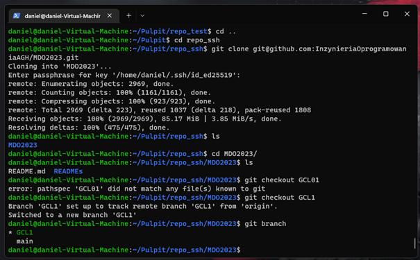  
6. Utwórz gałąź o nazwie "inicjały & nr indeksu" np. KD232144  
  
7. Rozpocznij pracę na nowej gałęzi  
  
	- W katalogu właściwym dla grupy utwórz nowy katalog, także o nazwie „inicjały & nr indeksu” np KD232144  
	- W nowym katalogu dodaj plik ze sprawozdaniem  
	- Dodaj zrzuty ekranu  
	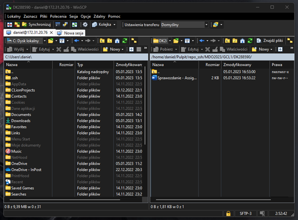  
	- Wyślij zmiany do zdalnego źródła  
	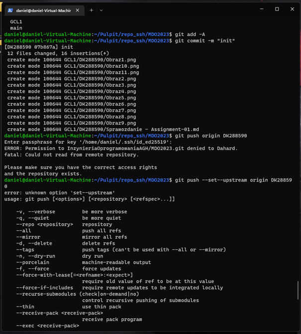  
	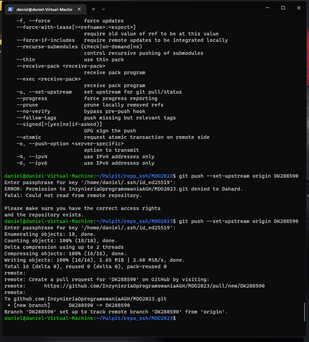  
	- Spróbuj wciągnąć swoją gałąź do gałęzi grupowej  
	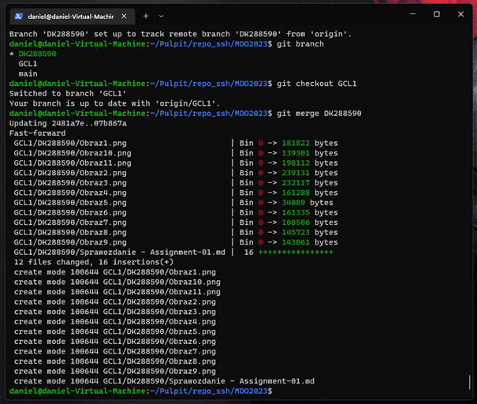  
	- Zaktualizuj sprawozdanie i zrzuty o ten krok i wyślij aktualizację do zdalnego źródła (na swojej gałęzi)  
	  
	- Oznacz tagiem ostatni commit i wypchnij go na zdalną gałąź  
	  
	- Ustal hook, który będzie sprawdzał, czy wiadomość z commitem zawiera nazwę przedmiotu  
	  
	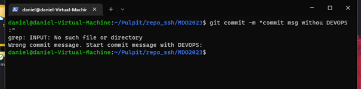  
	- W jaki sposób stworzyć hook, który będzie ustawiał prefiks wiadomości commitu tak, by miał nazwę przedmiotu?  
	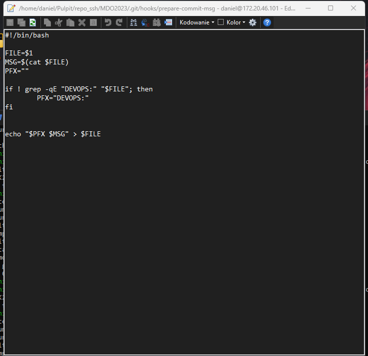  
	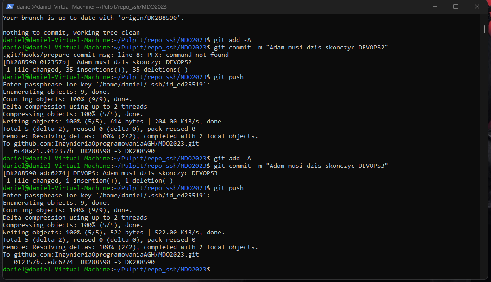  
	### Weryfikacja działania środowiska konteneryzacji  
1. Rozpocznij przygotowanie środowiska Dockerowego  
    - zapewnij dostęp do maszyny wirtualnej przez zdalny terminal (nie "przez okienko")  
    - jeżeli nie jest stosowane VM (np. WSL, Mac, natywny linux), wykaż ten fakt **dokładnie**  
    - zainstaluj środowisko dockerowe w stosowanym systemie operacyjnym  
2. Działanie środowiska  
    - wykaż, że środowisko dockerowe jest uruchomione i działa (z definicji)  
    - wykaż działanie z sposób praktyczny (z własności):  
      - pobierz obraz dystrybucji linuksowej i uruchom go  
      - wyświetl jego numer wersji  
	  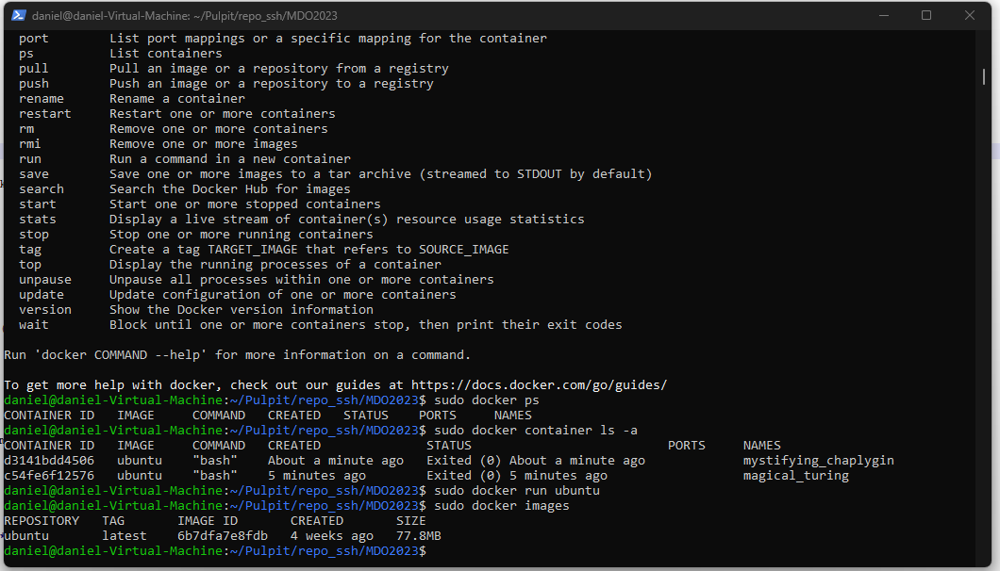  
	  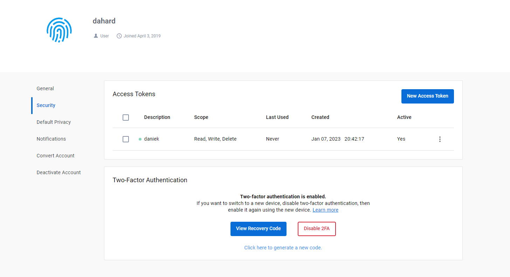  
