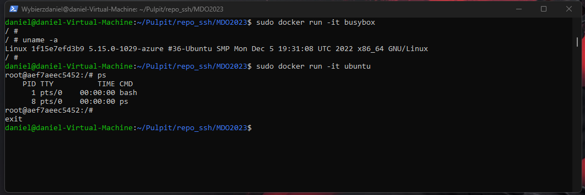
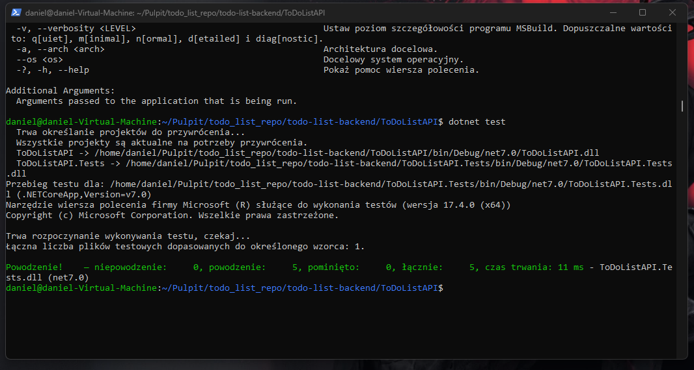

## Zestawienie środowiska  
1. Zainstaluj Docker w systemie linuksowym  
  
2. Zarejestruj się w Docker Hub i zapoznaj z sugerowanymi obrazami  
  
3. Pobierz hello-world, busybox, ubuntu lub fedorę, mysql  
  
4. Uruchom busybox  
   - Pokaż efekt uruchomienia kontenera  
  
   - Podłącz się do kontenera interaktywnie i wywołaj numer wersji  
  
5. Uruchom "system w kontenerze"  
   - Zaprezentuj PID1 w kontenerze i procesy dockera na hoście  
  
  
   - Zaktualizuj pakiety  
  
   - Wyjdź  
Komenda "exit"  
6. Pokaż uruchomione ( != "działające" ) kontenery, wyczyść je.  
  
  
7. Wyczyść obrazy  
  

## Budowanie programu  
1. Znajdź projekt umożliwiający łatwe wywołanie testów jednostkowych  
  
2. Przeprowadź budowę/konfigurację środowiska  
  
  
  
3. Uruchom testy  
  
4. Ponów ten proces w kontenerze  
   - Wybierz i uruchom platformę  
Wybrano ubuntu:latest  
   - Zaopatrz ją w odpowiednie oprogramowanie wstępne  
  
  
   - Sklonuj aplikację  
  
   - Skonfiguruj środowisko i uruchom build  
  
  
   - Uruchom testy  
  
5. Stwórz Dockerfile, który ma to osiągnąć  
   - Na bazie platformowego obrazu...  
FROM ubuntu
   - ...doinstaluj wymagania wstępne...  
RUN apt update && apt -y upgrade && apt install -y git dotnet-sdk-6.0  
   - ...sklonuj repozytorium...  
RUN git clone {repo URL}  
   - ...zbuduj kod  
RUN dotnet restore ./InventoryUniversity.sln  
RUN dotnet build ./InventoryUniversity.sln  
6. Zaprezentuj Dockerfile i jego zbudowanie  
  
  
  
  
7. Na bazie obrazu utworzonego poprzednim dockerfilem stwórz kolejny, który będzie uruchamiał testy  
  
 	* Kontener pierwszy ma przeprowadzać wszystkie kroki aż do builda  
  
	* Kontener drugi ma bazować na pierwszym i wykonywać testy  
  
## Runda bonusowa: kompozycja   
1. Zdefiniuj kompozycję, która stworzy dwie usługi  
   - Pierwszą na bazie dockerfile'a budującego  
   - Drugą na bazie pierwszej  
  
2. Wdróż :)  
     