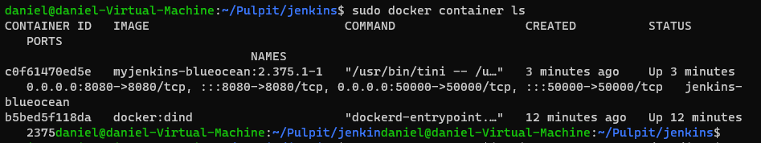

## Pipeline  
# Przygotowanie
Zgodnie z instrukcją, ze strony https://www.jenkins.io/doc/book/installing/docker/ , instalujemy jenkinsa. Przebieg instalacji poniżej.

Po stworzeniu dedykowanej sieci dla jenkinsa:
```
sudo docker network create jenkins
```
oraz uruchomieniu kontenera jenkinsa:
```
sudo docker run \
  --name jenkins-docker \
  --rm \
  --detach \
  --privileged \
  --network jenkins \
  --network-alias docker \
  --env DOCKER_TLS_CERTDIR=/certs \
  --volume jenkins-docker-certs:/certs/client \
  --volume jenkins-data:/var/jenkins_home \
  --publish 2376:2376 \
  docker:dind \
  --storage-driver overlay2
```
sprawdzamy czy nasz kontener jest aktywny za pomocą komendy `sudo docker container ls`
 

Następnie kastomizujemy oficjalny obraz za pomocą nowego Dockerfile'a:
```
FROM jenkins/jenkins:2.375.1
USER root
RUN apt-get update && apt-get install -y lsb-release
RUN curl -fsSLo /usr/share/keyrings/docker-archive-keyring.asc \
  https://download.docker.com/linux/debian/gpg
RUN echo "deb [arch=$(dpkg --print-architecture) \
  signed-by=/usr/share/keyrings/docker-archive-keyring.asc] \
  https://download.docker.com/linux/debian \
  $(lsb_release -cs) stable" > /etc/apt/sources.list.d/docker.list
RUN apt-get update && apt-get install -y docker-ce-cli
USER jenkins
RUN jenkins-plugin-cli --plugins "blueocean:1.26.0 docker-workflow:563.vd5d2e5c4007f"
```
budujemy obraz
```
docker build -t myjenkins-blueocean:2.375.1-1 .
```
oraz go uruchamiamy
```
docker run \
  --name jenkins-blueocean \
  --restart=on-failure \
  --detach \
  --network jenkins \
  --env DOCKER_HOST=tcp://docker:2376 \
  --env DOCKER_CERT_PATH=/certs/client \
  --env DOCKER_TLS_VERIFY=1 \
  --publish 8080:8080 \
  --publish 50000:50000 \
  --volume jenkins-data:/var/jenkins_home \
  --volume jenkins-docker-certs:/certs/client:ro \
  myjenkins-blueocean:2.375.1-1 
  ```
   Po wykonaniu tychże komend poprzez przeglądarkę mamy już dostęp do GUI Jenkinsa, którego następnie należy odblokować. Aby to zrobić należy przejść (w moim przypadku) na ip mojej VM na porcie :8080. Pojawi się tam informacja z prośbą o podanie hasła administratorskiego. Aby je uzyskać należy wykonać poniższą komendę:

```
sudo docker exec -it f033f46761e2 cat /var/jenkins_home/secrets/initialAdminPassword
```
Następnie należy przejść proces konfiguracji i jesteśmy gotowi do użycia naszego narzędzia.
    

# Uruchomienie
Tworzymy pierwszy projekt w Jenkins.
  
    
