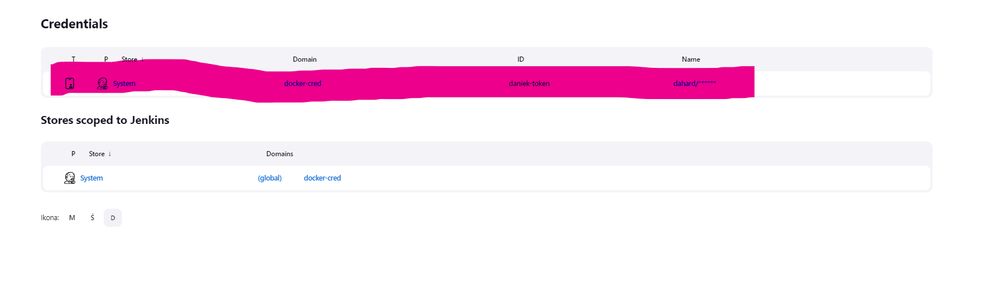

## Pipeline  
# Przygotowanie
Zgodnie z instrukcją, ze strony https://www.jenkins.io/doc/book/installing/docker/ , instalujemy jenkinsa. Przebieg instalacji poniżej.

Po stworzeniu dedykowanej sieci dla jenkinsa:
```
sudo docker network create jenkins
```
oraz uruchomieniu kontenera jenkinsa:
```
sudo docker run \
  --name jenkins-docker \
  --rm \
  --detach \
  --privileged \
  --network jenkins \
  --network-alias docker \
  --env DOCKER_TLS_CERTDIR=/certs \
  --volume jenkins-docker-certs:/certs/client \
  --volume jenkins-data:/var/jenkins_home \
  --publish 2376:2376 \
  docker:dind \
  --storage-driver overlay2
```
sprawdzamy czy nasz kontener jest aktywny za pomocą komendy `sudo docker container ls`
 

Następnie kastomizujemy oficjalny obraz za pomocą nowego Dockerfile'a:
```
FROM jenkins/jenkins:2.375.1
USER root
RUN apt-get update && apt-get install -y lsb-release
RUN curl -fsSLo /usr/share/keyrings/docker-archive-keyring.asc \
  https://download.docker.com/linux/debian/gpg
RUN echo "deb [arch=$(dpkg --print-architecture) \
  signed-by=/usr/share/keyrings/docker-archive-keyring.asc] \
  https://download.docker.com/linux/debian \
  $(lsb_release -cs) stable" > /etc/apt/sources.list.d/docker.list
RUN apt-get update && apt-get install -y docker-ce-cli
USER jenkins
RUN jenkins-plugin-cli --plugins "blueocean:1.26.0 docker-workflow:563.vd5d2e5c4007f"
```
budujemy obraz
```
docker build -t myjenkins-blueocean:2.375.1-1 .
```
oraz go uruchamiamy
```
docker run \
  --name jenkins-blueocean \
  --restart=on-failure \
  --detach \
  --network jenkins \
  --env DOCKER_HOST=tcp://docker:2376 \
  --env DOCKER_CERT_PATH=/certs/client \
  --env DOCKER_TLS_VERIFY=1 \
  --publish 8080:8080 \
  --publish 50000:50000 \
  --volume jenkins-data:/var/jenkins_home \
  --volume jenkins-docker-certs:/certs/client:ro \
  myjenkins-blueocean:2.375.1-1 
  ```
   Po wykonaniu tychże komend poprzez przeglądarkę mamy już dostęp do GUI Jenkinsa, którego następnie należy odblokować. Aby to zrobić należy przejść (w moim przypadku) na ip mojej VM na porcie :8080. Pojawi się tam informacja z prośbą o podanie hasła administratorskiego. Aby je uzyskać należy wykonać poniższą komendę:

```
sudo docker exec -it f033f46761e2 cat /var/jenkins_home/secrets/initialAdminPassword
```
Następnie należy przejść proces konfiguracji i jesteśmy gotowi do użycia naszego narzędzia.
    

# Uruchomienie
Tworzymy pierwszy projekt w Jenkins.
  
  Zjeżdżamy w dół do sekcji Build Steps dodajemy krok `Uruchom powłokę` i w miejscu na komendy wpisujemy `uname`

Następnie odpalamy projekt. Po zajrzeniu do logów efekt powinien wyglądać następująco:


Przechodzimy do stworzenia nowego projektu, którego odpalenie będzie walidowane w przypadku nieparzystej godziny (uruchomienia). Wsszystkie kroki są takie jak w przypadku poprzedniego projektu po za poleceniem w powłoce. Tym razem musimy wpisać skrypt: 
```
HOUR=$(date +%H)
if [ $((HOUR%2)) -eq 1 ]
then
    exit 1
fi
```


Skrypt powinien działać następująco:


Tym razem stworzymy już prawilny projekt wraz z zaciągnięciem kodu z repozytorium. Aby to zrobić należy, tak jak w poprzednich przypadkach, stworzyć nowy projekt a następnie wypełnić formularz tak jak na poniższym ss. Zwróć uwagę link do repozytorium oraz wyspecyfikowany branch.


Następnie dodajmy krok budowania i wybieramy uruchomienie powłoki. Skrypt przechodzi do odpowiedniego katalogu oraz buduje stworzone wczesniej obrazy na podstawie pliku docker-compose, prezentuje się on następująco:

```
cd GCL1/DK288590/Assignment_2
docker-compose up -d
```

W moim przypadku w tym miejscu niestety natrafiłem na problem. Okazało się, iż kontener w którym odpalam jenkinsa nie posiada zainstalowanego `docker-compose`. 


Chwilę zajęło mi dojście do rozwiązania, którym okazało się stworzenie nowego obrazu na bazie `myjenkins-bloeocean` już z zainstalowanym `docker-compose`. Aby to zrobić musiałem przygotować nowy plik Dockerfile:
```
FROM myjenkins-blueocean:2.375.1-1
USER root

RUN curl -L \  
  "https://github.com/docker/compose/releases/download/1.25.3/docker-compose-$(uname -s)-$(uname -m)" \  
  -o /usr/local/bin/docker-compose \  
  && chmod +x /usr/local/bin/docker-compose
USER jenkins
```


Oraz lekko zmodyfikować plik `docker-compose.yml`. Np dodać mu wersję `docker-compose` lub pozmieniać nazwy generowanych obrazów(Początkowe wersje plików w sprawku Assignment-02). 
```
version: "3.7"
services:
  todo_list_test:
    image: todo-list:1.0.0
    depends_on:
      - todo_list_build
    command: dotnet test

  todo_list_build:
    build:
      context: ./
      dockerfile: dockerfile-build
    image: todo-list:1.0.0
```
 Po wykonaniu tych działań projekt odpala się poprawnie, build i testy świecą się na zielono :)


### Pipeline

Diagram koncepcyjny pipeline:


Opis kroków na diagramie:
* Checkout - klonuje repozytorium z kodem: `https://github.com/Dahard/todo-list-backend.git`
* Build - uruchamia kontener budujący aplikację.
* Test - uruchamia kontener odpalający testy aplikacji.
* Publish - buduje aplikacje w wersjach na Windows, Linux oraz OSX jako artefakty.
* Deploy - przesyła obraz na repozytorium DockerHub.

Konfiguracja pipeline w Jenkins:

Jenkinsfile:
```
pipeline {
    agent any
    environment{
        DOCKERHUB_CREDENTIALS=credentials('daniek-token')
    }
    stages {
        stage('Checkout') {
            steps {
                git url:'https://github.com/Dahard/todo-list-backend.git', branch: 'main'
            }
        }
        stage('Build') {
            steps {
                sh 'docker build -f Dockerfile.build  -t image_build .'
            }
        }
        stage('Test') {
            steps {
                sh 'docker build -f Dockerfile.test -t image_test .'
            }
        }
        stage('Publish') {
            steps {
                sh """
                    docker build -f Dockerfile.publish -t image_publish .
                    docker run -d --name temp_cont --tty image_publish
                    docker cp temp_cont:/app/publish/ ./artifacts
                    docker rm -f temp_cont
                """
                zip zipFile: './artifacts/win-x64.zip', archive: false, dir: './artifacts/win-x64'
                tar file: './artifacts/linux-x64.tar', archive: false, dir: './artifacts/linux-x64'
                tar file: './artifacts/osx-x64.tar', archive: false, dir: './artifacts/osx-x64'
                archiveArtifacts artifacts: 'artifacts/win-x64.zip', fingerprint: true
                archiveArtifacts artifacts: 'artifacts/linux-x64.tar', fingerprint: true
                archiveArtifacts artifacts: 'artifacts/osx-x64.tar', fingerprint: true
                sh 'docker build -f Dockerfile.deploy -t dahard/todo-list .'
                sh 'rm -r ./artifacts'
            }
        }
        stage('Deploy') {
            steps {
                sh 'echo $DOCKERHUB_CREDENTIALS_PSW | docker login -u $DOCKERHUB_CREDENTIALS_USR --password-stdin'
                sh 'docker push dahard/todo-list'
            }
        }
    }
    post {
		always {
			sh 'docker logout'
		}
	}
}
```
Aby wygenerować token `DOCKERHUB_CREDENTIALS=credentials('daniek-token')`, naleeży dodać poświadczenia do Jenkins:


Przy generowaniu artefaktów:
```
zip zipFile: './artifacts/win-x64.zip', archive: false, dir: './artifacts/win-x64'
tar file: './artifacts/linux-x64.tar', archive: false, dir: './artifacts/linux-x64'
tar file: './artifacts/osx-x64.tar', archive: false, dir: './artifacts/osx-x64'
```
użyłem kroków z pluginu `Pipeline Utility Steps`. Aby Jenkins poprawnie wykonywał swoje komendy z etapu Publish, należy go zainstalować w panelu administratora.


Dockerfile.build
```
FROM mcr.microsoft.com/dotnet/sdk:7.0
COPY . .
RUN ls
RUN dotnet restore ToDoListAPI.sln
RUN dotnet build ToDoListAPI.sln
```
Dockerfile.test
```
FROM image_build
RUN dotnet test ToDoListAPI.sln
```
Dockerfile.publish
```
FROM image_test
RUN dotnet publish "./ToDoListAPI.sln" -c Release -o /app/publish/dockerize
RUN dotnet publish -r win-x64 --self-contained true "./ToDoListAPI.sln" -c Release -o /app/publish/win-x64
RUN dotnet publish -r linux-x64 --self-contained true "./ToDoListAPI.sln" -c Release -o /app/publish/linux-x64
RUN dotnet publish -r osx-x64 --self-contained true "./ToDoListAPI.sln" -c Release -o /app/publish/osx-x64
```
Dockerfile.deploy
```
FROM mcr.microsoft.com/dotnet/aspnet:7.0
EXPOSE 80
WORKDIR /app
COPY ./artifacts/dockerize/ .
ENTRYPOINT ["dotnet", "ToDoListAPI.dll"]
```
Uruchomiony pipeline w Jenkins:


Wypchany obraz dockerowy na repozytorium Docker Hub:
