1.  Wyykaż możliwość komunikacji ze środowiskiem linuksowym (powłoka oraz przesyłanie plików) 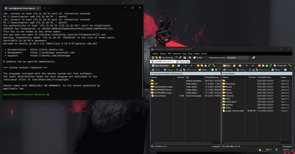
2.  Zainstaluj klienta Git i obsługę kluczy SSH 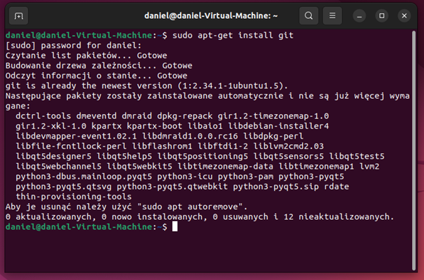
3.  Sklonuj repozytorium https://github.com/InzynieriaOprogramowaniaAGH/MDO2023 za pomocą HTTPS 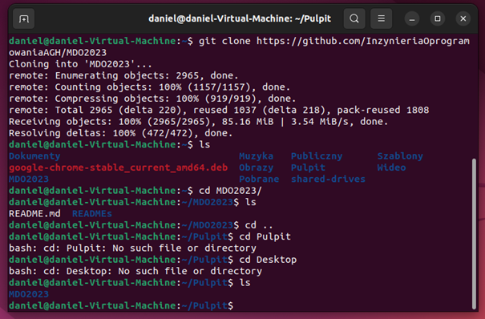
4.  Upewnij się w kwestii dostępu do repozytorium jako uczestnik i sklonuj je za pomocą utworzonego klucza SSH
5.  Utwórz dwa klucze SSH, inne niż RSA, w tym co najmniej jeden zabezpieczony hasłem 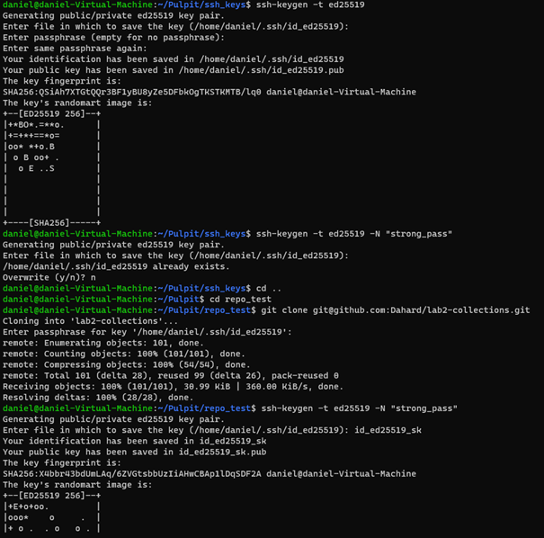

    Skonfiguruj klucz SSH jako metodę dostępu 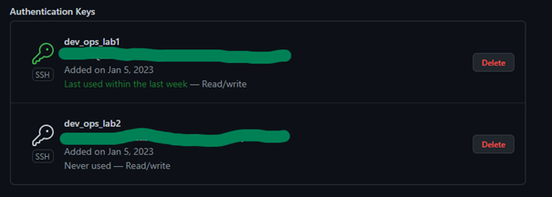

    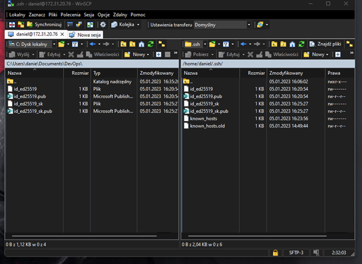

Sklonuj repozytorium z wykorzystaniem protokołu SSH 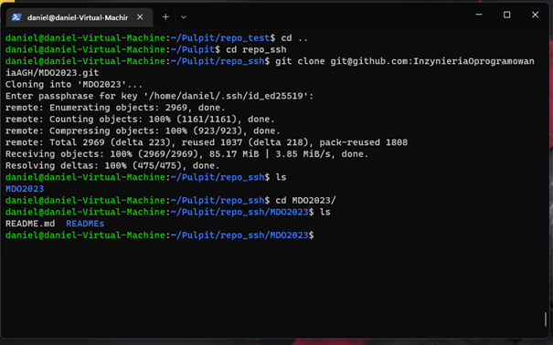

Przełącz się na gałąź swojej grupy 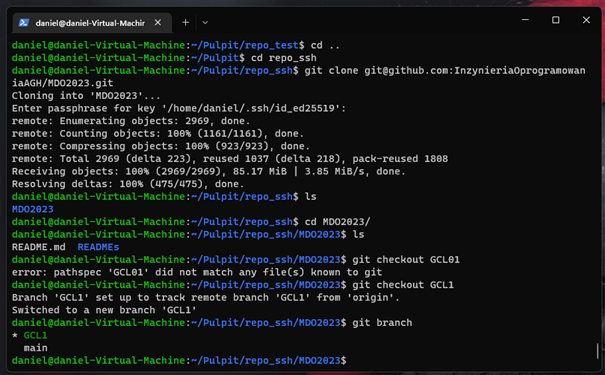

Utwórz gałąź o nazwie "inicjały & nr indeksu" np. KD232144 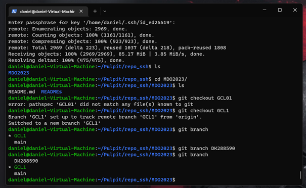

Rozpocznij pracę na nowej gałęzi 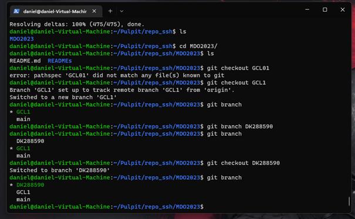

W katalogu właściwym dla grupy utwórz nowy katalog, także o nazwie „inicjały & nr indeksu” np KD232144

W nowym katalogu dodaj plik ze sprawozdaniem

Dodaj zrzuty ekranu 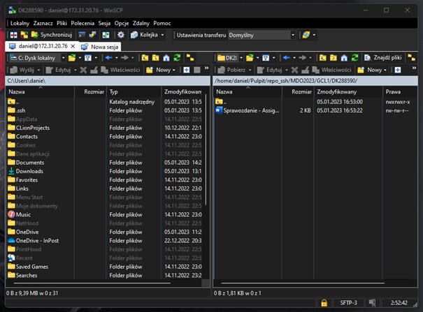

Wyślij zmiany do zdalnego źródła 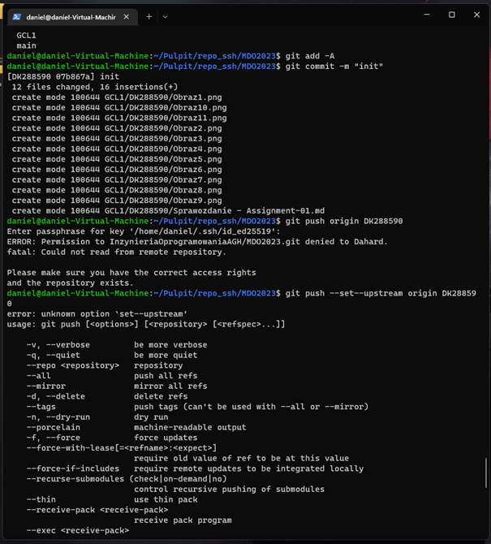 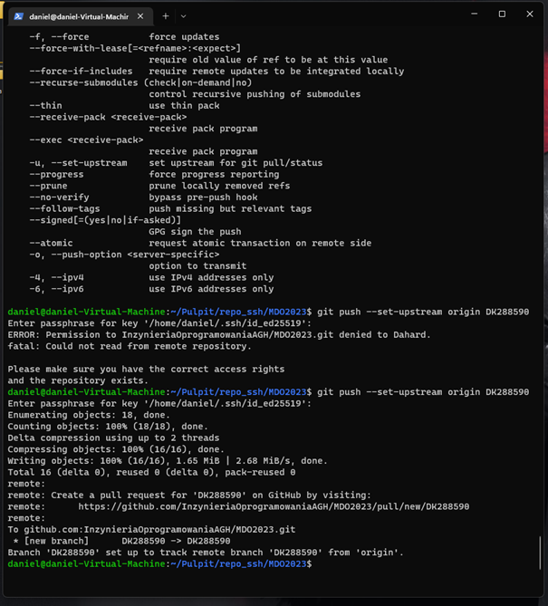

Spróbuj wciągnąć swoją gałąź do gałęzi grupowej 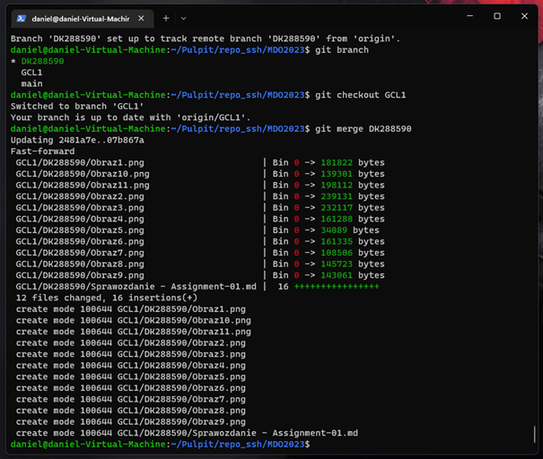

Zaktualizuj sprawozdanie i zrzuty o ten krok i wyślij aktualizację do zdalnego źródła (na swojej gałęzi) 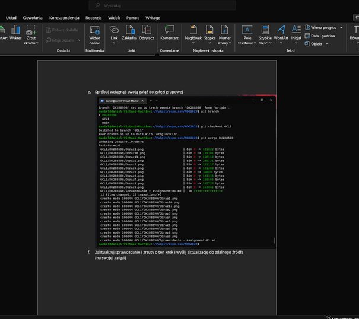

Oznacz tagiem ostatni commit i wypchnij go na zdalną gałąź 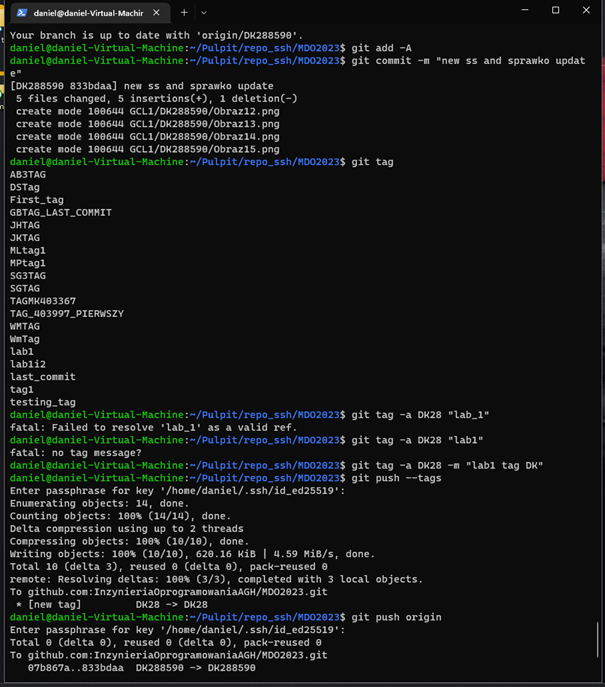

Ustal hook, który będzie sprawdzał, czy wiadomość z commitem zawiera nazwę przedmiotu 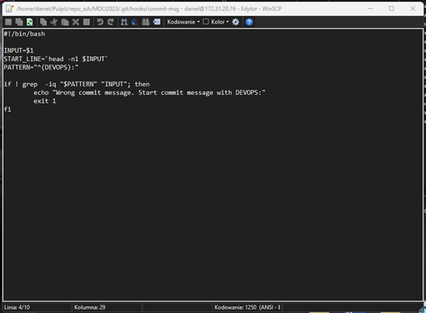 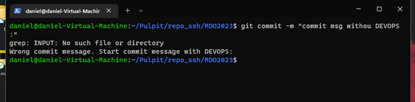

W jaki sposób stworzyć hook, który będzie ustawiał prefiks wiadomości commitu tak, by miał nazwę przedmiotu?
