# Zajęcia 01
### 2022-11-26
---
# Wprowadzenie, Git, Gałęzie, SSH
---
## Zadania do wykonania
### Weryfikacja sprawności środowiska UNIX
1.	Wykaż możliwość komunikacji ze środowiskiem linuksowym (powłoka oraz przesyłanie plików) 
    - Połączenie przez SSH i SFTP za pomocą programu Termius. 
    
    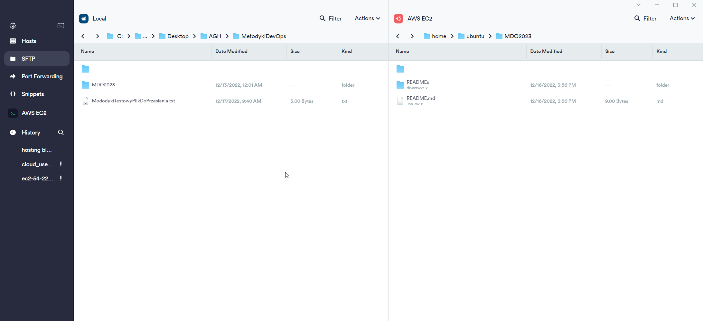
    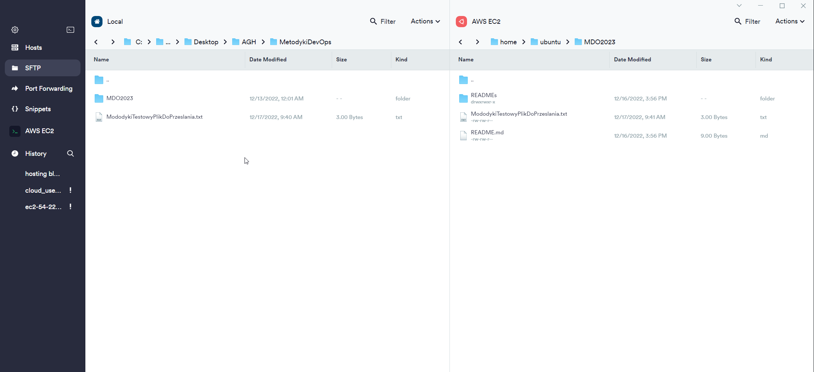
    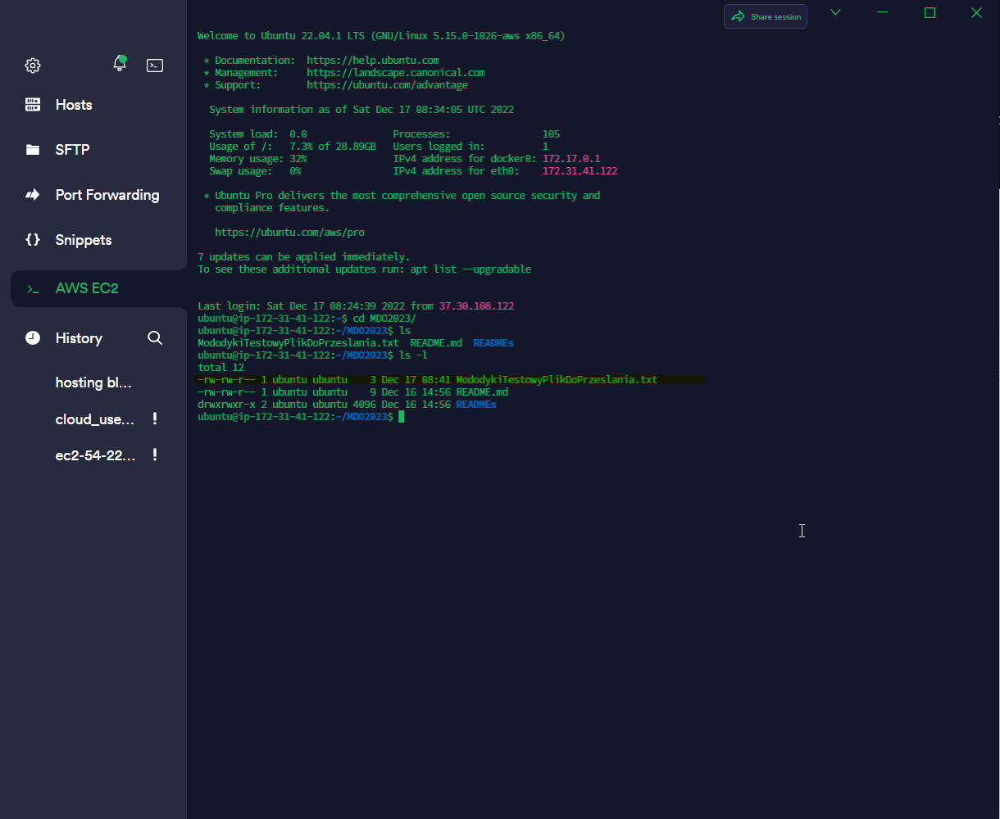

2.	Zainstaluj klienta Git i obsługę kluczy SSH
        - Zainstalowany git, generator kluczy ssh - weryfikacja poleceniami:
        
        git 
        ssh-keygen
    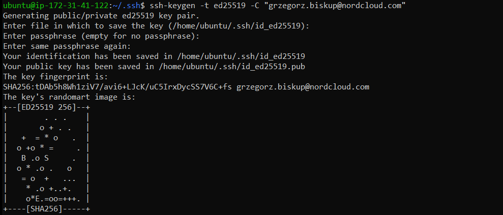
    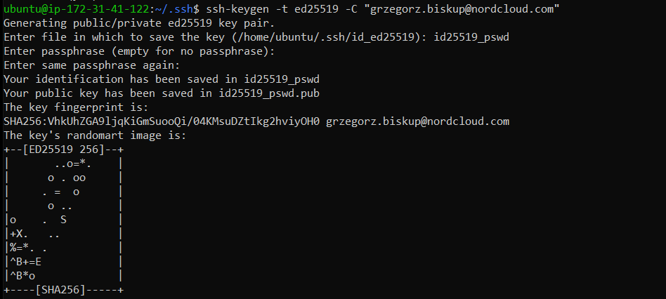


3.	Sklonuj repozytorium https://github.com/InzynieriaOprogramowaniaAGH/MDO2023 za pomocą HTTPS
        - Polecenie git clone: 
            
        git clone https://github.com/InzynieriaOprogramowaniaAGH/MDO2023
    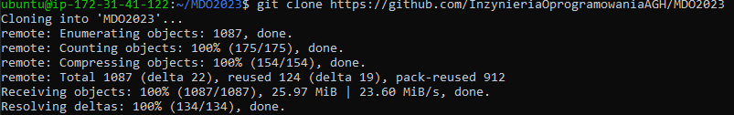


4.	Upewnij się w kwestii dostępu do repozytorium jako uczestnik i sklonuj je za pomocą utworzonego klucza SSH
    
    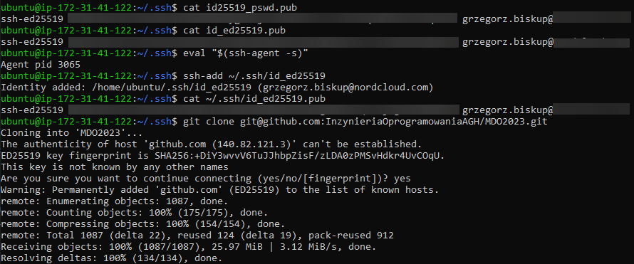

    - Utwórz dwa klucze SSH, inne niż RSA, w tym co najmniej jeden zabezpieczony hasłem - 2 klucze ed25519 polecenie: 
    
            ssh-keygen -t ed25519 -C "user e-mail"

    - Skonfiguruj klucz SSH jako metodę dostępu

            eval "$(ssh-agent -s)"
            ssh-add ~/.ssh/id_ed25519

    - Sklonuj repozytorium z wykorzystaniem protokołu SSH
    
            git clone git@github.com:InzynieriaOprogramowaniaAGH/MDO2023.git
    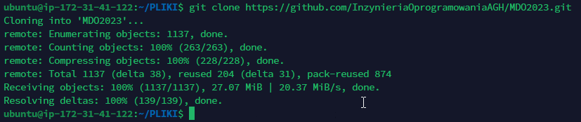


5.	Przełącz się na gałąź swojej grupy
    Gałąź mojej grupy polecenia: 

        git branch --all
        git checkout GCL1
        git fetch 

6.	Utwórz gałąź o nazwie "inicjały & nr indeksu" np. ```KD232144```
    Utworzenie mojej gałęzi
    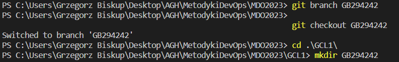
        
        git branch GB294242

7.	Utworzenie mojego katalogu

		git checkout GB294242
		cd GCL1
		mkdir GB294242

	Dodanie pliku ze sprawozdaniem 

        nano Sprawozdanie1.md

	Zrzuty ekranu przesłane za pomocą SFTP w programie Termius:
    	Dodanie zrzutów do katalogu 

        ./screenshots
		
    Wysłanie zmian do zdalnego źródła:

        git add ./ ; git commit -m "First step commit to remote repository - screenshots and statement" ;
		git push --set-upstream origin GB294242

    Wciągniecie mojej gałęzi do gałęzi grupowej: 

        git checkout GCL1
        git merge GB294242 
	
    Oznaczenie tagiem ostatni commit: 

        git tag GBTAG HEAD
        git log
        git push --tags
                
    Utworzenia hooka: hook tworzę w katalogu: 
    
        /home/ubuntu/MDO2023/.git/hooks 
    o nazwie commit-msg, zmieniam uprawnienia 
            
        chmod 700 commit-msg. 
    
    Zawartość pliku:

        #!/bin/bash
        pattern='^devops'
        
        if ! grep -iq "$pattern" "$1"; then
		    echo "Wrong commit message - first word should contain devops"
		    exit 1;
		fi
        echo "Correct commit message"
    
    Wybieram środowisko ``bash``. Definiuję ``pattern`` jako szukane słowo ``devops`` (1wsze słowo pliku). W zanegowanym warunku sprawdzam za pomocą ``grep -i`` ignorując wielkośc liter, z opcją quiet ``-q`` i szukam zmiennej pattern w ``$1`` (w commit message, przekazywana jako argument, ścieżka do pliku). Jeśli nie zawiera frazy commit jest anulowany i zwracam komentarz, jeśli jest ok to akcpetuję i zwracam poprawny komentarz.  
    
    Dodawanie prefix devops do commit message - tworzę plik 
            
        touch prepare-commit-msg,
    nadaje mu odpowiednie uprawnienia 
            
        chmod 700 prepare-commit-msg
    W samym skrypcie tak jak poprzednio sprawdzam czy pattern jest na 1 miejscu w commit message. Jeśli nie ma to dodaję go do commit message za pomocą polecenia sed. 

		#!/bin/bash
		pattern='^devops'

		if ! grep -iq "$pattern" "$1"; then
	        echo "Dodaje prefix dev ops"
	        sed -i '1i devops' $1
		fi
 
### Weryfikacja działania środowiska konteneryzacji
1. Rozpocznij przygotowanie środowiska Dockerowego
    * zapewnij dostęp do maszyny wirtualnej przez zdalny terminal (nie "przez okienko")
        
        Dostęp do maszyny wykazany w pierwszym punkcie - maszyna wirtualna (AWS EC2) 
        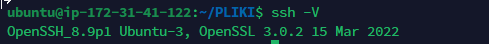
    * jeżeli nie jest stosowane VM (np. WSL, Mac, natywny linux), wykaż ten fakt **dokładnie**
        
        Stosowana jest maszyna virtualna typu EC2 dostarczana przez AWS
    * zainstaluj środowisko dockerowe w stosowanym systemie operacyjnym
        Docker zainstalowany: 

        docker --version
        Docker version 20.10.12, build 20.10.12-0ubuntu4
        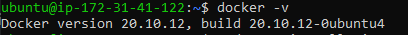
4. Działanie środowiska
    * wykaż, że środowisko dockerowe jest uruchomione i działa (z definicji)

            sudo systemctl status docker
            ubuntu@ip-172-31-41-122:~$ sudo systemctl status docker
            ● docker.service - Docker Application Container Engine
                 Loaded: loaded (/lib/systemd/system/docker.service; enabled; vendor preset: enabled)
                 Active: active (running) since Fri 2022-12-16 13:43:25 UTC; 22h ago
            TriggeredBy: ● docker.socket
                   Docs: https://docs.docker.com
               Main PID: 2577 (dockerd)
                  Tasks: 9
                 Memory: 227.4M
                    CPU: 16.389s
                 CGroup: /system.slice/docker.service
                  └─2577 /usr/bin/dockerd -H fd:// --containerd=/run/containerd/containerd.sock
    * wykaż działanie z sposób praktyczny (z własności):

        docker --version
        Docker version 20.10.12, build 20.10.12-0ubuntu4
        
    * pobierz obraz dystrybucji linuksowej i uruchom go         
            
        sudo docker pull ubuntu 
        sudo docker run -i --tty ubuntu
    * wyświetl jego numer wersji
        
        uname -a
        Linux 73d59878158c 5.15.0-1026-aws #30-Ubuntu SMP Wed Nov 23 14:15:21 UTC 2022 x86_64 GNU/Linux 
5. Załóż konto na Docker Hub lub zaloguj się do już posiadanego. Zadbaj o 2FA.
    
    Posiadam konto na DockerHub i zabezpieczyłem go 2FA.
    
    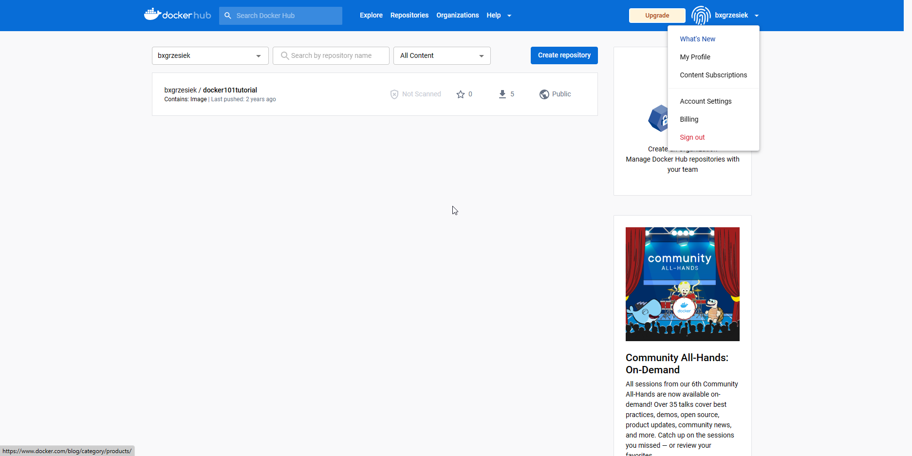