# Sprawozdanie 03
### 2023-01-02

1.Instalacja Jenkinsa zgodnie z instrukcją z https://www.jenkins/doc/book/installing/docker/.Stworzona zostala siec jenkins oraz dwa kontenery.
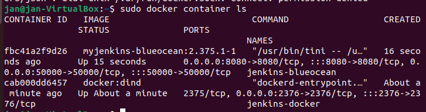
2.Działający Jenkins 
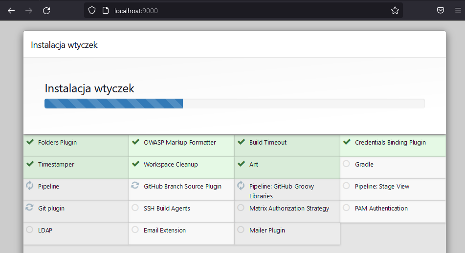
3.Funkcja uname
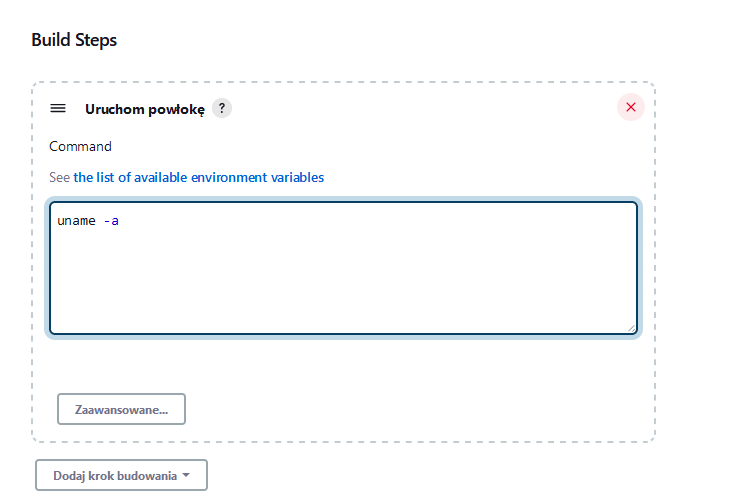
4.Skrypt zwracający blad jezeli godzina jest nieparzysta.
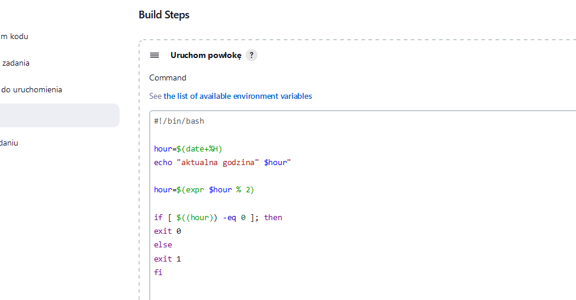
5.Dzialanie skryptu, godzina 14, sukces
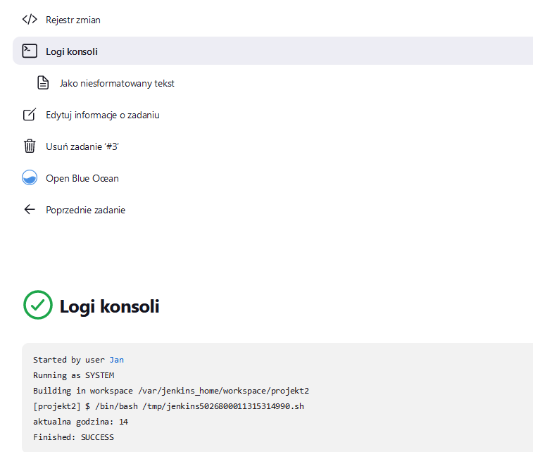
6.Stworzenie "prawdziwego" projektu.
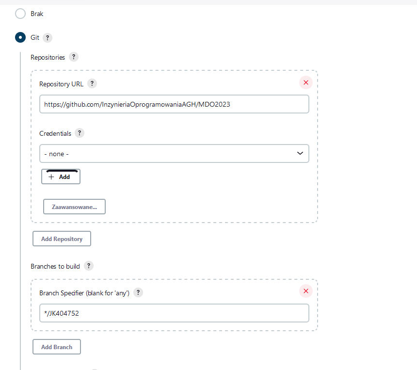
7.Uruchomienie projektu.
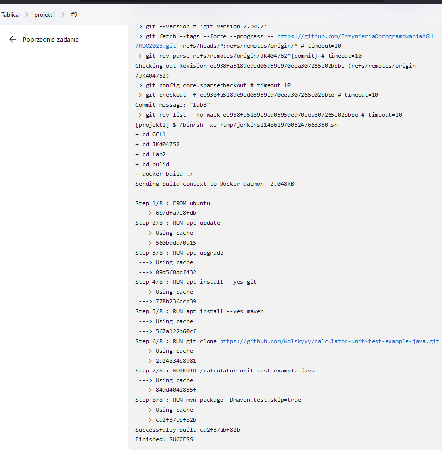
8.Pipeline, konfiguracja
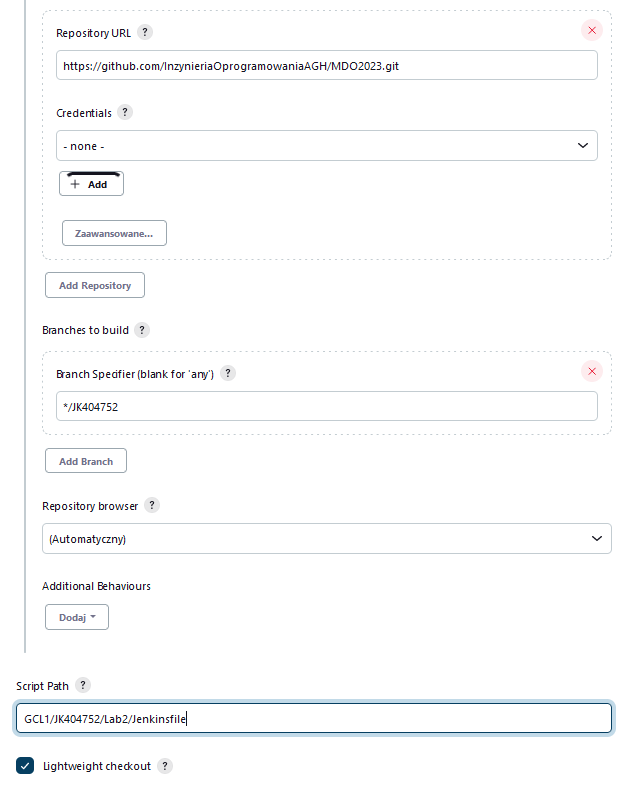
9.Pipeline, działanie(niestety nie udalo mi sie zrobic publikacji)
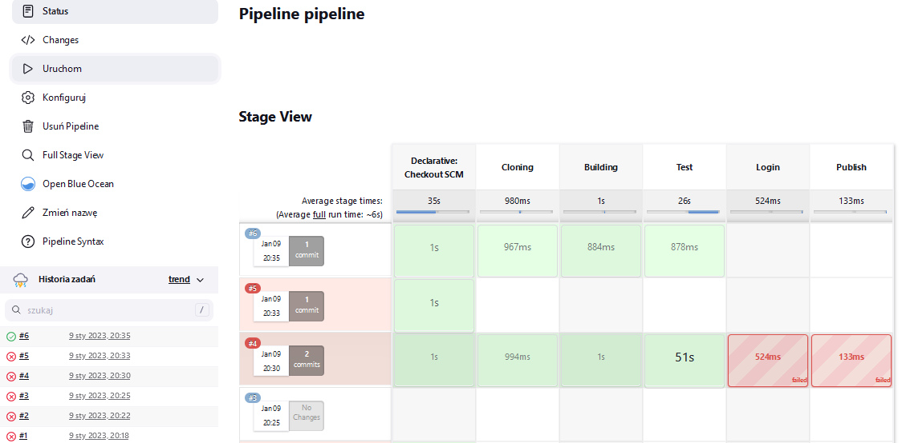
10.Plik Jenkinsfile
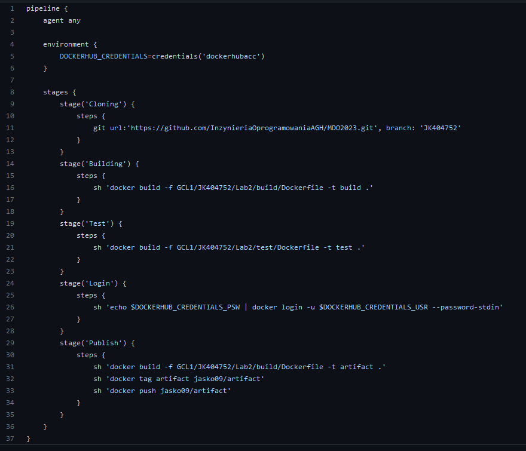
11.Diagramy
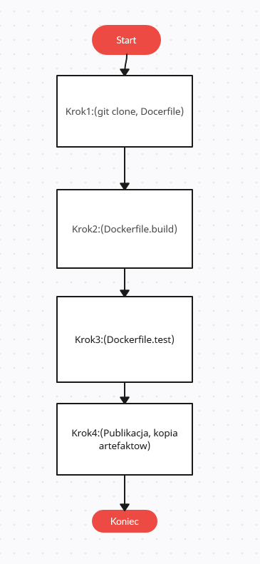
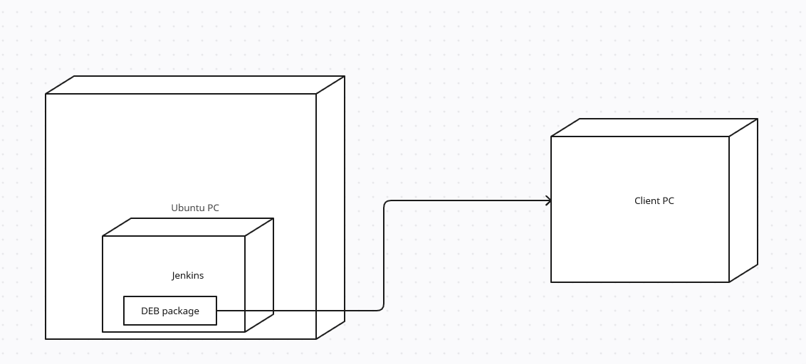

