# Sprawozdanie 2
Michał Kutaj
403367

## Zestawienie środowiska

Zaczynamy od zainstalowania Dockera. [Instrukcja](https://docs.docker.com/engine/install/ubuntu/) zaleca aby najpierw usunąć stare wersje programu. W tym celu została uruchomiona pierwsza komenda z listingu.
Kolejne komendy słuzą instalacji zalecanych poleceń i przygotowaniu do właściwej instalacji Dockera.

```bash
sudo apt-get remove docker docker-engine docker.io containerd runc

sudo apt-get update

sudo apt-get install \
    ca-certificates \
    curl \
    gnupg \
    lsb-release

sudo mkdir -p /etc/apt/keyrings

curl -fsSL https://download.docker.com/linux/ubuntu/gpg | sudo gpg --dearmor -o /etc/apt/keyrings/docker.gpg

echo \
  "deb [arch=$(dpkg --print-architecture) signed-by=/etc/apt/keyrings/docker.gpg] https://download.docker.com/linux/ubuntu \
  $(lsb_release -cs) stable" | sudo tee /etc/apt/sources.list.d/docker.list > /dev/null

sudo apt-get update
```

Następnie instalujemy Dockera
```bash
sudo apt-get install docker-ce docker-ce-cli containerd.io docker-compose-plugin
```
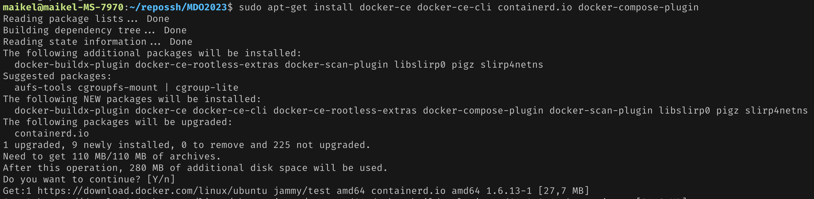
Aby upewnić się, ze Docker działa wykorzystana została komenda
```
sudo service docker status
```
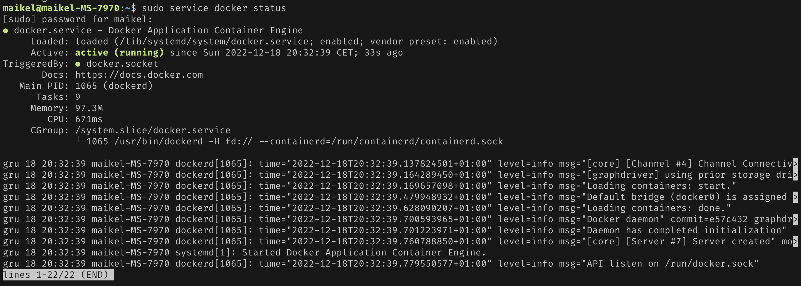

Zostało utworzone konto w serwisie Docker Hub wraz z 2FA

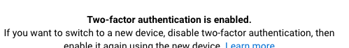

Zostały pobrane z instrukcji. Zostało wykorzystane polcenie `pull`, mozna równiez wywołać polecenie `run` co spowoduje, ze obraz zostanie pobrany (jezeli nie istenieje) i uruchomiony
```
sudo docker pull busybox
sudo docker pull ubuntu
sudo docker pull mysql
sudo docker run hello-world
```

Pobrane obrazy mozna wylistować poleceniem
```
sudo docker images -a
```
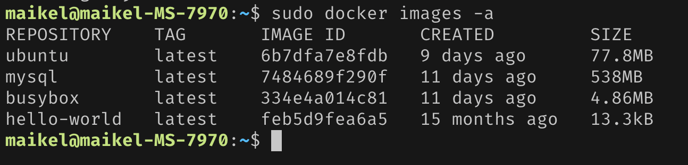

Został uruchomiony obraz `busybox` który jest obrazem zawierającym zbiór przydatnych poleceń, flaga `-it` otwiera połączenie do sdin'a w kontenerze
```
sudo docker run -it --rm busybox
```


Został uruchomiony kontener z systemem ubuntu, zostały uruchomione dwa polecenia, `ps` do lsitowania procesów oraz polecenie `apt-get update` do aktualizacji pakietów, nastepnie poleceniem `exit` zamknięto połączenie z terminalem kontenera.
```
sudo docker run -it ubuntu
ps
apt-get update
exit
```
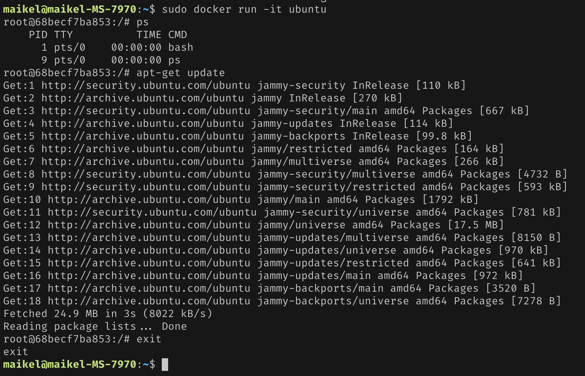

Do wylistowania uruchomionych kontenerów mozna uzyć jedno z poleceń:
```
sudo docker ps -a
sudo docker container ls
```
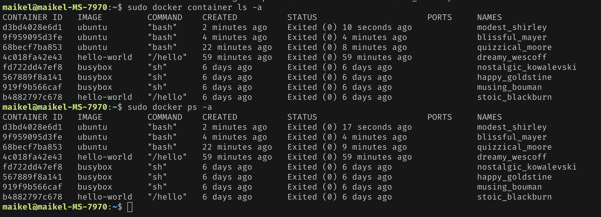

Czyszczenie kontenerów
```
sudo docker container prune
```
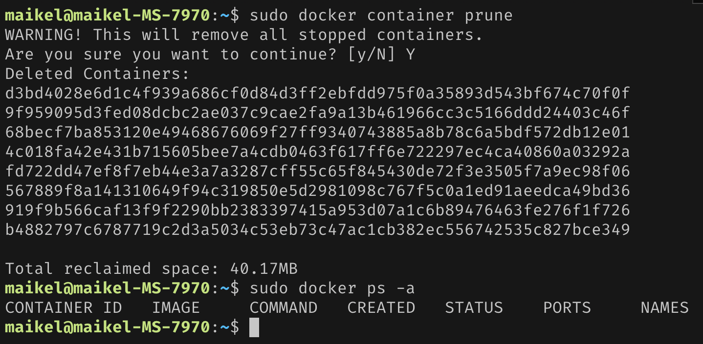

Czyszczenie wszystkich obrazów
```
sudo docker image prune -a
```
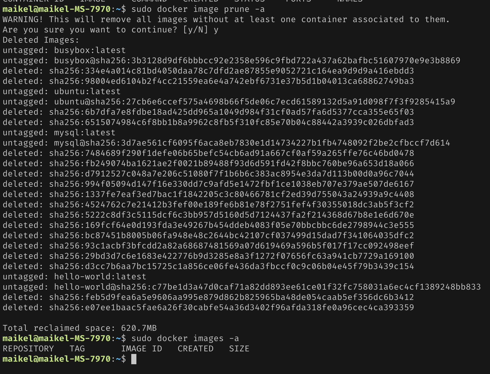

## Budowanie programu

Wykorzystany [program](https://github.com/adityaekawade/Vue.js-unit-test-with-jest) to aplikacja JS oparta o bibliotekę [Vue](https://vuejs.org/).

Proces setupu środowiska został rozpoczęty od pobrania środowiska [node.js](https://nodejs.org/en/). Dla wygody nie została pobrana konkretna wersja środowiska a manager, tzw. [NVM (Node Version Manager)](https://github.com/nvm-sh/nvm), który w razie potrzeby pozwla szybko instalować i przełączać się pomiędzy kolejnymi wersjami środowiska. NVM został wykorzystany ze względu na mozliwość pojawienia się błedów podczas budowania/testowania wybranej aplikacji związanej z niekompatybilnością z konkretną wersją środowiska.

Zgodnie z [instrukcją](https://github.com/nvm-sh/nvm#usage) zaczynamy od pobrania skryptu managera oraz wymaganego setupu.
```bash
curl -o- https://raw.githubusercontent.com/nvm-sh/nvm/v0.39.3/install.sh | bash

export NVM_DIR="$([ -z "${XDG_CONFIG_HOME-}" ] && printf %s "${HOME}/.nvm" || printf %s "${XDG_CONFIG_HOME}/nvm")"
[ -s "$NVM_DIR/nvm.sh" ] && \. "$NVM_DIR/nvm.sh"
```

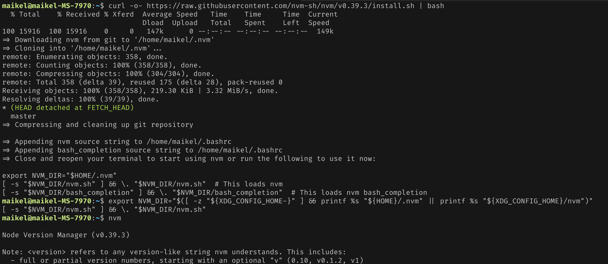

Jak widać powyzej, do terminala zostało dodane polecenie `nvm` dzięki, któremu będzimy mogli zarządzać wersjami node'a.

Spróbujemy nasz projekt zbudować z uzyciem ostatniej wersji LTS.

Sprawdzamy dostępne wersje przy pomocy komendy
```bash
nvm ls-remote
```
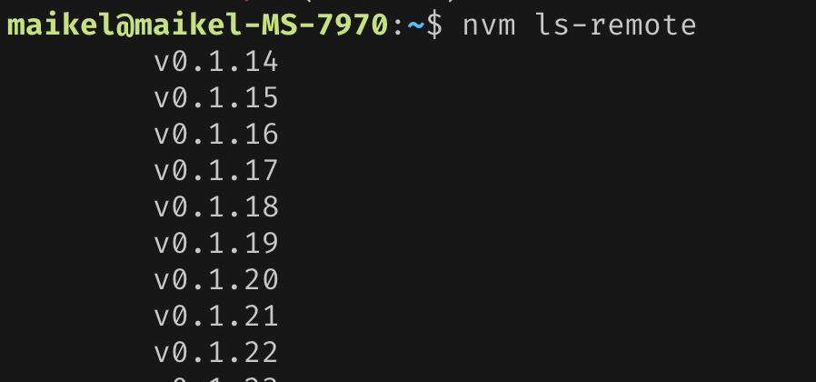
...
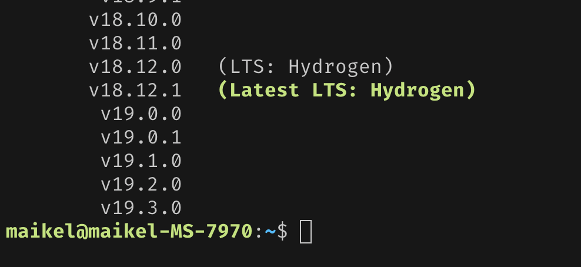
wybieramy, a następnie instalujemy najnowszą wersję z oznaczniem LTS. Będzie to wersja `18.12.1 Hydrogen`
```
nvm install 18
```
Manager pobrał za nas wskazana wersję. Mozna zweryfikować wersję przy uzyciu ponizszych poleceń:
```
node -v
npm -v
```
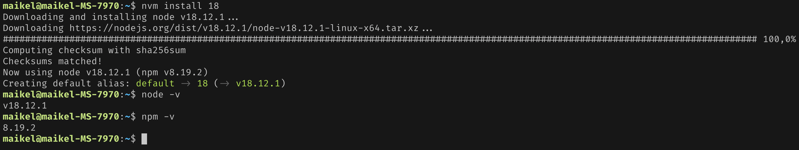

Następnie klonujemy wybrane wcześniej repozytorium do wybranego katalogu
```
git clone https://github.com/adityaekawade/Vue.js-unit-test-with-jest.git
```
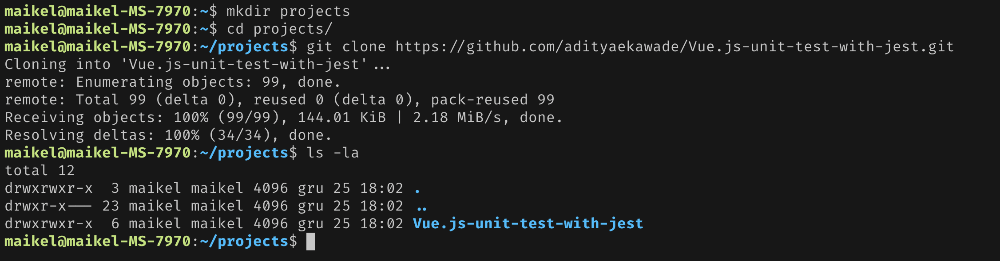

Przechodzimy do katalogu i uruchamiamy polecenie
```
npm install
```
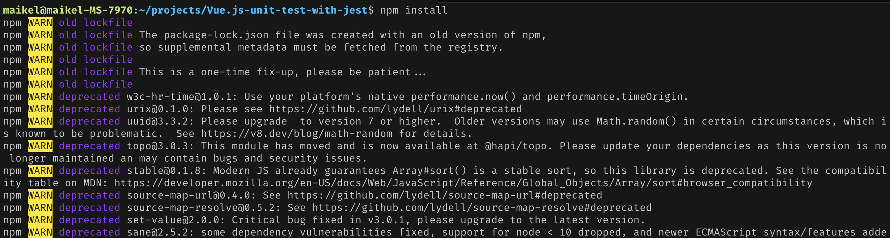

Po godzinie czytania "deprejektuff" na stdout'cie podczas instalacji, pojawia się błąd związany z paczka `node-sass`.

Rozwiązań jest kilka. Aby jednak nie ingerować w kod aplikacji w celu podbicia/downgrade'u wersji paczek spróbujemy uzyć, nieco starszej wersji środowiska node. Usuwamy katalog `node_modules` oraz wywołujemy następujące polecenia
```
rm -rm ./node_nodules
nvm install 14
nvm use 14
```
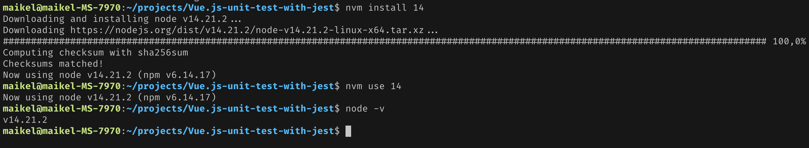

Ponawiamy instalację. Niestety znów pojawia się błąd.
Spróbujemy wykorzystać wersję 12 (analogiczenie jak dla wersji 14).

Tym razem się udało.

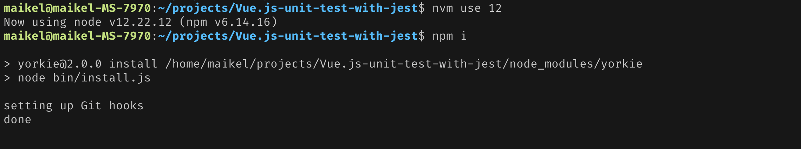
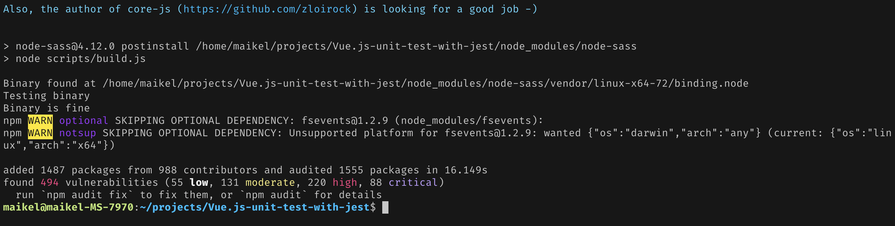

Wywołujemy polecenie tworzące build
```
npm run build
```
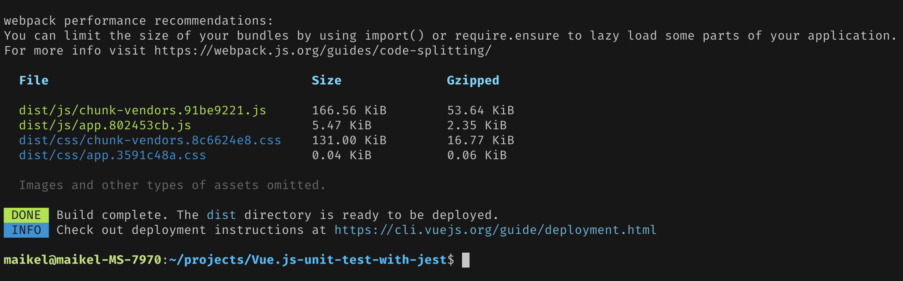
W projekcie został utworzony katalog `dist` gdzie został umieszczony build aplikacji. Build zawiera się w kilku plikach wynikowych, pliku zawierający zminifikowany JS, CSS oraz główny plik uruchamiający aplikację `index.html` oraz potrzebne assety, w tym przypadku jest to ikonka.

Następnie odpalamy testy aplikacji.
```
npm run test:unit
```
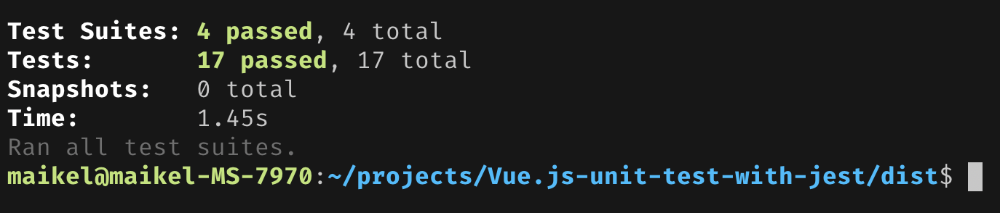

Kolejnym krokiem będzie wykonanie powyzszych kroków w kontenerze. Pobieramy obraz ubuntu, "wchodzimy do środka" i wykonujemy takie same kroki jak dla setupu środowiska jak w systemie natywnym.
```bash
# uruchamiamy kontener i przechodzimy do terminala wewnątrz
sudo docker run -it ubuntu

# pobieramy niezbedne narzędzia
apt update
apt install curl
apt install git

# pobieramy NVM
curl -o- https://raw.githubusercontent.com/nvm-sh/nvm/v0.39.3/install.sh | bash

export NVM_DIR="$([ -z "${XDG_CONFIG_HOME-}" ] && printf %s "${HOME}/.nvm" || printf %s "${XDG_CONFIG_HOME}/nvm")"
[ -s "$NVM_DIR/nvm.sh" ] && \. "$NVM_DIR/nvm.sh" # This loads nvm

# instalujemy node w wersji 12
nvm install 12
nvm use 12

#klonujemy projekt
git clone https://github.com/adityaekawade/Vue.js-unit-test-with-jest.git

# przechodzimy do katalogu z projektem i instalujemy zaleznosci
cd Vue.js-unit-test-with-jest
npm i

# wywolujemy build projektu
npm run build

# odpalamy testy
npm run test:unit
```

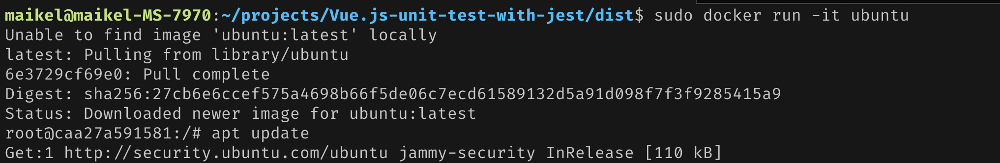
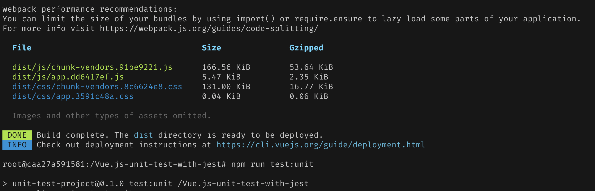
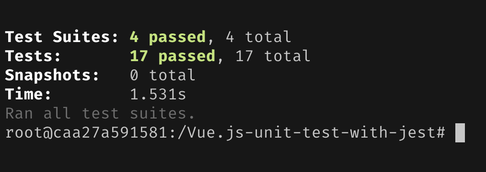

Teraz tworzymy Dockerfile i na jego podstawie zbudujemy obraz

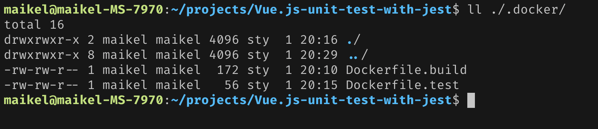

Dockerfile prezentuje się następująco
```Dockerfile
FROM ubuntu

# (ze stackoverflow się nie dyskutuje :D)
SHELL ["/bin/bash", "--login", "-i", "-c"]

RUN apt update
RUN apt install --yes curl
RUN apt install --yes git
WORKDIR home
RUN curl -o- https://raw.githubusercontent.com/nvm-sh/nvm/v0.39.3/install.sh | bash
RUN source /root/.bashrc && nvm install 12

RUN git clone https://github.com/adityaekawade/Vue.js-unit-test-with-jest.git


WORKDIR Vue.js-unit-test-with-jest
RUN npm install
CMD ["npm", "run", "build"]
```

Uruchamiamy budowanie obrazu, przy okazji warto go otagować. (na sc ponizej wersja bez taga)
```
sudo docker build -t project_build .
```


Widzimy, ze powstał nowy obraz z naszego `Dockerfile'a`

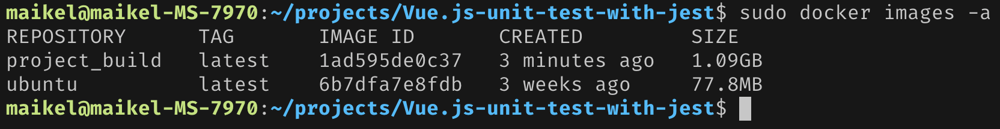

Kolejnym krokiem będzie stworzenie obrazu do wykonywania testów bazującym na obrazie do budowania.

Edytujemy nasz Dockerfile lub tworzymy nowy. Jego zawartość wygląda następująco:
```Dockerfile
FROM project_build
CMD ["npm", "run", "test:unit"]
```

Uruchamiamy build obrazu
```
sudo docker build -t project_test .
```
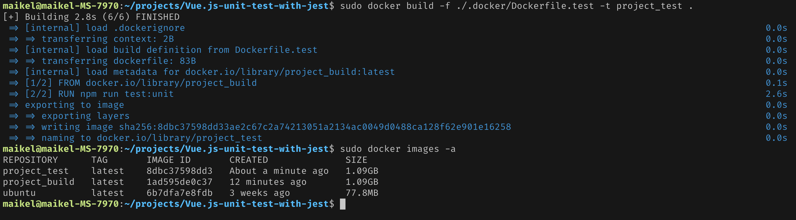
