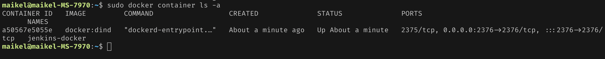
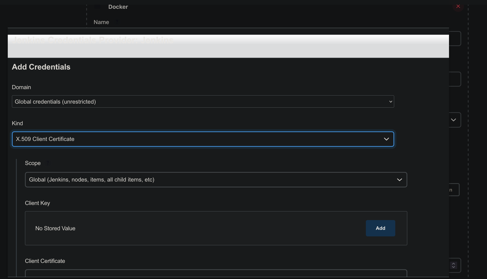
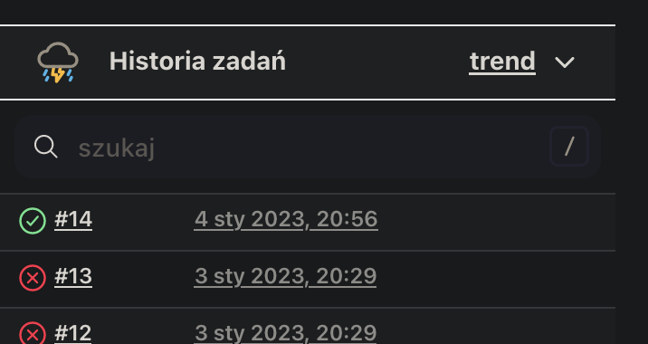

# Sprawozdanie 3
Michał Kutaj
403367

## Intro

Aby umieścić Dockerfile'e w repozytorium zrobiłem forka projektu, którego uzywałem, co wymagało małej aktualizacji zrobionych wcześniej Dockerfile'ów - zmiany adresu klonowanego repozytorium.

## Przygotowanie

Zgodnie z [instrukcją](https://www.jenkins.io/doc/book/installing/docker/) zaczynamy od stworzenia sieci przeznaczonej dla Jenkinsa
```
sudo docker network create jenkins
```


następnie uruchamiamy kontener Jenkinsa następującą komendą:
```
sudo docker run \
  --name jenkins-docker \
  --rm \
  --detach \
  --privileged \
  --network jenkins \
  --network-alias docker \
  --env DOCKER_TLS_CERTDIR=/certs \
  --volume jenkins-docker-certs:/certs/client \
  --volume jenkins-data:/var/jenkins_home \
  --publish 2376:2376 \
  docker:dind \
  --storage-driver overlay2
```


Po wykonaniu komendy mozemy sprawdzić czy nasz kontener jest aktywny za pomocą komendy `sudo docker container ls -a`



Nastepnie kastomizujemy oficjalny obraz, tworzymy nowego Dockerfile'a, którego zawarość wygląda nasrtepująco:

```dockerfile
FROM jenkins/jenkins:2.375.1
USER root
RUN apt-get update && apt-get install -y lsb-release
RUN curl -fsSLo /usr/share/keyrings/docker-archive-keyring.asc \
  https://download.docker.com/linux/debian/gpg
RUN echo "deb [arch=$(dpkg --print-architecture) \
  signed-by=/usr/share/keyrings/docker-archive-keyring.asc] \
  https://download.docker.com/linux/debian \
  $(lsb_release -cs) stable" > /etc/apt/sources.list.d/docker.list
RUN apt-get update && apt-get install -y docker-ce-cli
USER jenkins
RUN jenkins-plugin-cli --plugins "blueocean:1.26.0 docker-workflow:563.vd5d2e5c4007f"
```
następnie budujemy obraz:
```
docker build -t myjenkins-blueocean:2.375.1-1 .
```


i uruchamiamy poleceniem:
```
docker run \
  --name jenkins-blueocean \
  --restart=on-failure \
  --detach \
  --network jenkins \
  --env DOCKER_HOST=tcp://docker:2376 \
  --env DOCKER_CERT_PATH=/certs/client \
  --env DOCKER_TLS_VERIFY=1 \
  --publish 8080:8080 \
  --publish 50000:50000 \
  --volume jenkins-data:/var/jenkins_home \
  --volume jenkins-docker-certs:/certs/client:ro \
  myjenkins-blueocean:2.375.1-1 
```


Widzimy nowy obraz. Teraz po wejsciu w przeglądarkę (w moim przypadku ip maszyny fizycznej i port `8080`) powinniśmy ujrzeć Jenkinsa.


Następnie trzeba odblkować Jenkinsa zgodnie z tym co jest wyświetlone na stronie. Wykorzytujemy do tego polcenie `docker exec`, które pozwala na wykonanie komendy w kontenerze
```
sudo docker exec -it f033f46761e2 cat /var/jenkins_home/secrets/initialAdminPassword
```

Następnie przechodzimy przez kroki instalacyjne.


## Uruchomienie

Tworzymy pierwszy projekt. Wpisujemy nazwę i wybieramy pierwszą opcję `Ogólny projekt`.


Następnie zjedzamy w dół to sekcji `Build steps` (swoją chyba korzystam z wersji z unikatowym językiem tzw `polisz inglisz` :sweat_smile:) i dodajemy krok `Uruchom powłokę`, i wpisujemy polecenie `uname`.


Nastepnie odpalamy projket. Po wykonaniu mozemy zajrzeć do logów. Ekefet powinien być następujący:


Następnie tworzymy kolejny project, który będzie failował gdy godzina jest nieparzysta. Kroki tworzenia są takie same z tym, ze w połoce umieszczamy następujacy skrypt.

```bash
HOUR=$(date +%H)
if [ $((HOUR%2)) -eq 1 ]
then
    exit 1
fi
```

Skrypt działa jak nalezy.


Kolejny projektem będzie "prawdziwy" projekt uruchamiający dockerfile'e przygotowane w poprzednim labie. Tworzymy projekt tak samo jak dwa poprzednie.

Tym razem będzimy klokować repozytorium więc wskazujemy je w odpowiednim polu oraz wybieramy branch. 


Następnie dodajmy krok budowania i wybieramy uruchomienie powłoki. Skrypt przechodzi do odpowiedniego katalogu oraz buduje stworzone wczesniej obrazy na podstawie Dockerfile'ów, prezentuje się on następująco:

```bash
cd GCL1/MK403367/LAB2
sudo docker build -f ./Dockerfile.build -t project_build .
sudo docker build -f ./Dockerfile.test -t project_test .
```

Niestety projekt wyrzuca błąd podczas uruchomienia. Nie mozna uruchomic poleceń Dockera. W logach mozna podejrzeć błąd. Próbowałem takze uzyć innych poleceń shella oraz Dockera, takie jak listowanie kontenerów aby zmnieszyć obszar poszukiwań, jednak błąd był podobny. Wygląda następująco:

```
Started by user Michał
Running as SYSTEM
Building in workspace /var/jenkins_home/workspace/prawdziwy
The recommended git tool is: NONE
No credentials specified
 > git rev-parse --resolve-git-dir /var/jenkins_home/workspace/prawdziwy/.git # timeout=10
Fetching changes from the remote Git repository
 > git config remote.origin.url https://github.com/InzynieriaOprogramowaniaAGH/MDO2023.git # timeout=10
Fetching upstream changes from https://github.com/InzynieriaOprogramowaniaAGH/MDO2023.git
 > git --version # timeout=10
 > git --version # 'git version 2.30.2'
 > git fetch --tags --force --progress -- https://github.com/InzynieriaOprogramowaniaAGH/MDO2023.git +refs/heads/*:refs/remotes/origin/* # timeout=10
 > git rev-parse refs/remotes/origin/MK403367^{commit} # timeout=10
Checking out Revision d2974646c47d5fd6a9b96c8a106c979b429bac3f (refs/remotes/origin/MK403367)
 > git config core.sparsecheckout # timeout=10
 > git checkout -f d2974646c47d5fd6a9b96c8a106c979b429bac3f # timeout=10
Commit message: "DEVOPS add dockerfiles to lab2"
 > git rev-list --no-walk d2974646c47d5fd6a9b96c8a106c979b429bac3f # timeout=10
[prawdziwy] $ /bin/sh -xe /tmp/jenkins16165300855523342695.sh
+ cd GCL1/MK403367/LAB2
+ ls -la
total 32
drwxr-xr-x 3 jenkins jenkins 4096 Jan  3 18:31 .
drwxr-xr-x 4 jenkins jenkins 4096 Jan  3 18:31 ..
-rw-r--r-- 1 jenkins jenkins  169 Jan  3 18:31 Dockerfile.build
-rw-r--r-- 1 jenkins jenkins   41 Jan  3 18:31 Dockerfile.test
-rw-r--r-- 1 jenkins jenkins 8551 Jan  3 18:31 SPRAWOZDANIE2.md
drwxr-xr-x 2 jenkins jenkins 4096 Jan  3 18:31 img
+ which docker
/usr/bin/docker
+ sudo docker container ls -a
/tmp/jenkins16165300855523342695.sh: 5: sudo: not found
Build step 'Execute shell' marked build as failure
Finished: FAILURE
```


Pierwszy trop prowadził do braku uprawnień roota - bo tak sugeruje błąd. Spróbowałem więc odpalić komendy Dockera bez `sudo`. Sukces? I tak i nie...

```
Started by user Michał
Running as SYSTEM
Building in workspace /var/jenkins_home/workspace/prawdziwy
The recommended git tool is: NONE
No credentials specified
 > git rev-parse --resolve-git-dir /var/jenkins_home/workspace/prawdziwy/.git # timeout=10
Fetching changes from the remote Git repository
 > git config remote.origin.url https://github.com/InzynieriaOprogramowaniaAGH/MDO2023.git # timeout=10
Fetching upstream changes from https://github.com/InzynieriaOprogramowaniaAGH/MDO2023.git
 > git --version # timeout=10
 > git --version # 'git version 2.30.2'
 > git fetch --tags --force --progress -- https://github.com/InzynieriaOprogramowaniaAGH/MDO2023.git +refs/heads/*:refs/remotes/origin/* # timeout=10
 > git rev-parse refs/remotes/origin/MK403367^{commit} # timeout=10
Checking out Revision d2974646c47d5fd6a9b96c8a106c979b429bac3f (refs/remotes/origin/MK403367)
 > git config core.sparsecheckout # timeout=10
 > git checkout -f d2974646c47d5fd6a9b96c8a106c979b429bac3f # timeout=10
Commit message: "DEVOPS add dockerfiles to lab2"
 > git rev-list --no-walk d2974646c47d5fd6a9b96c8a106c979b429bac3f # timeout=10
[prawdziwy] $ /bin/sh -xe /tmp/jenkins11380027652249091292.sh
+ cd GCL1/MK403367/LAB2
+ docker build -f ./Dockerfile.build -t project_build .
error during connect: Post "https://docker:2376/v1.24/build?buildargs=%7B%7D&cachefrom=%5B%5D&cgroupparent=&cpuperiod=0&cpuquota=0&cpusetcpus=&cpusetmems=&cpushares=0&dockerfile=Dockerfile.build&labels=%7B%7D&memory=0&memswap=0&networkmode=default&rm=1&shmsize=0&t=project_build&target=&ulimits=null&version=1": dial tcp: lookup docker: Temporary failure in name resolution
Build step 'Execute shell' marked build as failure
Finished: FAILURE

```

Pozbycie się jednego błędu wygenerowało nastepny. Bez `sudo` polecenie Dockera wydaje się startować... jednak pojawia się problem z jakimś łączniem??? Widać jakiś info o tcp.

Po kilku godzinach uzywania niestosowanych wyrazów oraz szybkiej wymianie mailów i pomocy kolegów okazuje się, ze problemem jest nieuruchomiony kontener dind. I faktycznie, kontener dind nie jest uruchomiony. Ponownie uruchomienie `dind'a` komendą

```
docker run --name jenkins-docker --rm --detach \
  --privileged --network jenkins --network-alias docker \
  --env DOCKER_TLS_CERTDIR=/certs \
  --volume jenkins-docker-certs:/certs/client \
  --volume jenkins-data:/var/jenkins_home \
  --publish 2376:2376 \
  docker:dind --storage-driver overlay2
```

uruchamia nam kontener ale to jednak nie rozwiązuje problemu. Nalezy skonfigurować Jenkinsa aby korzystał z dind'a. W tym celu wykorzystany został [poradnik](https://davelms.medium.com/run-jenkins-in-a-docker-container-part-1-docker-in-docker-7ca75262619d#f800).

W panelu, po lewej stronie, w aplikacji Jenkinsa wybieramy `Zarządzanie Jenkinsem`, następnie w ustawieniach `Zarządzaj wtyczkami`. Wyszukujemy i instalujemy plugin `Docker plugin`. Po restarcie Jenkinsa znów udajemy się do ustawień - `Zarządzaj Jenkinsem` i wybieramy `Węzły`, następnie z menu po lewej wybieramy `Configure Clouds`. Rozwijamy dodatkowe opcje i w polu `Docker Hosti URI` wpisujemy wartość `tcp://docker:2376` (tcp - wygląda znajomo, port 2376 tez jezeli przyjrzymy się komendzie uruchamiającej dind'a).

Następnie mozna przetestować połączenie. Pojawia się błąd związany z brakiem HTTPS, przyda się więc certyfikat. 


Klikamy `Add` i wybieramy `X.509 Client Certificate`



Do wypełnienia danych posłuzą komendy:

```
sudo docker exec jenkins-docker cat /certs/client/key.pem
sudo docker exec jenkins-docker cat /certs/client/cert.pem
sudo docker exec jenkins-docker cat /certs/server/ca.pem
```
Teraz test działa!


Po ponowym uruchomieniu projektu, budowanie kończy sie sukcesem.



### Pipeline

Zdecydowałem się zmienić nieco podejście i zmienić moje Dockerfile'e. Główną zmianą jest stworzenie nowych Dockerfile'ów - zawierającego dependencje oraz uruchomieniowego. Ponadto nie klonuję repozytorium wewnątrz kontenera tylko poza nimi. Dockerfile'e prezentują się następująco:

Dockerfile zawierający dependencje kopiuje `package.json` czyli plik z wszystkimi niezbędnymi bibliotekami. Dlaczego wybrałem wersję 12 node'a opisuję w sprawku nr 2.
```Dockerfile
# Dockerfile.dep
FROM node:12
WORKDIR /app
COPY package.json ./
COPY package-lock.json ./
CMD ["npm", "install"]
```

Dockerfile testujący odpala testy jednostkowe. polecenie `.exit` zostawiłem aby mieć pewność, ze znajdujemy się w wierszu poleceń a nie wewnątrz serwera node.
```Dockerfile
# Dockerfile.test
FROM project_dep
CMD [".exit"]
CMD ["npm", "run", "test:unit"]
```

Dockerfile budujący buduje statyczne pliki naszej aplikacji.
```Dockerfile
# Dockerfile.build
FROM project_dep
CMD [".exit"]
CMD ["npm", "run", "build"]
```

Dockerfile uruchamiający stawia serwer do serwowania aplikacji. Jest to serwer nginx do serwowania statycznych plików.
```Dockerfile
# Dockerfile.run
FROM nginx:stable-alpine
COPY /dist/ /usr/share/nginx/html
EXPOSE 80
CMD ["nginx", "-g", "daemon off;"]
```

Do repozytorium dodany został `Jenkinsfile`. Poszczególne kroki wykorzystują kontenery opisane powyzej. Kontenery współdzielą volume z katalogiem aplikacji. Pipline składa się z 5 kroków. 
- Checkout - pobiera repozytorium z aplikacją
- Test - w przypadku aplikacji JavaScript nie jest wymagane utworzenie builda do testowania aplikacji testami unitowymi. Mozna więc ten krok wykonanć przed buildem, bo jezeli testy nie przejdą nie ma sensu budowac naszej aplikacji.
- Build - efektem końcowym naszej aplikacji jest katalog `dist` do którego zostają wyplute wszytkie statyczne pliki niezbędne do odpalenia naszej aplikacji takie jak zminifikowane pliki `.js`, pliki styli `.css`, plik `index.html`, który jest entrypointem do naszej aplikacji oraz inne statyczne pliki takie jak grafiki i ikony.
- Deploy - ten krok odpala kontener z serwerem zdolnym zaserwować build naszej aplikacji
- Publish - pakuje katalog z naszym buildem aby było gotowy do dalszej drogi. (Normalnie to wysłałbym to na jakiś serwer produkcyjny ale nie ma takiej potrzeby tutaj więc tylko go skapowałem, mozna równiez pobrac skapowany build i odpalić lokalnie w przeglądrce gdyz jest to apliakcja JS)

W panelu Jenkinsa tworzymy nowy projekt. Wybieramy pipeline i w definicji wybieramy `Pipeline script from SCM`, ustawiamy repo z naszym Jenkinsfile'em oraz wybieramy branch.


Gdy Pipline jest gotowy odpalamy go.

Początkowo pojawiały się błędy - były one związane z niepoprawną składnią Jenkinsfile'a.


