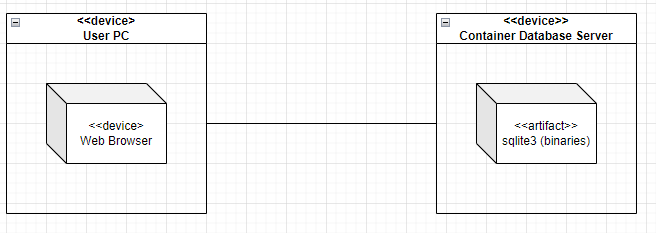

WSTĘP

Celem projektu było stworzenie samodzielnego pipeline w jenkins izolującego poszczególne etapy w procesie CI (dependencje, build, testy) oraz w procesie CD (deploy oraz 
publish). Pipeline budowany był w aplikacji webowej Jenkins Blue Ocean, która uruchomiona była jako kontener dockerowy i wystawiona na świat na porcie 8080. Do budowania
została użyta aplikacja napisana w C sqlite3 https://github.com/sqlite/sqlite i z tego repozytorium była klonowana. Klonowanie i build aplikacji odbywał się z utworzonego
usera "sebastian". Klonowanie tworzyło katalog sqlite a w nim tworzono katalog bld. W pierwszym etapie wywoływano ../configure, następnie make, make test oraz 
można było uruchamiać apkę z binarki sqlite3, która została artefaktem. Budowanie aplikacji wymagało sporo bibiotek, które nie były podane wprost w dokumetancji, 
a odnalezienie wymaganych było bardzo czasochłonne (szczegóły dalej). Niezbędne docker files .dependencies, .builder, .tester (dependencje, budowanie, testowanie) 
zostały utworzone w repozytorium przedmiotowym (https://github.com/InzynieriaOprogramowaniaAGH/MDO2023) na gałęzi SG287586 w ścieżce /MDO2023/GCL1/SG287586/LAB3. 
Docker file z dependencjami referuje do tagów z konretnymi wersjami OS ubuntu oraz libool, autoconf, tcl-dev, zlib1g-dev, git. Builder korza z utworzonego uprzednio 
obrazu z dependencji i tworzy usera sebastian, klonuje repozytorium sqlite, tworzy katalog bld i później buduje aplikację (configure, make, make sqlite3.c). Docker file 
tester korzysta z buildera i odpala testy (make test). Pipeline został podzielony na 5 stages: Dependencies, Build, Test, Deploy, Publish. W 1 budowany jest obraz z 
docker file dependencies, w 2 z builder, w 3 z tester. Krok 4 to deploy, w którym tworozny jest tymczasowy kontener z buildera, kopiowany jest lokalnie do /tmp artefakt 
(binarka sqlite3 do uruchomienia aplikacji), usuwa się tymczasowy konter i tworozny jest kontener z pustym OS ubuntu (latest) do niego przesyła się artefakt i włącza 
program. O ile build wymagał kilku bibliotek tak do włączenia nic nie jest wymagane. Ostatni, 5 krok to Publish, a w nim tworzony jest docker image ze środowiska 
uruchomieniowego używanego do deploy, tzn. goły kontener z uruchomioną aplikacją sqlite3. Obraz ten wysyłany jest do Docker Hub objdumpr/devops-classes. 

DIAGRAMY UML

Diagram aktywność:

Diagram wdrożeniowy:

PRZEBIEG ĆWICZENIA

1. Konfiguracja Jenkins Blue Ocen- konfiguracja wg dokumentacji dostawy oprogramowania https://www.jenkins.io/doc/book/installing/docker/ Podczas konfiguracji dodawany jest 
wpis sieciowy jenkins do sieci, kontener DIND pozwalający na uruchamianie poleceń docker w konterze docelowym i kontener jenkins blue ocean na porcie 8080. 
Z ostatnim kontenerem łączymy się poprzez przeglądarkę, a pierwsze uruchomienie wymaga podania pierwszego hasła adminowego znajdującego się w logach instalacji 
sudo docker logs jenkins-blueocean. Ustawiane zostało hasło adminowe oraz pobrane sugerowane wtyczki do jenkinsa. Sama konfiguracja ważne by przebiegała ze zwykłego usera
(nie root) i z poleceniami sudo, ponieważ może później nie działać odpowiednio. Jeśli wciąż nie działa to warto utworzyć snap VM i następnie pozbyć się serwisu 
apparmor.service i dalej restart docker service. 

2. Do repozytorium na prywatną gałąź SG287586 https://github.com/InzynieriaOprogramowaniaAGH/MDO2023 przesyłam 3 docker files wymagane w budowaniu pipeline. 

Dockerfile.dependencies
FROM ubuntu:20.04

RUN ln -snf /usr/share/zoneinfo/$CONTAINER_TIMEZONE /etc/localtime && echo $CONTAINER_TIMEZONE > /etc/timezone
RUN apt update && apt -y upgrade && apt install -y \
	libtool=2.4.6-14 \
	autoconf=2.69-11.1 \
	tcl-dev=8.6.9+1 \
	zlib1g-dev=1:1.2.11.dfsg-2ubuntu1.5 \
	git=1:2.25.1-1ubuntu3.6

Sqlite zostało napisane w C i do budowania aplikacji wymagane są konkretne wersje bibliotek i OS, tak by aplikacja mogła poprawnie się zbudować. Biblioteki te nie są podane
wprost poprze producenta, a w trakcie budowania Docker image kończył się to coraz innymi błędami. Odnalezenie właściwych wymaganych paczek jest mocno absorbujące. 
Pobieranie "latest" np. za pół roku może spowodować, iż aplikacja może się nie zbudować, stąd tworzony jest docker image z konkretnym tagiem wersji aplikacji, by mieć 
pewność, iż build zadziała. Używam ubuntu 20.04, i w pierwszym kroku ustawiam odpowiedni timezone, ponieważ jedna z paczek przy instalacji interaktywnie wymaga podania 
lokalizacji i strefy czasowej. Nie ustawienie tego spowodowałoby czekanie na input użytkownika. Drugi krok to aktulizacja i instalacja wymaganych bibliotek. Operacje 
z parameterm -y, by odrazu zatwierdzić apt by zainstalować paczkę. 

Dockerfile.builder
FROM dependencies 

RUN useradd -m -s /bin/bash  sebastian 
WORKDIR /home/sebastian
USER sebastian
RUN git clone https://github.com/sqlite/sqlite.git ; mkdir sqlite/bld
WORKDIR sqlite/bld

RUN ../configure
RUN make
RUN make sqlite3.c

Korzystam z obrazu dependencies, tworzę usera sebastian. Ustawiam work directory jako jego home, przechodzę na usera sebastian i klonuję repozytorium sqlite. Po 
sklonowaniu w katalog sqlite tworzę bld (zalecenia dostawcy) i następnie ustawiam jako work directory i z niego buduję aplikację sqlite, wg dokumentacji dostawcy 
oprogramowania. 

Dockerfile.tester
FROM builder

RUN make test

Z obrazu builder w katalogu roboczym (bld) i jako sebastian włączam testy, również zgodnie z dokumetnacją dostawcy. Brak dokładnego opisu testów "waliduje sqlite kod". 
Można więc uznać, że jeśli testy wykonały się prawidłowo to aplikacja powinna działać. 

3. Budowanie pipeline "sqlitePipeline"- pipeline podzielono na 5 stages: Dependencies, Build, Test, Deploy, Publish. 

pipeline {
    agent any
    
    stages {
        stage('Dependencies') {
            steps {
                    git(
                      url: 'https://github.com/InzynieriaOprogramowaniaAGH/MDO2023.git',
                      credentialsId: 'jenkins-user-github',
                      branch: 'SG287586'
                    )
                    
                    sh '''docker build -f "GCL1/SG287586/LAB3/Dockerfile.dependencies" -t dependencies .'''
            }
        }
        
        stage('Build') {
            steps {
                sh '''docker build -f "GCL1/SG287586/LAB3/Dockerfile.builder" -t builder .'''
            }
        }
        
        stage('Test') {
            steps {
                sh '''docker build -f "GCL1/SG287586/LAB3/Dockerfile.tester" -t tester .'''
            }
        }
        
        stage('Deploy') {
            steps {
                sh """
                    docker run --name sample builder
                    docker cp sample:/home/sebastian/sqlite/bld/sqlite3 /tmp
                    docker rm -f sample
                """
                
                sh """
                    docker run -d --name=deployer --tty ubuntu:latest
                    docker exec deployer mkdir /app
                    docker cp /tmp/sqlite3 deployer:/app
                    docker exec deployer /app/sqlite3
                    rm /tmp/sqlite3
                """
            }
        }
        
        stage('Publish') {
            steps {
                sh 'docker commit deployer objdumpr/devops-classes:sqlitev1'
                withCredentials([usernamePassword(credentialsId: 'dockerhub', passwordVariable: 'dockerhubPassword', usernameVariable: 'dockerhubUser')]) {
        	    sh "docker login -u ${env.dockerhubUser} -p ${env.dockerhubPassword}"
                sh 'docker push objdumpr/devops-classes:sqlitev1'
                }
            }
            post {
                always {
                    sh 'docker logout' 
                }
            }
        }
       
    }      
}

W stagu 1 klonuję swoją gałąź w której są docker files i buduję obraz dependencies z docker file. Krok ten jest osobno, ponieważ jak wcześniej wspomnianio apliakcja
wymaga konkretnych wersji bibliotek do budowania, i na latest może się nie wybudować poprawnie. 

Stage 2 Build- buduję image builder z Dockerfile.builder. Budowanie odbywa się na utworzonym w uprzednim kroku dependencies. W wyniku budowania otrzymuję artefakt, 
plik binarny sqlite3, który uruchamia aplikację SQlite. 

Stage 3 Test- w tym kroku uruchamiane są testy dostarczone przez dostawcę oprogramowania, sprawdzające kod SQlite i czy aplikacja zbudowała się poprawnie. 

Stage 4 Deploy- tutaj nie potrzebny jest cały kontener build, a jedynie artefakt, tj. wykonywalny plik sqlite3. Plik ten w pełni wystarczy do działania aplikacji, co 
przetestowałem na osobnym pustym kontenerze. Stworzyłem tam bazę danych, tabelki, selecty i wszystko działało poprawnie. Baza została zapisana jako plik (nie 
działała w pamięci OS jedynie jako instancja). Do uruchomienia aplikacji nie były wymagane żadne dependencje, a dependencje do builda są używane tylko w build. 
Użyłem pustego OS ubuntu w wersji latest. By wyciągnąć sam artefakt potrzebny do działania apki (w ramach rozwoju git będzie mieć kolejne nowsze wersje) tworzę tymczasowy
kontener sample z obrazu builder, kopiuję plik binarny sqlite3 do kontenera jenkins blue ocean (kontener wyżej) do katalogu /tmp i usuwam z force sample (ponieważ jest 
działający). Próbowałem stworzyć docker file, który tworzyłby image uruchomieniowy from ubuntu i do którego byłby zaciągany artefakt, ale napotkałem problemy z context
które było przykrywane prze env HOST związaną z ustawieniami jenkins blue ocen. Nie bardzo miałem też pomysł jak skopiować do pustego kontenera plik wykonywalny- 
uruchamiając w wersji interactive pipeline stawał i nie wykonywały się kolejne polecenia. Nie podając parameteru --tty kopiując uzyskiwałem błąd, iż kontener 
nie został uruchomiony i w docker ps nic nie pokazywał jako active. Podając paramter -it wyskakiwał błąd. Próbująć kopiować plik pomiędzy kontenerami uzyskiwałem błąd, a więc
kopiowanie musiało odbyć się na dwa kroki. Mv nie jest poleceniem dockerowym stąd kopia, a potem usunięcie pliku. W końcu natknąłem się w dokumentacji na parameter -d 
(detached), który pozwala uruchomić kontener w tle i pipeline mógł działać dalej, a ja mogłem użyć parametru --tty. Nazywam kontener deployer z gołą latest wersją ubuntu i 
tworzę w nim katalog /app. Kopiuję do niego artefatk sqlite3 i uruchamiam aplikację, a następnie usuwam z /tmp plik sqlite3 który jest już niepotrzebny. Apliakcja działa w 
nowym, pustym kontenerze. Teoretycznie deploy możemy przeprowadzać na kontener z już działająca aplikacją, podmieniamy stary artefakt na nowy. Mamy potwierdzenie, że 
apliakcja zadziała na innym serwerze, a nie tylko po stronie dewelopera. Po sukcesie w tym kroku możemy przejśc do ostatniego, publish. 

Stage 5 Publish- w ustawieniach Jenkins dodaję Credentials do mojego Docker Hub o ID dockerhub. Próbowałem z dockerImage.Push(), ale nie mogłem przypisać image z docker 
commit, musiałbym uzyć przypisania docker.build. Finalnie postawiłem na polecenia powłoki sh. Najpierw wykonuje dockere commit, który tworzy mi obraz z gołym OS i 
artefaktem z poprzedniego kroku. Nie tworzę zip, ponieważ jest to tylko jeden plik i nie warto zachodu. Sama aplikacja nazywa się SQlite i jak nazwa wskazuje jest
mocno okrojoną wersją bazy w porównaniu z Oracle czy Postgres. Loguję się do docker hub przy pomocy zmiennych, które ciągnięte są z Credentials Jenkins ustawionych
z id dockerhub. Nazwa image musi być specjalnie dobrana tak by push dokonał się na odpowiedniogo usera i do odpowiedniego repozytorium, w tym przypadku: 
objdumpr/devops-classes:sqlitev1 - nick, nazwa repozytorium, i tag. Ostatni krok jest jako always by wykonał się zawsze- następuje wylogowanie i wykasowanie cashu. 
Można usuwać obraz lokalnie jeśli został przeniesiony na DockerHub, a ja zostawiłem dla celi dokumentacyjnych i testowych.

