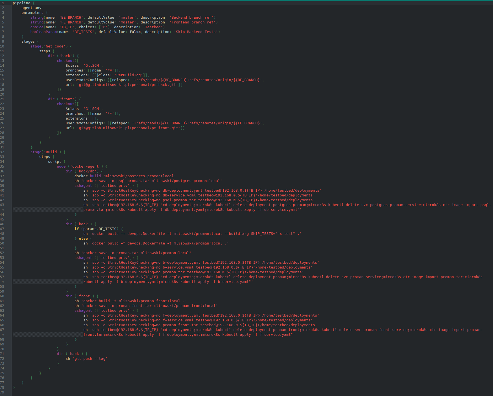

# Maciej Lisowski

## Istniejący pipeline do budowy projektu przy użyciu Gradle oraz jego późniejszy deployment na dowolny testbed z zainstalowanym kubernetesem

#### 2022-12-04

---

## 1. Opis pipelineu Jenkinsa

W celu usprawnienia i automatyzacji budowania, testowania i deployowania aplikacji utworzyłem pipeline używając do tych celów Jenkinsa. Cały pipeline jest zawarty w pojedynczym Jenkinsfile i przechowywany w specjalnym repozytorium do celów DevOps. Pipeline utworzyłem żeby był parametryzowalny, dzięki temu mogę wybrać konkretny commit / branch, który chcę zbudować. Przydatne jest to kiedy pracuję nad kilkoma rzeczami w tym samym czasie. Mogę również wybrać maszynę "testbed", na którym zostanie zainstalowana aplikacja po zbudowaniu. Pozwoli mi to w elastyczny sposób na testowanie aplikacji w różnych warunkach (ilość CPU, RAM, etc.) dodatkowo poprzez odpowiednie checkboxy mogę wybrać żeby uruchomiły się testy jednostkowe i integracyjne.

**Skrypt pipeline:**

**Widok w Jenkinsie:**

Pomyślny build taguje commit, z którego został zbudowany i pushuje go do repozytorium:

## 2. Dockerfile projektu

Dockerfile stworzyłem w sposób, żeby w pierwszej kolejności robił za buildera i budował aplikację, a następnie z tamtego kontenera wyciągany jest otrzymany JAR file i z jego pomocą tworzony jest finalny kontener runner. Dzięki takiemu rozwiązaniu dependencje są utrzymane do minimum i nie pozostawiam żadnych śmieci / artefaktów po buildzie.

## 3. Dedykowane repo do DevOps

Żeby przechowywać wszystkie rzeczy związane z DevOps w jednym miejscu utworzyłem specjalne repozytorium w mojej prywatnej instancji GitLaba. Zawierać się będą w nim pipeliney, a w przyszłości będę mógł rozbudować je o np.: 
Helmcharty lub dowolne skrypty.

## 4. Deployment do Klastra kubernetesowego

Jednym z kroków, które wykonuje pipeline jest deployment aplikacji do Klastra kubernetesowego. Aktualnie mam jedną maszynę wirtualną z zainstalowanym Ubuntu Server, a na nim microk8s. Maszyna ma przydzielone 2 rdzenie CPU i 8GB ramu. W pierwszej kolejności są usuwane wszystkie możliwe pozostałości (deploymenty, serwisy), a następnie jest wrzucany dopiero co zbudowany obraz aplikacji do lokalnego repozytorium i są aplikowane nowe manifesty kubernetesowe.

## 5. Skalowanie aplikacji

Aplikacja została zaprojektowana, żeby była dowolnie skalowalna. W celu przetestowania skalowalności utworzyłem dokładną kopie manifestu deploymentu zmieniając liczbę replik na 3. Aplikując nowy deployment wykazuje dodatkowo jego wersjonowalność, a po chwili oczekiwania pody wstają bez problemu:

