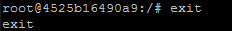
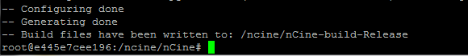

# Sprawozdanie z zajęć 2.
Wykonał Michał Prochwicz
### Zestawienie środowiska Deckerowego
1. Zainstalowano program Docker\
 
2. Dokonano rejestracji na Docker Hub:\
 ``` https://hub.docker.com/u/mprochwicz ```
3. Pobrano hello-world, busybox, ubuntu, mysql: \
  \
  \
  \
  
4. Uruchomienie busybox \
 ``` sudo docker run -it busybox ```
 * Efekty uruchomienia:\
  
 * Wywołanie numeru wersji obrazu:\
  
5. Uruchomienie "systemu w kontenerze" \
 ``` sudo docker run -it ubuntu ```
 * PID1 w kontenerze:\
  
 * Procesy Dockera na hoście:\
  
 * Zaktualizowano pakiety poleceniami:\
  ``` 
   sudo apt upgrade 
   sudo apt update 
  ```
  
 * Wyjście z kontenera:\
  
6. Wyświetlono uruchomione kontenery: \
 ``` sudo docker ps -a ``` \
  
7. Na koniec wyczyszczono obrazy i kontenery: \
 ``` sudo docker system prune -a ``` \
  \
  
 
### Budowanie programu
1. Do przeprowadzenia ćwiczenia wykorzystano projekt silnika do gier 2D w języku C++ https://github.com/nCine/nCine
2. Konfiguracja środowiska:
 * Pobranie repozytorium:\
 ``` git clone https://github.com/nCine/nCine ```
 * Instalowanie zależnosci:\
 ``` sudo apt-get install -y libgl1-mesa-dev libglfw3-dev libopenal-dev libx11-dev cmake curl gcc g++ ``` \
 ``` git clone https://github.com/nCine/nCine-data.git ```
 * Budowanie programu:\
  Wykorzystano w tym celu środowisko CMake:
  ``` 
   cd nCine 
   export CC=gcc && export CXX=g++ 
   cmake -B ../nCine-build-Release -D CMAKE_BUILD_TYPE=Release -D NCINE_BUILD_UNIT_TESTS=ON  
  ```
   \
   \
  Tak przygotowane pliki służą do tworzenia Buildu za pomocą polecenia: \
  ``` make -j2 -C ../nCine-build-Release ``` \
   \
3. Testowanie programu:
  ``` 
   cd ../nCine-build-Release 
   ctest -j2 --build-config Release 
  ```
   \
   
 
4. Cały proces został ponowiony w kontenerze z systemem ubuntu.
 * Kontener uruchomiono z obrazu ubuntu:
  
 * Należało zainstalować wymagania wstępne przed uruchomieniem w/w procesu budowania:
 ``` 
  apt-get update 
  apt-get install git -y 
 ```
 * Po tym można postępować podobnie jak na hoście. \
 -- Dla uporządkowania utworzono folder roboczy w katalogu głównym kontenera: \
 ``` mkdir ncine && cd ncine ``` \
  Sklonowano aplikację: \
 ``` git clone https://github.com/nCine/nCine ``` \
 -- Skonfigurowano środowisko (w tym przypadku bez sudo): \
  \
  \
 -- Utworzono build: \
  \
  \
  \
 -- Wykonano testy: \
  \
  
 
5. Stworzono Dockerfile, który wykonuje budowanie programu w kontenerze:\
  
6. Powyższy Dockerfile poprawnie stworzył build, korzystając z podstawowego obrazu ubuntu. Plecenie dockera:\
 ``` sudo docker build . -f Dockerfile -t ncine_build ``` \
  \
  \
  
7. Na bazie utworzonego w pkt 6. obrazu, wykonano testy w kontenerze utworzonym przez kolejny Dockerfile:\
 ``` sudo docker build . -f Dockerfile2 -t ncine_test ``` \
  \
  \
  \
  
