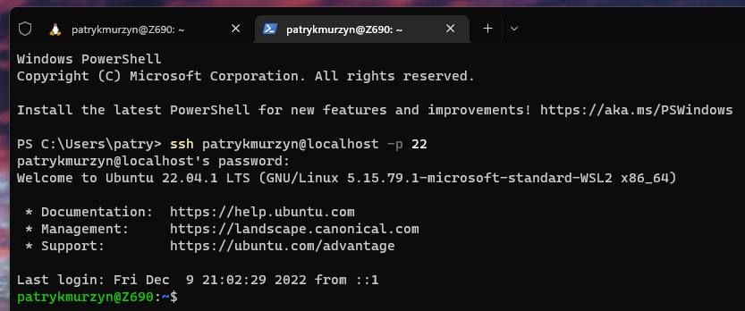
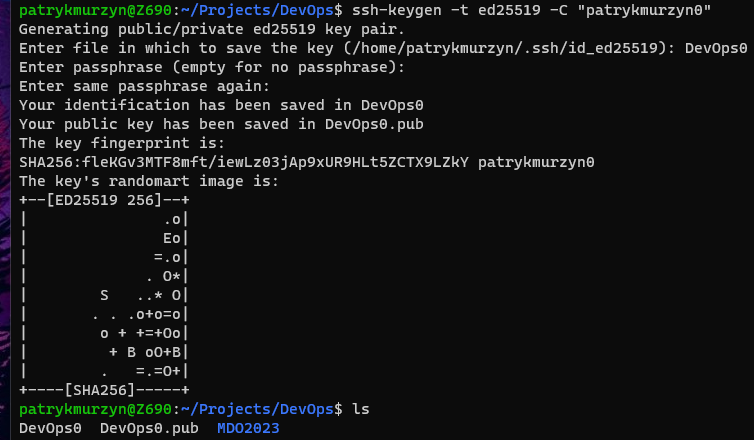
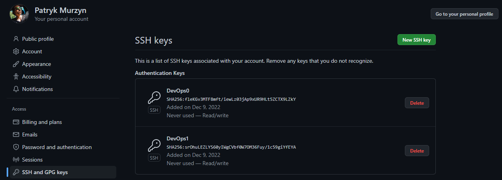
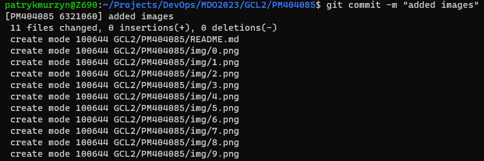
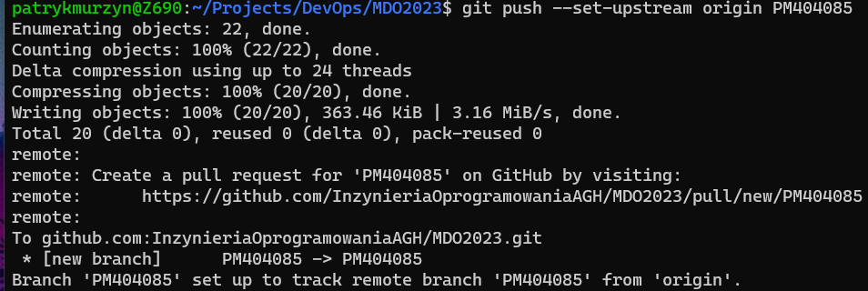
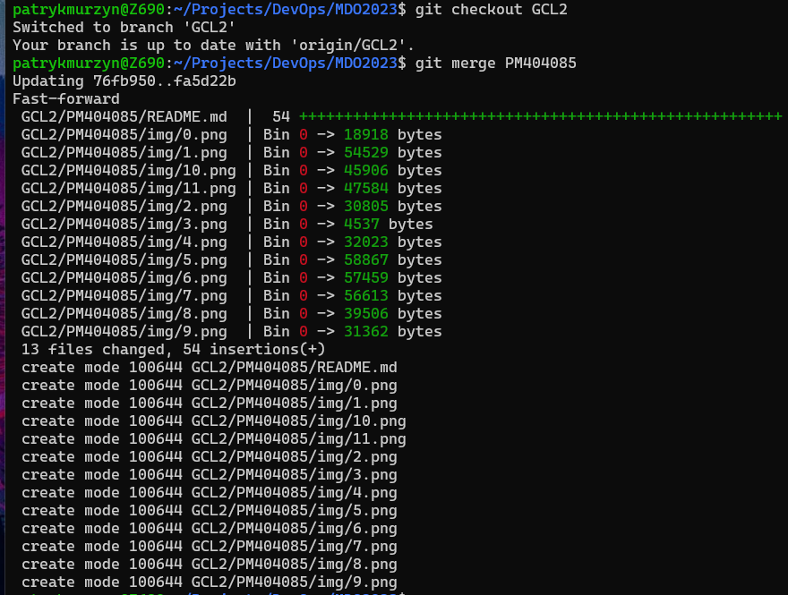

# Sprawozdanie 1 - Wprowadzenie, Git, Gałęzie, SSH

### Weryfikacja sprawności środowiska UNIX

1) Wykaż możliwość komunikacji ze środowiskiem linuksowym (powłoka oraz przesyłanie plików)

Zdecydowałem się na wykorzystanie WSL2 oraz dystrybucji Ubuntu do wykonania laboratorium. Połączyłem się z WSLem za pomocą ssh oraz sftp.

2) Zainstaluj klienta Git i obsługę kluczy SSH

3) Sklonuj repozytorium https://github.com/InzynieriaOprogramowaniaAGH/MDO2023 za pomocą HTTPS

4) Upewnij się w kwestii dostępu do repozytorium jako uczestnik i sklonuj je za pomocą utworzonego klucza SSH

    * Utwórz dwa klucze SSH, inne niż RSA, w tym co najmniej jeden zabezpieczony hasłem
	
	
	
    * Skonfiguruj klucz SSH jako metodę dostępu
	
	
	
    * Sklonuj repozytorium z wykorzystaniem protokołu SSH
	
	
    
5) Przełącz się na gałąź swojej grupy
6) Utwórz gałąź o nazwie "inicjały & nr indeksu" np. KD232144

7) Rozpocznij pracę na nowej gałęzi
    * W katalogu właściwym dla grupy utwórz nowy katalog, także o nazwie "inicjały & nr indeksu" np. KD232144
    * W nowym katalogu dodaj plik ze sprawozdaniem
	
	
	
    * Dodaj zrzuty ekranu
	
	
	
    * Wyślij zmiany do zdalnego źródła
	
	
	
	* Spróbuj wciągnąć swoją gałąź do gałęzi grupowej
	
	* Zaktualizuj sprawozdanie i zrzuty o ten krok i wyślij aktualizację do zdalnego źródła (na swojej gałęzi)

	
	
	* Oznacz tagiem ostatni commit i wypchnij go na zdalną gałąź
	
	
	
	* Ustal hook, który będzie sprawdzał, czy wiadomość z commitem zawiera nazwę przedmiotu
	
	
	
	
	
	* W jaki sposób stworzyć hook, który będzie ustawiał prefiks wiadomości commitu tak, by miał nazwę przedmiotu?
	
	Należy do tego wykorzystać hook pre-commit-msg. Skrypt na bazie poprzedniego kodu. Po zamknięciu ifa 'fi' dodajemy komendę echo "$KEY $START_LINE" > $INPUT_FILE
	
	