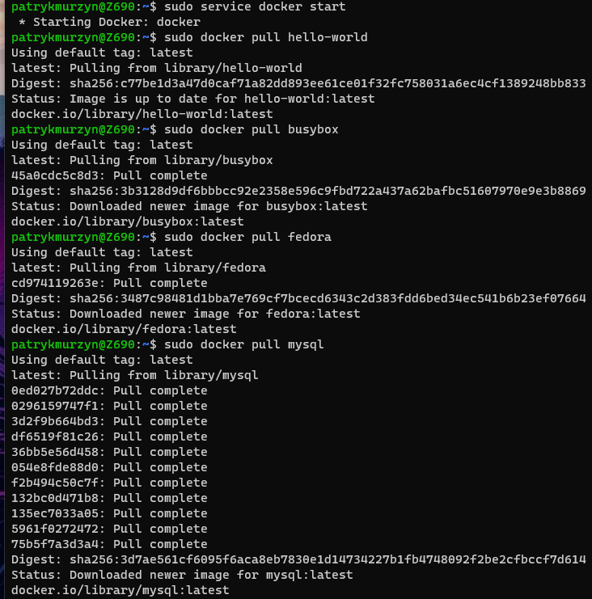
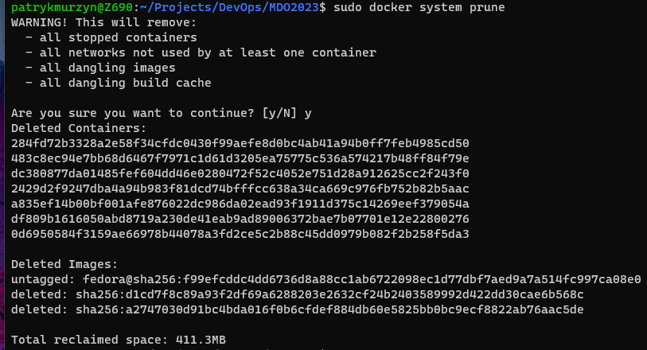

# Sprawozdanie Zajęcia 02

### Zestawienie środowiska

1) Zainstaluj Docker w systemie linuksowym

Docker został zainstalowany na potrzeby poprzedniego laboratorium: 


2) Zarejestruj się w Docker Hub i zapoznaj z sugerowanymi obrazami

Link do profilu: https://hub.docker.com/u/patrykmurzyn

3) Pobierz hello-world, busybox, ubuntu lub fedorę, mysql

Instalujemy wymienione obrazy za pomocą polecenia docker pull <nazwa>



4) Uruchom busybox

* Pokaż efekt uruchomienia kontenera
* Podłącz się do kontenera interaktywnie i wywołaj numer wersji
	

	
5) Uruchom "system w kontenerze"

Uruchomiłem system Fedora oraz zainstalowałem pakiet procps z którego skorzystam w kolejnym podpunkcie.


* Zaprezentuj PID1 w kontenerze i procesy dockera na hoście
	

	
* Zaktualizuj pakiety
	
Zaktualizowałem pakiety korzystając z polecenia:
```
dnf upgrade
```
	

	
* Wyjdź
	

	
6) Pokaż uruchomione ( != "działające" ) kontenery

Pokazanie uruchomionych kontenerów:


7) Wyczyść obrazy



