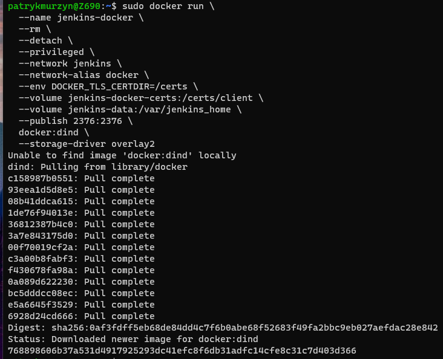
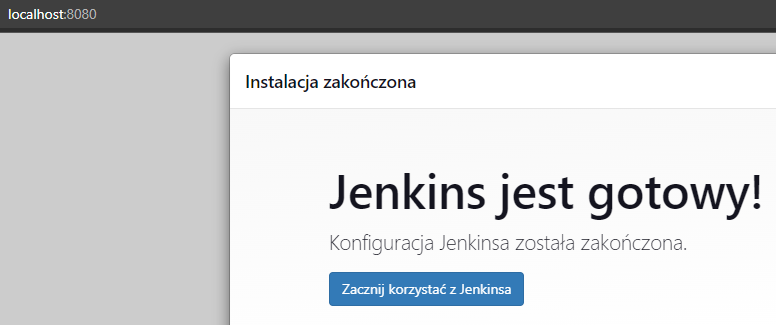
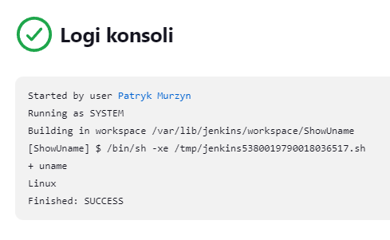
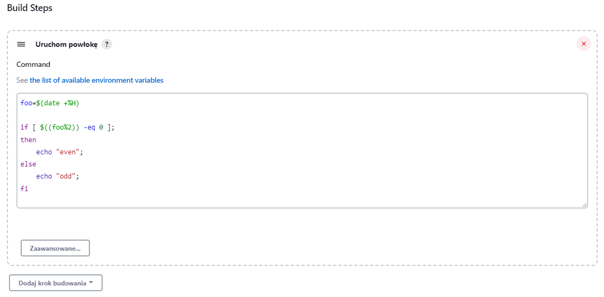
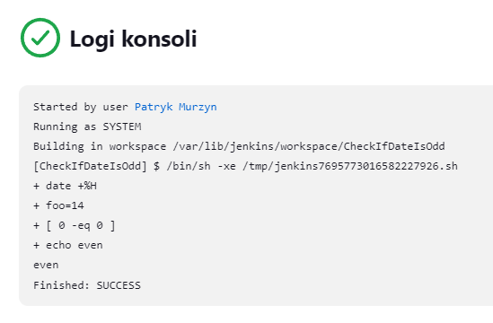
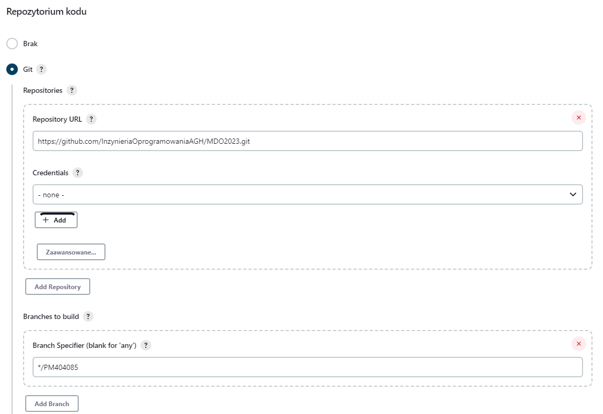
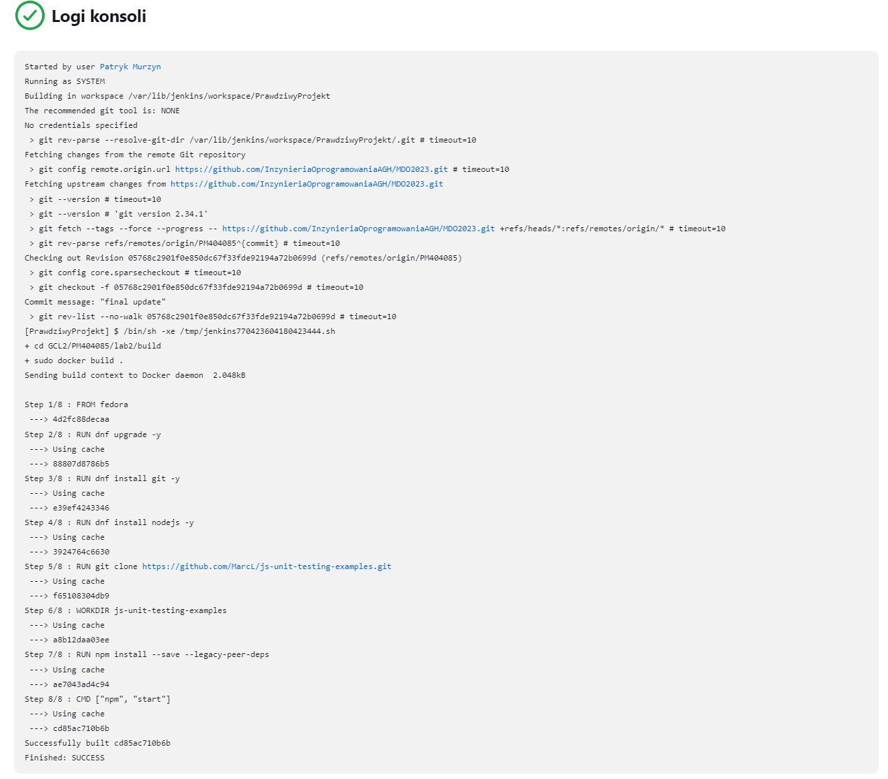
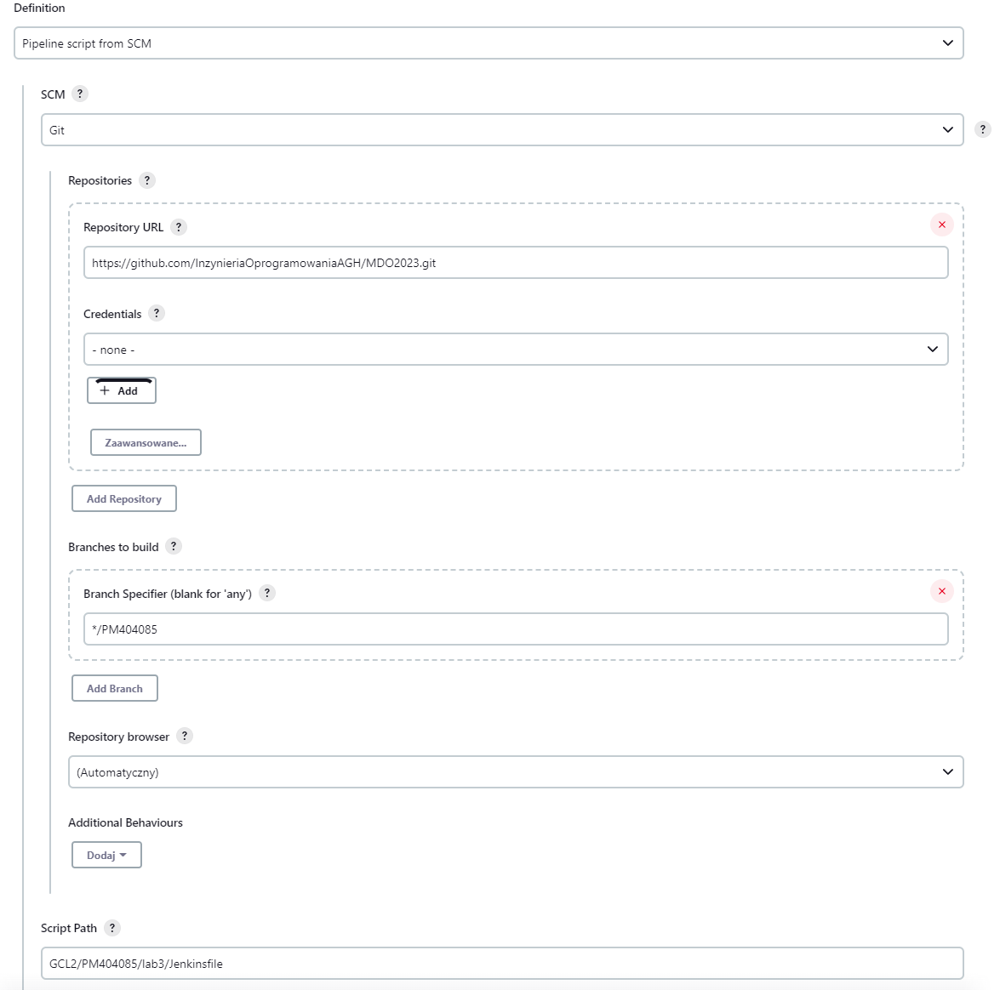
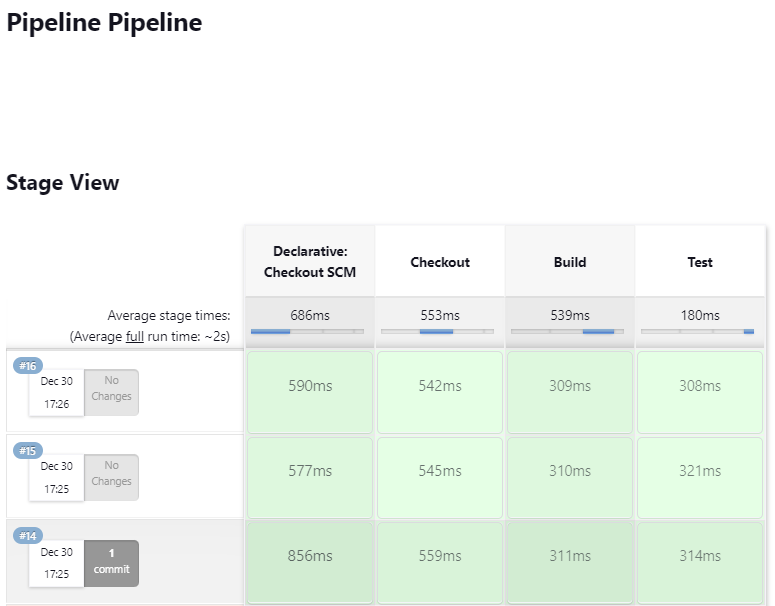

# Sprawozdanie Zajęcia 03

### Pipeline, Jenkins, izolacja etapów

## Przygotowanie

* Upewnij się, że na pewno działają kontenery budujące i testujące, stworzone na poprzednich zajęciach

Kontener budujący i testujący przygotowany na potrzeby poprzedniego laboratorium działają prawidłowo.

* Zapoznaj się z instrukcją instalacji Jenkinsa: https://www.jenkins.io/doc/book/installing/docker/

Zainstalowałem Jenkinsa na WSL2:






## Uruchomienie

* Konfiguracja wstępna i pierwsze uruchomienie

	* Utwórz projekt, który wyświetla uname
	
	
	
	* Utwórz projekt, który zwraca błąd, gdy... godzina jest nieparzysta
	
	
	
	
	
* Utwórz "prawdziwy" projekt, który:

	* klonuje nasze repozytorium
	
	* przechodzi na osobistą gałąź
	
	* buduje obrazy z dockerfiles i/lub komponuje via docker-compose
	
	
	
	Początkowo nie mogłem uruchomić komendy sudo, ale po skonfigurowaniu visudo dodając:
	
	```
	jenkins ALL=(ALL) NOPASSWD: ALL
	```
	
	proces przebiega pomyślnie:
	
	
	
## Pipeline

* Definiuj pipeline korzystający z kontenerów celem realizacji kroków build -> test

Konfiguracja nowego projektu:



Stworzyłem plik Jenkinsfile:

```
pipeline {
  agent any
  stages {
    stage('Checkout') {
      steps {
        checkout([$class: 'GitSCM', branches: [[name: 'PM404085']], doGenerateSubmoduleConfigurations: false, extensions: [], submoduleCfg: [], userRemoteConfigs: [[url: 'https://github.com/InzynieriaOprogramowaniaAGH/MDO2023.git']]])
      }
    }
    stage('Build') {
      steps {

        sh 'sudo docker build -f GCL2/PM404085/lab2/build/Dockerfile -t builder .'
      }
    }
    stage('Test') {
      steps {

		sh 'sudo docker build -f GCL2/PM404085/lab2/test/Dockerfile -t tester .'
      }
    }
  }
}
```

i umieściłem go w katalogu lab3, a następnie przeprowadziłem testy działania pipelinu:



Proces dockera budującego i testującącego zakończony powodzeniem.


	
	