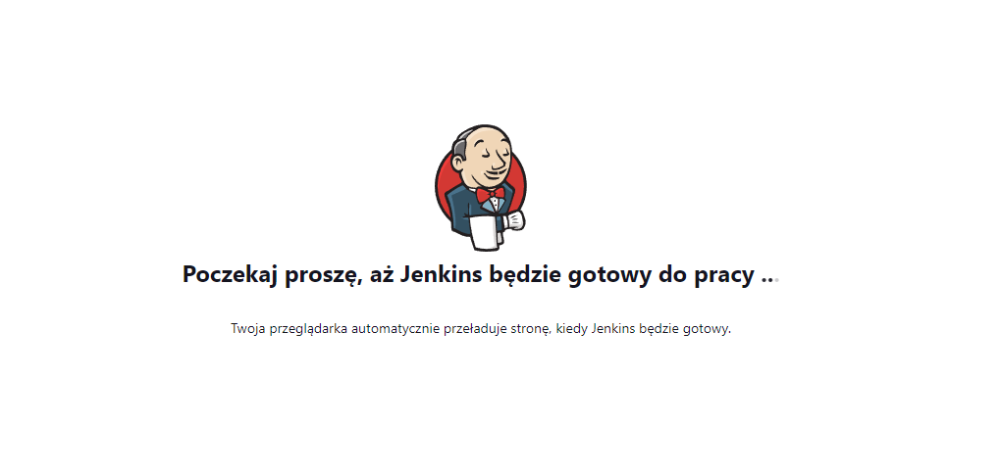

# Sprawozdanie Zajęcia 03

### Pipeline, Jenkins, izolacja etapów

## Przygotowanie

* Upewnij się, że na pewno działają kontenery budujące i testujące, stworzone na poprzednich zajęciach

Kontener budujący i testujący przygotowany na potrzeby poprzedniego laboratorium działają prawidłowo.

* Zapoznaj się z instrukcją instalacji Jenkinsa: https://www.jenkins.io/doc/book/installing/docker/

Zainstalowałem Jenkinsa na WSL2:





## Uruchomienie

* Konfiguracja wstępna i pierwsze uruchomienie

	* Utwórz projekt, który wyświetla uname
	
	
	
	* Utwórz projekt, który zwraca błąd, gdy... godzina jest nieparzysta
	
	
	
	
	
* Utwórz "prawdziwy" projekt, który:

	* klonuje nasze repozytorium
	
	* przechodzi na osobistą gałąź
	
	* buduje obrazy z dockerfiles i/lub komponuje via docker-compose
	
	
	
	Początkowo nie mogłem uruchomić komendy sudo, ale po skonfigurowaniu visudo dodając:
	
	```
	jenkins ALL=(ALL) NOPASSWD: ALL
	```
	
	proces przebiega pomyślnie:
	
	
	
	
	
	