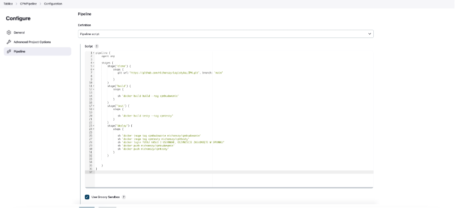
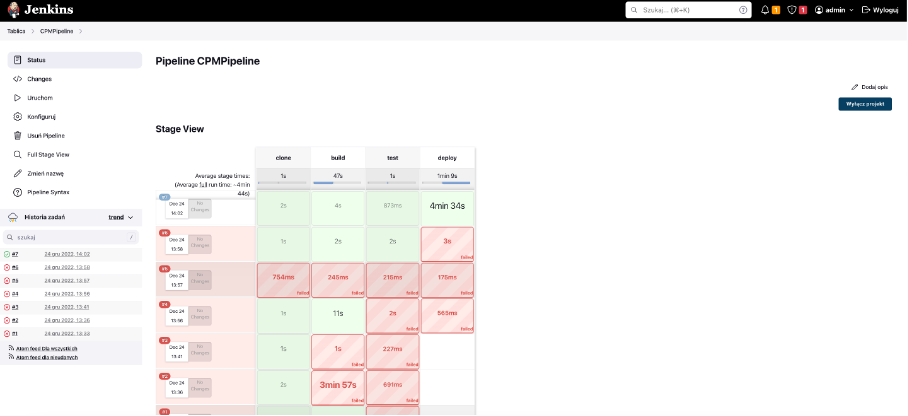
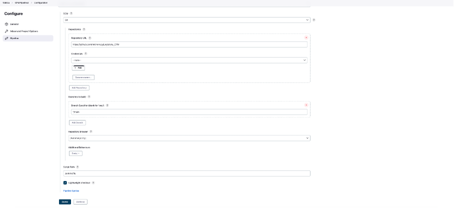
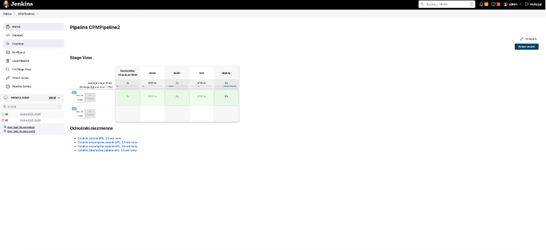

CZĘŚĆ 1: Poczatkowe kroki

Zainstalowałem Jenkinsa na serwerze, proces instalacji przeprowadzałem według oficjalnej dokumentacji (https://www.jenkins.io/doc/book/installing/docker/#setup-wizard) poniżej użyte komendy i wynik końcowy:

Stworzyłem prosty projekt w Jenkinsie który wyświetla uname -a, oto wyniki jego działania w logach:

Stworzyłem projekt do sprawdzenia czy data jest parzysta, efekt wykonania:

Aby to stworzyć napisałem skrypt w bash który wygląda następująco:

CZĘŚĆ 2: Tworzenie pipeline

Opis projektu: Otóż program to zapożyczony kod z innych zajęć, jest to zbiór funkcji pozwalających obliczyć metodą CPM koszt wykonania prac, zasadniczo po odpaleniu wyrzuca wynik, wyrzuca obrazek z grafem i kończy swoje działanie.

Link do projektu: https://github.com/michonszy/Logistyka_CPM

Sam build polega na sprawdzeniu poprawności uruchomienia kodu, jeżeli nie wypluwa nic to jest dobrze, jak wypluwa błąd to jest niedobrze, nie będzie więc on działał ciągle w tle np. nasłuchując zapytania po API, wykonuje swoją pracę i kończy działanie

Nieco bardziej rozbudowane są testy, tam do podstawowej funkcji przekazywane są testowe dane i pokazują się wyniki, czy testy przeszły itd., generowany jest też plik png

Co do zmian w Dockerfileach to dokonałem jednej zmiany względem poprzedniego zadania, wybrałem konkretną wersję ubuntu zamiast latest (większa świadomość na jakim środowisku pracuje nasza aplikacja, brak niespójności przy różnych uruchomieniach)

Pipeline został przedstawiony za pomocą diagramu UML:

 

Skrypt do pipeline jakiego użyłem (tutaj wyszczególniony osobny krok clone którego nie ma na diagramie, spowodowane to było tym że jak się okazuje podanie powyżej linka do GitHuba Jenkinsowi nie wystarcza więc dodałem pobranie repo w samym pipeline, a jednak nie jest to częśc kroku build):

Udany proces budowy:

Jak widać nie wszystkie poprzednie wykonania były prawidłowe, spowodowane to było moimi przeoczeniami i np literówkami

Następnie Jenkinsfile wrzuciłem do swojego repo i mogłem nieco zmodyfikować pipeline aby korzystał z tego pliku:

Wykonanie poprzez Jenkinsfile w repo na githubie:

Końcowe wnioski:

Zastosowałem instalacje Jenkinsa w Dockerze, okazało się to błędem, każde błedne postawienie obrazu powodowało że znowu musiałem czekać na instalacje np wszelkich wtyczek w jenkinsie, oczywiście mógłbym tak samo zmiany dokonać wewnątrz kontenera lecz nie wszystko było możliwo (np dodanie volume, przynajmniej na moim poziomie wiedzy), również zasadniczo modyfikowanie postawionego kontenera nieco psuje moim zdaniem istote kontenera, wykonując zadanie jeszcze raz zastosował bym instalację bezpośrednio na serwerze CI, również w internecie znalazłem informację że takie podejście było bardzo popularne jednak szybko zostało uznane za anty wzorzec wdrażania jenkinsa z powodu wielu problemów z jenkinsem zainstalownym w ten sposób co doświadczyłem osobiście (żródło: https://szkoladockera.pl/)

