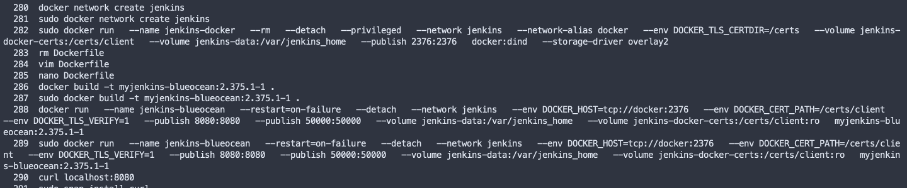
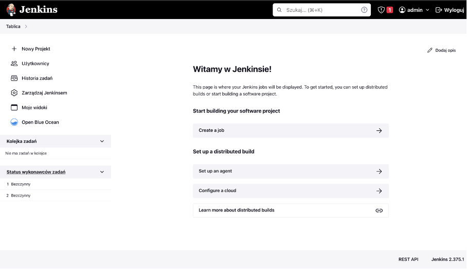
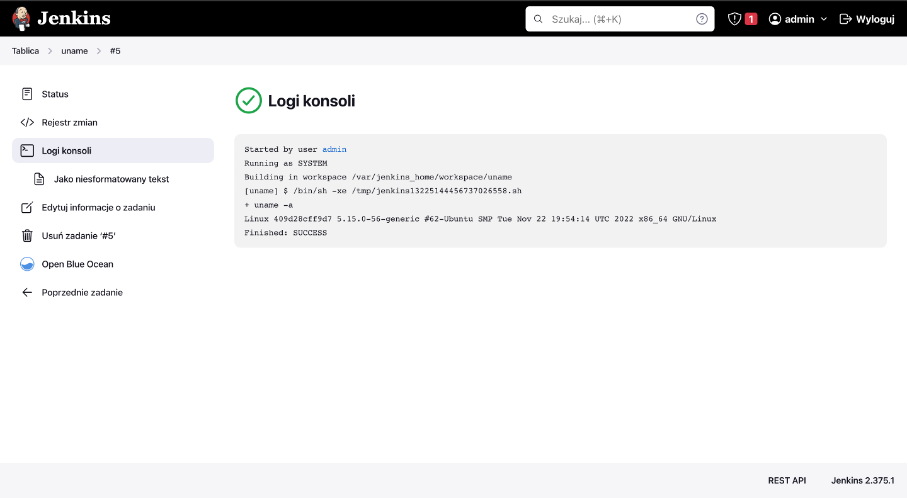
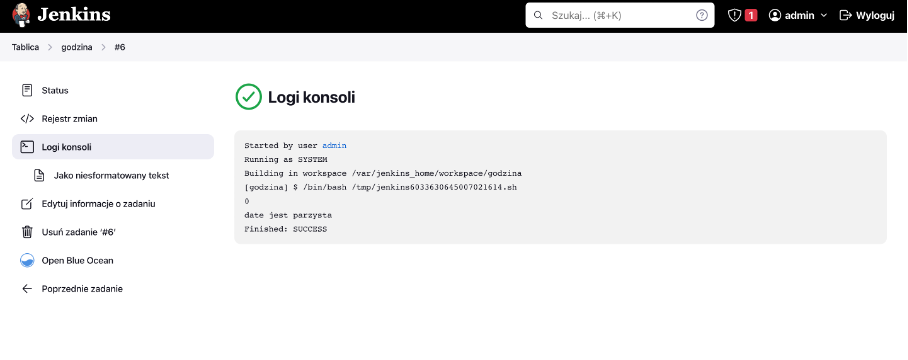
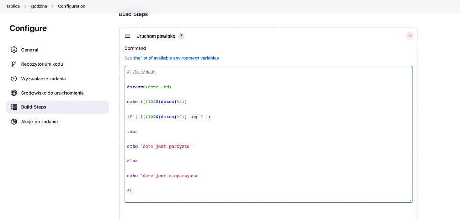
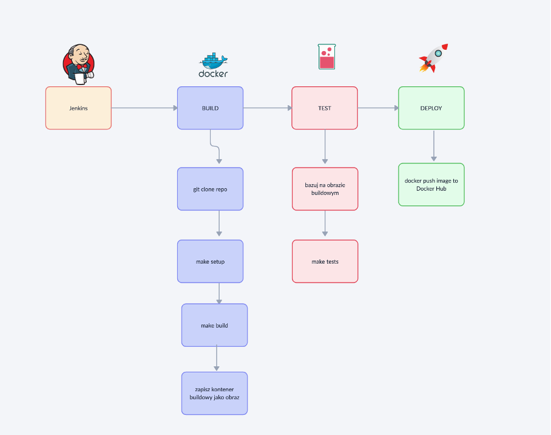

CZĘŚĆ 1: Poczatkowe kroki

Zainstalowałem Jenkinsa na serwerze, proces instalacji przeprowadzałem według oficjalnej dokumentacji (https://www.jenkins.io/doc/book/installing/docker/#setup-wizard) poniżej użyte komendy i wynik końcowy:

Stworzyłem prosty projekt w Jenkinsie który wyświetla uname -a, oto wyniki jego działania w logach:

Stworzyłem projekt do sprawdzenia czy data jest parzysta, efekt wykonania:

Aby to stworzyć napisałem skrypt w bash który wygląda następująco:

CZĘŚĆ 2: Tworzenie pipeline

Opis projektu: Otóż program to zapożyczony kod z innych zajęć, jest to zbiór funkcji pozwalających obliczyć metodą CPM koszt wykonania prac, zasadniczo po odpaleniu wyrzuca wynik, wyrzuca obrazek z grafem i kończy swoje działanie.

Sam build polega na sprawdzeniu poprawności uruchomienia kodu, jeżeli nie wypluwa nic to jest dobrze, jak wypluwa błąd to jest niedobrze, nie będzie więc on działał ciągle w tle np. nasłuchując zapytania po API, wykonuje swoją pracę i kończy działanie

Nieco bardziej rozbudowane są testy, tam do podstawowej funkcji przekazywane są testowe dane i pokazują się wyniki, czy testy przeszły itd., generowany jest też plik png

Co do zmian w Dockerfileach to dokonałem jednej zmiany względem poprzedniego zadania, wybrałem konkretną wersję ubuntu zamiast latest (większa świadomość na jakim środowisku pracuje nasza aplikacja, brak niespójności przy różnych uruchomieniach)

Pipeline został przedstawiony za pomocą diagramu UML:

 

Udany proces budowy:

Następnie Jenkinsfile wrzuciłem do swojego repo i mogłem nieco zmodyfikować pipeline aby korzystał z tego pliku:

Napotkane błędy:

Przy użyciu dockera wyskakiwał błąd error during connect Post docker, naprawą okazało się otwarcie portu 5000 i zmapowanie volume /var/run/docker.sock aby jenkins korzystał z dockera hosta

Końcowe wnioski:

Zastosowałem instalacje Jenkinsa w Dockerze, okazało się to błędem, definiując zadanie jeszcze raz zastosował bym instalację bezpośrednio na serwerze CI, również w internecie znalazłem informację że takie podejście było bardzo popularne jednak szybko zostało uznane za anty wzorzec wdrażania jenkinsa z powodu wielu problemów z jenkinsem zainstalownym w ten sposób co doświadczyłem osobiście (żródło: https://szkoladockera.pl/)

