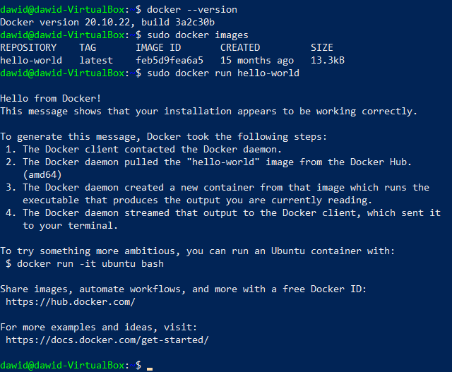
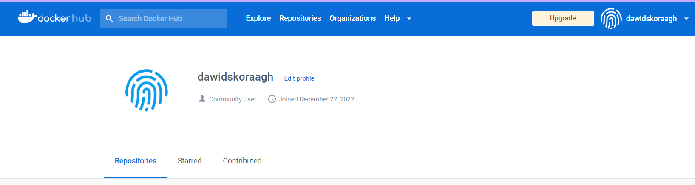
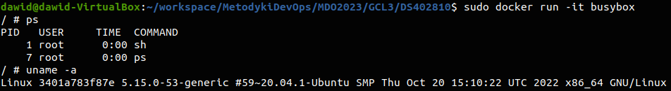
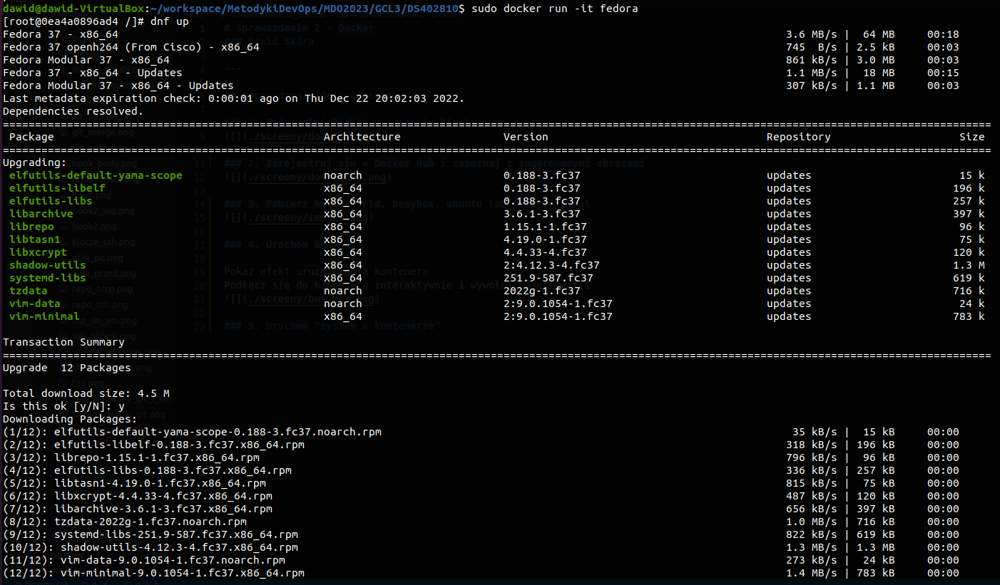
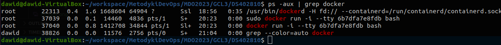
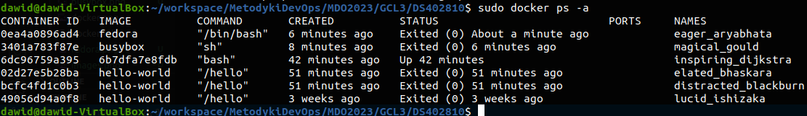
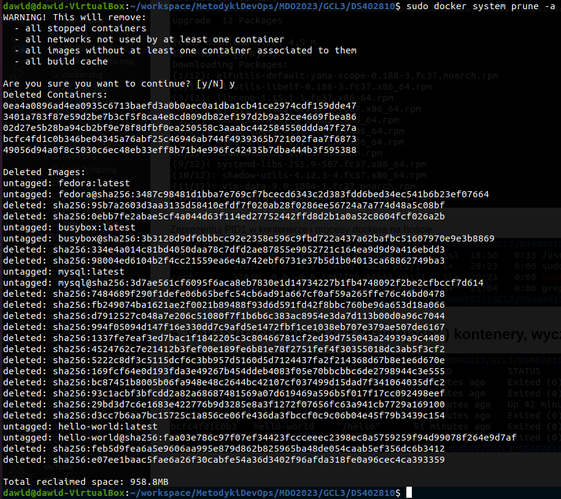

# Sprawozdanie 2 - Docker
### Dawid Skóra

---

## Wprowadzenie do kontenerów

### 1. Zainstaluj Docker w systemie linuksowym

### 2. Zarejestruj się w Docker Hub i zapoznaj z sugerowanymi obrazami

### 3. Pobierz hello-world, busybox, ubuntu lub fedorę, mysql

### 4. Uruchom busybox

Pokaż efekt uruchomienia kontenera
Podłącz się do kontenera interaktywnie i wywołaj numer wersji

### 5. Uruchom "system w kontenerze"

Zaprezentuj PID1 w kontenerze i procesy dockera na hoście

### 6. Pokaż uruchomione ( != "działające" ) kontenery, wyczyść je.

### 7. Wyczyść obrazy

