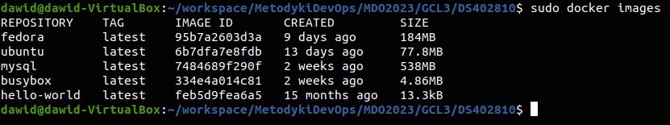

# Sprawozdanie 2 - Docker
### Dawid Skóra

---

## Wprowadzenie do kontenerów

### 1. Zainstaluj Docker w systemie linuksowym

### 2. Zarejestruj się w Docker Hub i zapoznaj z sugerowanymi obrazami

### 3. Pobierz hello-world, busybox, ubuntu lub fedorę, mysql

### 4. Uruchom busybox

Pokaż efekt uruchomienia kontenera
Podłącz się do kontenera interaktywnie i wywołaj numer wersji

### 5. Uruchom "system w kontenerze"

Zaprezentuj PID1 w kontenerze i procesy dockera na hoście

### 6. Pokaż uruchomione ( != "działające" ) kontenery, wyczyść je.

### 7. Wyczyść obrazy

## Budowanie programu

### 1. Znajdź projekt umożliwiający łatwe wywołanie testów jednostkowych

### 2. Przeprowadź budowę/konfigurację środowiska
### 3. Uruchom testy
### 4. Ponów ten proces w kontenerze
Wybierz i uruchom platformę
Zaopatrz ją w odpowiednie oprogramowanie wstępne
Sklonuj aplikację
Skonfiguruj środowisko i uruchom build
Uruchom testy
### 5. Stwórz Dockerfile, który ma to osiągnąć
Na bazie platformowego obrazu...
...doinstaluj wymagania wstępne...
...sklonuj repozytorium...
...zbuduj kod
### 6. Zaprezentuj Dockerfile i jego zbudowanie
### 7. Na bazie obrazu utworzonego poprzednim dockerfilem stwórz kolejny, który będzie uruchamiał testy
Kontener pierwszy ma przeprowadzać wszystkie kroki aż do builda
Kontener drugi ma bazować na pierwszym i wykonywać testy