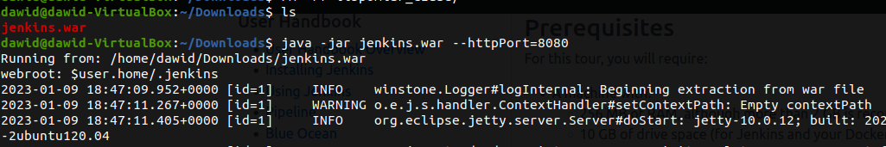
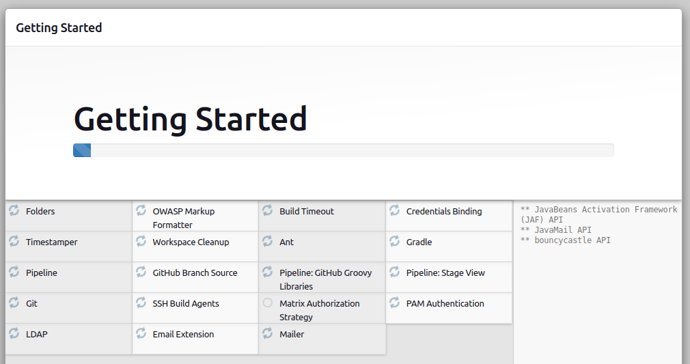
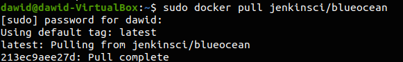
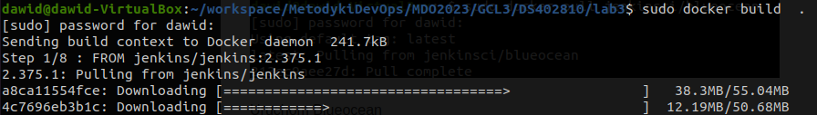
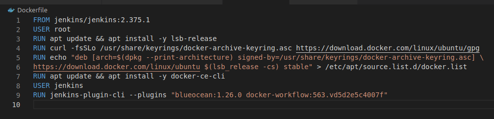
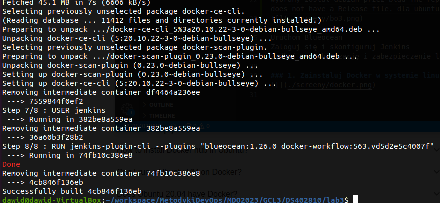

# Sprawozdanie 3 - Jenkins
### Dawid Skóra

---

## Przygotowanie

### Zapoznaj się z instrukcją instalacji Jenkinsa: https://www.jenkins.io/doc/book/installing/docker/

Pobranie Jenkinsa ze strony:

Hasło zostało wpisane:

Instalacja

Przygotuj obraz blueocean na podstawie obrazu Jenkinsa (czym się różnią?)

wybrany został debian przez błąd The repository 'https://download.docker.com/linux/ubuntu bullseye Release' does not have a Release file. dla ubuntu i fedory

Uruchom Blueocean
Zaloguj się i skonfiguruj Jenkins
Zadbaj o archiwizację i zabezpieczenie logów

### 1. Zainstaluj Docker w systemie linuksowym

