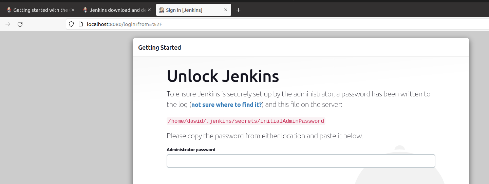

# Sprawozdanie 3 - Jenkins
### Dawid Skóra

---

## Przygotowanie

### Zapoznaj się z instrukcją instalacji Jenkinsa: https://www.jenkins.io/doc/book/installing/docker/

Pobranie Jenkinsa ze strony:

Hasło zostało wpisane:

Instalacja

Uruchom obraz Dockera który eksponuje środowisko zagnieżdżone
Przygotuj obraz blueocean na podstawie obrazu Jenkinsa (czym się różnią?)
Uruchom Blueocean
Zaloguj się i skonfiguruj Jenkins
Zadbaj o archiwizację i zabezpieczenie logów

### 1. Zainstaluj Docker w systemie linuksowym

