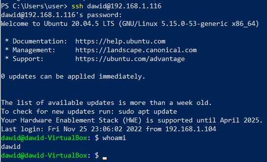
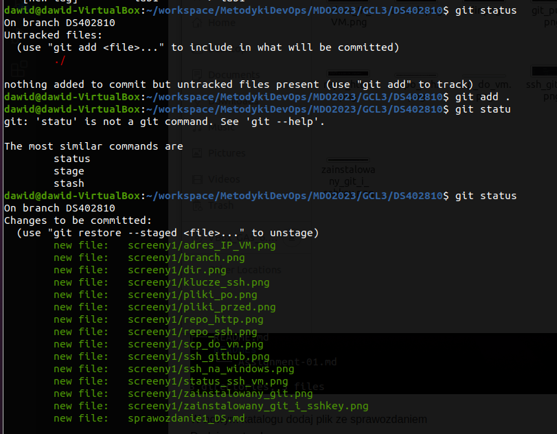
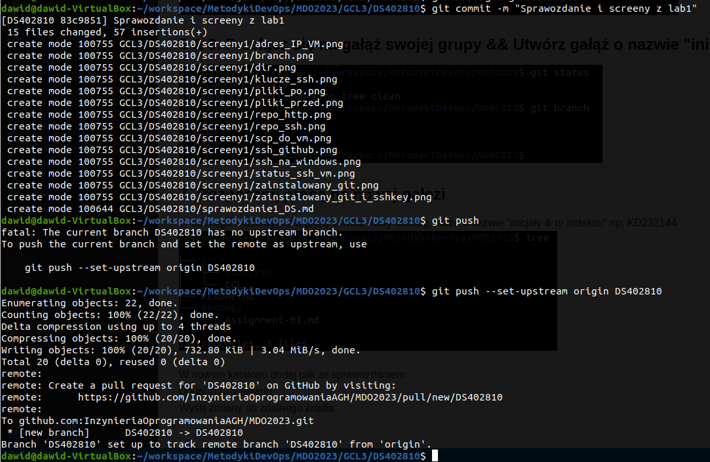
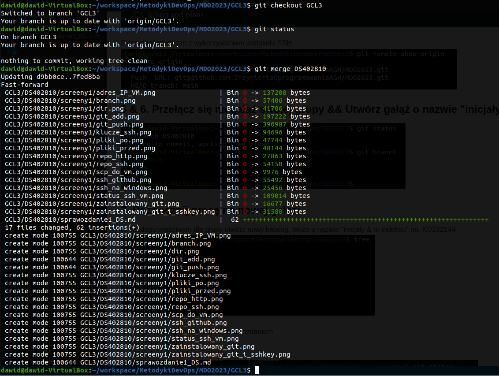

# Sprawozdanie 1 - Wprowadzenie, Git, Gałęzie, SSH
### Dawid Skóra, data oddania: 5.12.2022

---

### 1. Wykaż możliwość komunikacji ze środowiskiem linuksowym (powłoka oraz przesyłanie plików)

Polecenie zostało zrealizowane przed pierwszymi zajęciami w ramach przygotowania środowiska, więc poniższe zrzuty ekrany pokazują już działające połączenie SSH.

Odczytany adres IP maszyny wirtualnej

Sprawdzenie statusu servera ssh na maszynie virtualnej

Możliwe jest połączenie się z maszyną wirtualną poprzez ssh

Wysłanie przykładowego pliku pod ssh

Folder do którego wysłano plik z hosta

### 2. Zainstaluj klienta Git i obsługę kluczy SSH

Git i ssh-keygen zostały zainstalowane na maszynie wirtualnej przed wykonaniem zadania

### 3. Sklonuj repozytorium InzynieriaOprogramowaniaAGH/MDO2023 za pomocą HTTPS

Repozytorium zostało sklonowane przez https

### 4. Upewnij się w kwestii dostępu do repozytorium jako uczestnik i sklonuj je za pomocą utworzonego klucza SSH

Utwórz dwa klucze SSH, inne niż RSA, w tym co najmniej jeden zabezpieczony hasłem

Skonfiguruj klucz SSH jako metodę dostępu

Sklonuj repozytorium z wykorzystaniem protokołu SSH

### 5 & 6. Przełącz się na gałąź swojej grupy && Utwórz gałąź o nazwie "inicjały & nr indeksu" np. KD232144

### 7. Rozpocznij pracę na nowej gałęzi

W katalogu właściwym dla grupy utwórz nowy katalog, także o nazwie "inicjały & nr indeksu" np. KD232144

W nowym katalogu dodaj plik ze sprawozdaniem
Dodaj zrzuty ekranu
Wyślij zmiany do zdalnego źródła

Spróbuj wciągnąć swoją gałąź do gałęzi grupowej
Zaktualizuj sprawozdanie i zrzuty o ten krok i wyślij aktualizację do zdalnego źródła (na swojej gałęzi)

Oznacz tagiem ostatni commit i wypchnij go na zdalną gałąź

Ustal hook, który będzie sprawdzał, czy wiadomość z commitem zawiera nazwę przedmiotu

