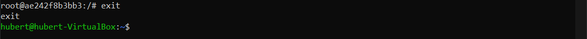
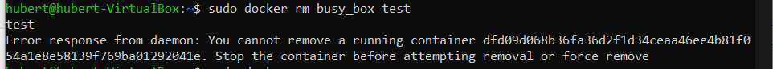

# Sprawozdanie 2 - Wprowadzenie do kontenerów
---

### Zestawienie środowiska
---
1. Zainstaluj Docker w systemie linuksowym

    Instalacja z wykorzystaniem kroków ze strony  
    https://devopscube.com/how-to-install-and-configure-docker/
   
    
    
    
    

2. Zarejestruj się w Docker Hub i zapoznaj z sugerowanymi obrazami  
    

3. Pobierz hello-world, busybox, ubuntu lub fedorę, mysql
    

4. Uruchom busybox
    - Pokaż efekt uruchomienia kontenera
        
    - Podłącz się do kontenera interaktywnie i wywołaj numer wersji
        
        
        Uruchomione kontenery
        

5. Uruchom "system w kontenerze"
    
    - Zaprezentuj PID1 w kontenerze i procesy dockera na hoście
        
        
    - Zaktualizuj pakiety
        
    - Wyjdź
        

6. Pokaż uruchomione ( != "działające" ) kontenery, wyczyść je.
    - Uruchomione
        

    - Czysczenie
        
        Kontener busy_box nie został usuniety ponieważ został nieprawidłowo zamkniety.
        Używam komenty jak niżej by go zamknąć a następnie usuwam.
        

7. Wyczyść obrazy
        

---
### Budowanie programu
---
1. Znajdź projekt umożliwiający łatwe wywołanie testów jednostkowych

     Do wykonania użyłem  https://github.com/claudio-giovanni/example-dog-food-calculator.git
    Shelter Food Calculator
    Demo project for a calculator function with unit tests.
    Given the count of dogs and leftover food, calculate the next month's order.
     

2. Przeprowadź budowę/konfigurację środowiska

    - budowa i konfiguracja srodowiska
     

3. Uruchom testy
    

4. Ponów ten proces w kontenerze
   - Wybranie i uruchomienie platformy
    
   - konfigiracja platformy
   
   
   
   
   - git clone w kontenerze
   
   - Skonfiguruj środowisko i uruchom build
   
   - Uruchom testy
   

5. Stwórz Dockerfile, który ma to osiągnąć
    

6. Zaprezentuj Dockerfile i jego zbudowanie
     
     

7. Na bazie obrazu utworzonego poprzednim dockerfilem stwórz kolejny, który będzie uruchamiał testy
    - zmiana struktury
    
    
    

    

---
### Runda bonusowa: kompozycja
---

1. Zdefiniuj kompozycję, która stworzy dwie usług

    Gotowa kompozycja
 
