Sprawozdanie 2

## Zestawienie środowiska
1. Obecność Dockera w systemie linuksowym  
  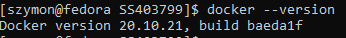
2. DockerHub  
  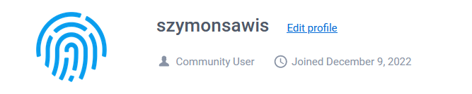
3. Pobranie obrazów hello-world, busybox, fedora oraz mysql  
  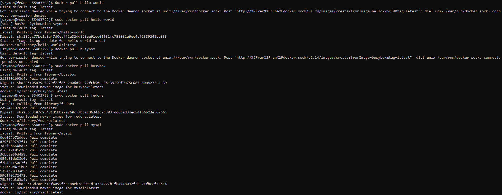
4. Urchomienie busybox  
Efekt uruchomienia  
  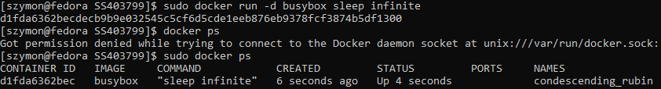
Podłączenie do kontenera i pokazanie numeru wersji  
  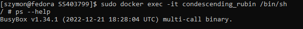
5. Urchomienie systemu w kontenerze  
Prezentacja PID oraz procesów dockera na hoście  
  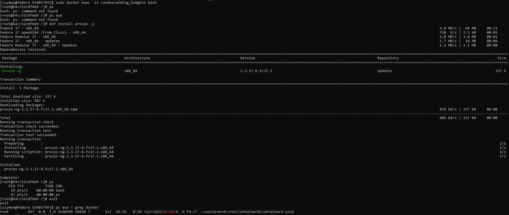
6. Wyświetlenie uruchomionych kontenerów oraz wyczyszczenie ich  
  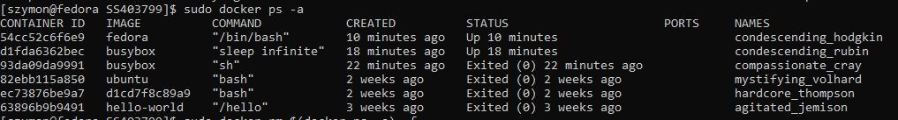
  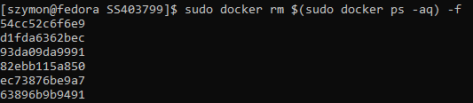
7. Wyczyszczenie obrazów  
  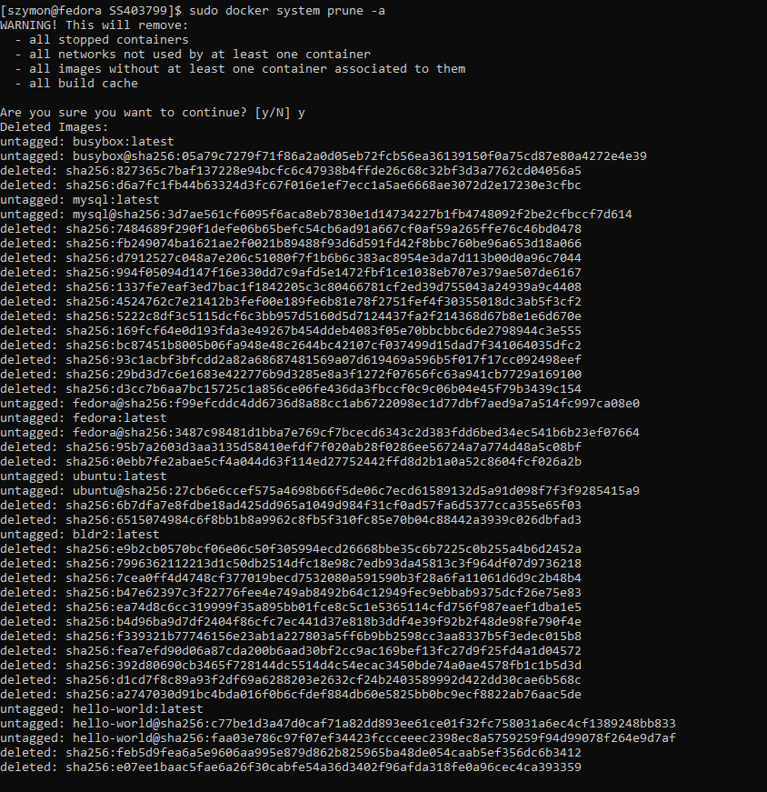

## Budowanie programu
1. Znalezenie projektu umożliwiającego łatwe wywołanie testów jednostkowych 
https://github.com/sunainapai/makesite  
2. Przeprowadzenie budowy oraz konfiguracji środowiska
  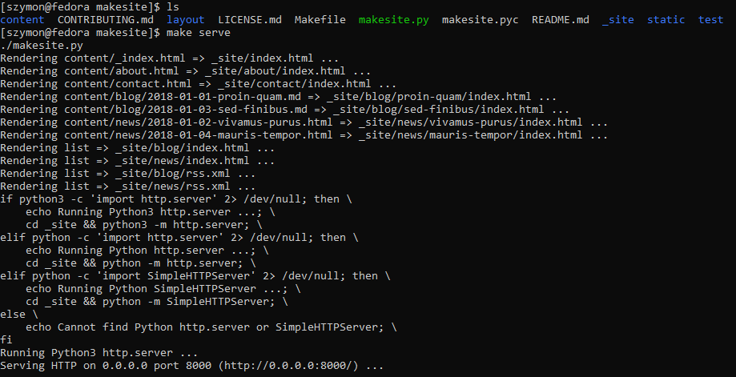
3. Urchomienie testów  
  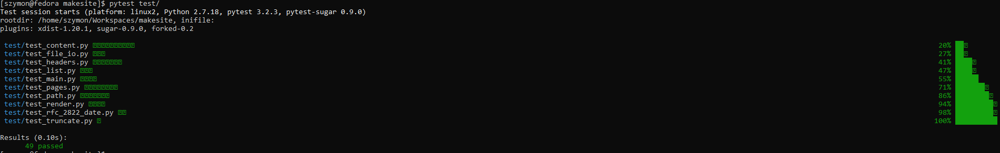
4. Ponownie powyższczego procesu w kontenerze  
Uruchomienie kontenera fedory  
  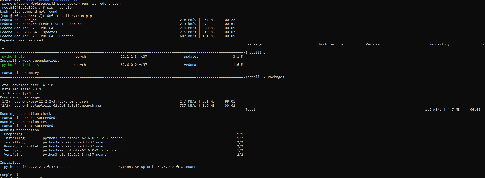
Zaopatrzenie w oprogramowania wstępne  
  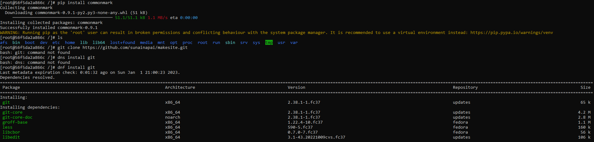
Sklonowanie aplikacji  
  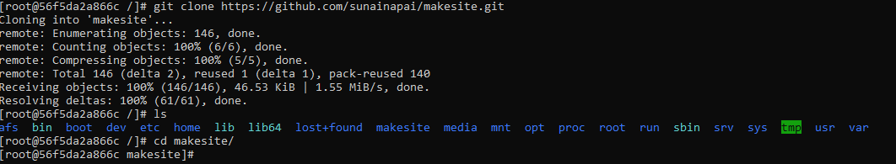
Konfiguracja środowsika i uruchomienie builda  
  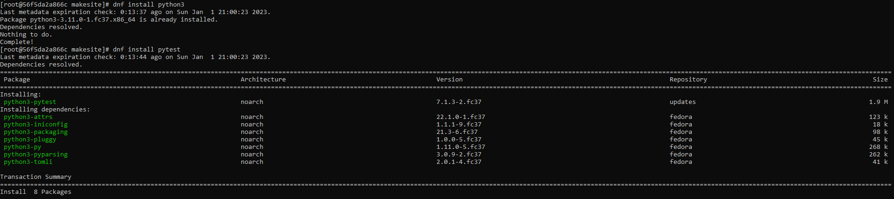  
  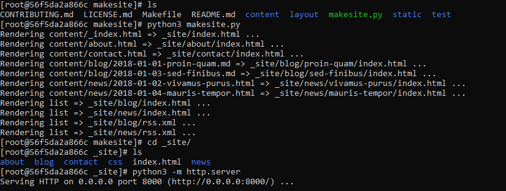
Uruchomienie testów  
  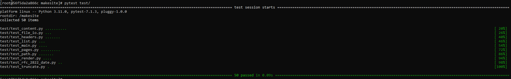
5. Stworzenie Dockerfila  
  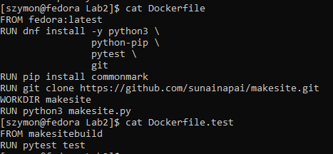

6. Prezentacja procesu budowania  
  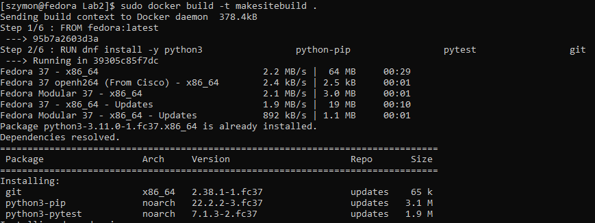
  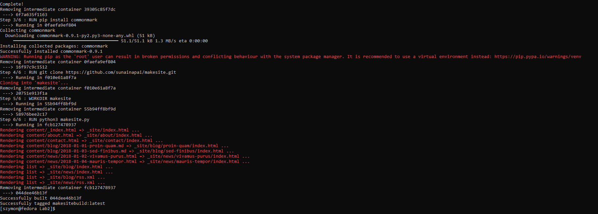

7. Stworzenie drugiego Dockerfila dla kontenera uruchamijącego testy

## Kompozycja
Zdefiniowanie kompozycji  
  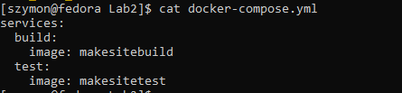  
Wdrożenie   
  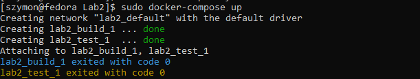

