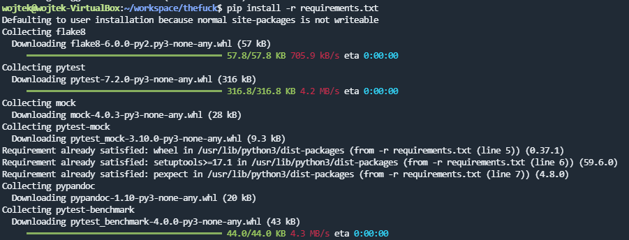
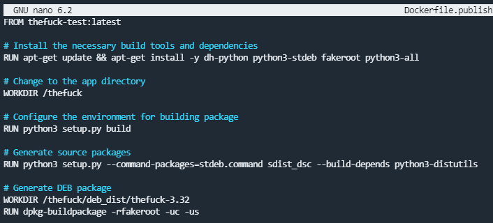
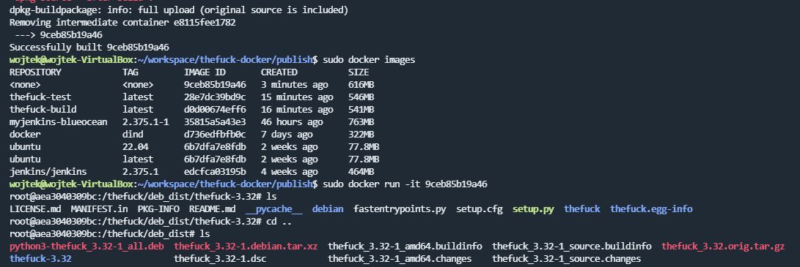

# Sprawozdanie 2 - Wprowadzenie do kontenerów
---

### Zestawienie środowiska
---
1. Zainstaluj Docker w systemie linuksowym
Instalację Dockera najlepiej przeprowadzić zgodnie z odpowiednią instrukcją, dostępną w internecie, np. https://devopscube.com/how-to-install-and-configure-docker/
Instalacja za pomocą zwykłego **sudo apt install docker** może sprawić że część funkcjonalności Dockera nie będzie zainstalowana lub nie będzie działać poprawnie

2. Zarejestruj się w Docker Hub i zapoznaj z sugerowanymi obrazami

3. Pobierz hello-world, busybox, ubuntu lub fedorę, mysql
Aby pobrać dowolny image, wystarczy znaleźć go na docker hubie i użyć komendy **docker pull nazwa_obrazu**

4. Uruchom busybox
Kontenery uruchamiamy poleceniem "docker run nazwa_obrazu". Dodatkowo możemy użyć parametru **--name** aby przypisać konkretną nazwę do tworzonego kontenera

- Pokaż efekt uruchomienia kontenera
Aby szybko wykazać że kontener działa warto skorzystać z parametru **-it** aby po uruchomieniu podłączyć się do niego przez **sh** i następnie użyć jakiejś podstawowej komendy typu **ls** lub **ps**

- Podłącz się do kontenera interaktywnie i wywołaj numer wersji
Numer wersji Linuxa możemy sprawdzić komendą **uname -a**

W osobnym terminalu możemy zobaczyć działające kontenery poleceniem **docker  ps**

5. Uruchom "system w kontenerze"
Uruchomienie systemu w kontenerze wygląda identycznie jak uruchomienie każdego kontenera, jedynie musimy wybrać odpowiedni obraz

- Zaprezentuj PID1 w kontenerze i procesy dockera na hoście

- Zaktualizuj pakiety
Aktualizację pakietów wykonuje się tak samo jak na hoście - **apt update**

- Wyjdź
Z terminala w kontenerze wychodzi się tak jak z każdego terminala poleceniem **exit**

6. Pokaż uruchomione ( != "działające" ) kontenery, wyczyść je.
Aby zobaczyć wszystkie kontenery, nie tylko te aktualnie działające używamy komendy **docker ps -a**

Kontenery usuwamy komendą **docker rm nazwa_kontenera1 nazwa_kontenera2 ...**

7. Wyczyść obrazy
Za pomocą komendy **docker system prune -a** możemy usunąć wszystkie nieużywane obrazy

### Budowanie programu
---
1. Znajdź projekt umożliwiający łatwe wywołanie testów jednostkowych
Projektem, który wybrałem jest **thefuck**, jest to program napisany w języku Python i jego zadaniem jest poprawienie ostatniej, błędnie wpisanej komendy w terminalu po wpisaniu komendy **fuck**
Repozytorium pobieramy za pomocą **ssh** komendą: **git clone link_do_repo**

2. Przeprowadź budowę/konfigurację środowiska
Na początek trzeba zainstalować samego Pythona w wersji 3.X oraz "pip'a", czyli managera paczek

Następnie za pomocą **pip'a** instalujemy wymagane biblioteki na podstawie pliku "requirements.txt". Wystarczy nazwę pliku z bibliotekami podać jako parametr komendy **pip install -r nazwa_pliku**

Następnie uruchamimy skrypt pythonowy **setup.py**, który skonfiguruje środowisko developerskie dla tego projektu

3. Uruchom testy
Po pomyślnej konfiguracji środowiska oraz instalacji zależności, możemy uruchomić unit testy za pomocą komendy **python3 -m pytest**

4. Ponów ten proces w kontenerze
- Wybierz i uruchom platformę
Aby uruchomić powyższe procesy w kontenerze należy na wstępie wybrać na docker hubie odpowiednią platformę dla naszego projektu, w moim przypadku będzie to dobrze mi znane **Ubuntu** (niestety po fakcie zdałem sobie sprawę że jest platforma o nazwie Python w docker hubie :(), a następnie pobrać obraz komendą **docker pull nazwa_obrazu**

Po pobraniu obrazu uruchamiamy go, nadajemy nazwę i łączymy się z nim w trybie interaktywnym, aby wykonać dalsze kroki

- Zaopatrz ją w odpowiednie oprogramowanie wstępne
Tutaj w zasadzie wykonujemy te same kroki co w punkcie drugim, lecz tym razem wykonujemy je wewnątrz kontenera

- Sklonuj aplikację
Tym razem aplikację klonujemy za pomocą **HTTPS**, aby nie generować klucza dla tego tymczasowego kontenera

- Skonfiguruj środowisko i uruchom build
Środowisko konfigurujemy identycznie jak w punkcie drugim

- Uruchom testy
Testy uruchamimy tak samo jak w punkcie 3

5. Stwórz Dockerfile, który ma to osiągnąć
- Na bazie platformowego obrazu...
Obraz wybieramy za pomocą komendy **FROM "obraz":"tag"**
- ...doinstaluj wymagania wstępne...
Aby zaintalować wymagania posłużymy się komendą **apt-get**, lecz aby wywoływać komendy w **Dockerfile'u** musimy użyć instrukcji **RUN**
- ...sklonuj repozytorium...
Tutaj też posługujemy się instrukcją **RUN** aby wykonać komendę **git clone**
Sklonowane repozytorium, będzie się znajdowało wewnątrz folderu **/thefuck**, dlatego po sklonowaniu zmieniamy nasz folder roboczy w kontenerze instrukcją **WORKDIR "folder"**
- ...zbuduj kod
Następnie ponownie wykorzystujemy **RUN** aby zainstalować zależności i skonfigurować środowisko

6. Zaprezentuj Dockerfile i jego zbudowanie
Dockerfile budujemy komendą **docker build "folder"**, gdzie jako "folder" rozumiemy kontekst builda. Proces budowania może się dzięki temu odnieść do każdego pliku zawartego w kontekście i przykładowo skopiować jakiś plik z kontekstu do kontenera instrukcją **COPY**
Outputem komendy **docker build** są wszystkie kroki zawarte w **dockerfile'u**, wraz z outputem wszystkich komend zawartych w tych krokach

Na koniec builda dostajemy informację o rezultacie, czyli czy build się udał, oraz o nazwie nowo utworzonego kontenera

7. Na bazie obrazu utworzonego poprzednim dockerfilem stwórz kolejny, który będzie uruchamiał testy
Na początek modyfikujemy strukturę folderów, tak aby build i test miały swój osobny folder, gdzie umieścimy ich **dockerfile'e**

- Kontener pierwszy ma przeprowadzać wszystkie kroki aż do builda
**Dockerfile** dla builda pozostawiamy bez zmian

- Kontener drugi ma bazować na pierwszym i wykonywać testy
W **Dockerfile'u** wykonującym testy musimy zrobić jedynie 2 rzeczy:
    1. W instrukcji **FROM** bazujemy na obrazie utworonym przez kontener pierwszy, ponieważ w nim znajduje się sklonowane repo oraz potrzebne oprogramowanie
    2. W drugim kroku po prostu uruchamiamy testy instrukcją **RUN python3 -m pytest**

Po wywołaniu komendy **docker build** na **Dockerfile'u** testującym widzimy rezultat uruchomionych unit testów wewnątrz tego kontenera

Po zbudowaniu obu **Dockerfile'ów** mamy następujące obrazy:

### Runda bonusowa: kompozycja
---

Aby była możliwość uruchamiania kompozycji należy na wstępie doinstalować plugin który to umożliwia
Po instalacji wywołujemy komendę **docker compose version** aby upewnić się że plugin działa

1. Zdefiniuj kompozycję, która stworzy dwie usługi
Aby utworzyć kompozycję, tworzymy plik o ściśle określonej nazwie - **docker-compose.yml** (są też inne dostępne nazwy dzięki którym nie musimy nazwy tego pliku podawać w komendzie)

- Pierwszą na bazie dockerfile'a budującego
Usługi tworzymy poprzez wpisanie dowolnej nazwy w pierwszym zagnieżdzeniu po słowie **services**
Pierwszym serwisem jest **appbuild** i jest on zbudowany na podstawie **dockerfile'a** w katalogu ./build

- Drugą na bazie pierwszej
Druga usługa o nazwie **apptest** jest tworzona na podstawie obrazu **thefuck-docker-appbuild**, jest to obraz utworzony przez pierwszy serwis
Serwisy są uruchamiane równolegle, dlatego musimy użyć atrybutu **depends_on** aby serwis **apptest** został uruchomiony po zakończeniu **appbuild**

2. Wdróż :)
Jako wdrożenie utworzymy pakiet DEB, umożliwiający instalację aplikacji dla dystrybucji bazujących na debianie.
W tym celu tworzymy osobny **Dockerfile** wyglądający w ten sposób:

Bazujemy tutaj na obrazie utworzonym z testów, ponieważ nie chcemy mieć możliwości zbudowania tego kontenera, gdy nie będzie możliwości utworzenia obrazu kontenera testowego

Jak widać pakiet DEB został poprawnie utworzony
Następnym krokiem byłoby przekopiowanie pakietu DEB do hosta i uruchomienie w osobnym kontenerze, tak aby przetestwować instalację

### Przygotowanie do wdrożenia (deploy): dyskusje
---
- czy program nadaje się do wdrażania i publikowania jako kontener, czy taki sposób interakcji nadaje się tylko do builda

Program nadaje się do publikowania jako kontener, lecz nie miało by to za dużego sensu, ponieważ jest to zwykła aplikacja, którą uruchamiamy na hoście w przypadku źle wpisanej komendy w terminalu, konteneryzacja tej aplikacji nie miałaby żadnej wartości dodanej, ponieważ z tej funkcjonalności potencjalny użytkownik zapewne będzie chciał korzystać na swojej głównej maszynie, a nie w kontenerze

- opisz w jaki sposób miałoby zachodzić przygotowanie finalnego artefaktu
    - jeżeli program miałby być publikowany jako kontener - czy trzeba go oczyszczać z pozostałości po buildzie?
    Nie trzeba ponieważ tak naprawdę w przypadku tej aplikacji nie mamy do czynienia z prawdziwym buildem, po prostu pobieramy zależności i konfigurujemy środowisko

    - A może dedykowany deploy-and-publish byłby oddzielną ścieżką (inne Dockerfiles)?
    Deploy-and-publish w tym przypadku to byłoby utworzenie pakietu DEB za pomocą osobnego **Dockerfile** lub osobnego serwisu w kompozycji, który został by wykonany po pozytywnym rezultacie unit testów

    - Czy zbudowany program należałoby dystrybuować jako pakiet, np. JAR, DEB, RPM, EGG?
    Biorąc pod uwagę do czego służy wybrany przeze mnie program, najlepiej dystrybuować go jako pakiet pod dystrybucje Linuksowe, więc DEB i RPM wchodzą tutaj w gre

    - W jaki sposób zapewnić taki format? Dodatkowy krok (trzeci kontener)? Jakiś przykład?
    Taki format (np. DEB) można zapewnić poprzez zbudowanie pakietu zgodnie z tą instrukcją: https://www.internalpointers.com/post/build-binary-deb-package-practical-guide. Budowanie pakietu DEB najlepiej wykonać w osobnym kontenerze po wykonaniu builda i testów, ponieważ na pakiecie DEB nie wykonamy już unit testów.
    Osobny kontener najpierw zweryfikowałby czy unit testy przeszły, następnie bazując na obrazie z **build'a**:
    1. Doinstalował potrzebne programy do utworzenia pakietu DEB
    2. Utworzył docelową strukturę pakietu oraz przekopiował potrzebne pliki programu w odpowiednie miejsca
    3. Utworzył i wypełnił plik "control"
    4. Zbudował pakiet DEB
    5. Przetestował pakiet DEB (instalacje, usunięcie, czy program działa po zainstalowaniu itd.)
