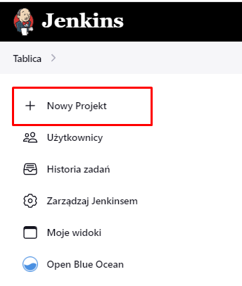
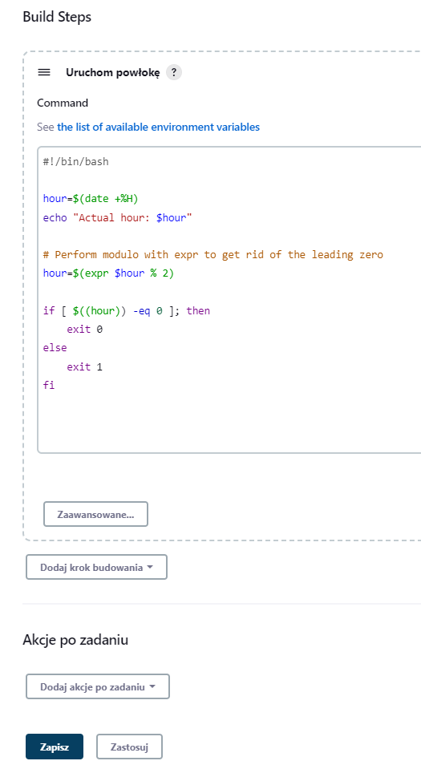
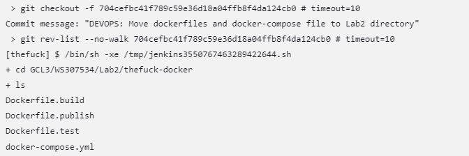

# Sprawozdanie 3 - Pipeline, Jenkins, izolacja etapów
---

### Przygotowanie
- Upewnij się, że na pewno działają kontenery budujące i testujące, stworzone na poprzednich zajęciach
- Zapoznaj się z instrukcją instalacji Jenkinsa: https://www.jenkins.io/doc/book/installing/docker/
Instalacja jenkinsa w kontenerze jest świetnie opisana pod powyższym linkiem, wystarczy wykonywać krok po kroku i instalacja się powiedzie

- Uruchom obraz Dockera który eksponuje środowisko zagnieżdżone

- Przygotuj obraz blueocean na podstawie obrazu Jenkinsa (czym się różnią?)
Blueocean to nowoczesny interfejs graficzny do Jenkinsa, ułatwiający korzystanie z niego. Blueocean zawiera funkcje takie jak graficzny edytor pipelinów i aktualizacje w czasie rzeczywistym
Natomiast Jenkins to bardzo popularny tool do zarządzania procesami CI/CD

- Uruchom Blueocean

- Zaloguj się i skonfiguruj Jenkins
Po udanej instalacji pokaże nam się taka strona:

W przypadku braku interfejsu graficznego w systemie, należało by w tym momencie dokonać forwardowania portu z wirtualnej maszyny do naszego systemu (w moim przypadku Windows), aby wyświetlić tę stronę

Przekierowania portu można dokonać w ustawieniach sieci maszyny wirtualnej w następujący sposób:

Po tym zabiegu Jenkins będzie dostępny na naszym głównym systemie w przeglądarce pod adresem **localhost:9000**

Następnie sprawdzamy czy oba kontenery (Jenkins i DIND) działają, co oznacza prawidłowe wykonanie się poprzednich poleceń

Za pomocą komendy **docker exec** wypisujemy hasło do Jenkinsa z pod podanej ścieżki i wpisujemy je

Następnie ukaże się taka strona - klikamy na **Install suggested plugins**

Tworzymy konto

Po utworzeniu konta zobaczymy ekran główny Jenkinsa

A tutaj widzimy również główny ekran Jenkinsa, jednakże uruchomiony na Windowsie po przekierowaniu portów

- Zadbaj o archiwizację i zabezpieczenie logów
O archiwizację i zabezpieczenie logów dba wolumen **/var/jenkins_home**, uruchamiany wraz z kontenerem Jenkinsa i DIND

### Uruchomienie
- Konfiguracja wstępna i pierwsze uruchomienie
    - Utwórz projekt, który wyświetla uname
Poniżej pokazano dokładne kroki w celu utworzenia projektu **uname**

    - Utwórz projekt, który zwraca błąd, gdy... godzina jest nieparzysta
Projekt tworzymy tak samo jak projekt **uname**, zmieniamy tylko komendy

Jak widać projekt działa właściwie i informuje nas o rezultacie

---

- Utwórz "prawdziwy" projekt, który:
    - klonuje nasze repozytorium
    - przechodzi na osobistą gałąź
    - buduje obrazy z dockerfiles i/lub komponuje via docker-compose
Na początek zaznaczamy że projekt bazuje na konkretnym repozytorium i branchu

Następnie dokonano drobnej restrukturyzacji projektu - Dockerfile zostały wyciągnięte z folderów, których nazwa określała etap i zostały zmienione ich nazwy

Po restrukturyzacji dodajemy komendy do pola **Build Steps**
Wszystkim obrazom przypisano nazwy, tak aby na koniec po wywołaniu komendy **docker images** móc zweryfikować w logu czy wszystkie obrazy są obecne

Podczas pierwszego uruchomienia projektu napotkano następujący problem:

Jak się okazało później, kontener docker:dind nie był uruchomiony po restarcie wirtualnej maszyny, co uniemożliwiło poprawne wykonywanie komend Dockera, wystarczyło po prostu na nowo uruchomić kontener zgodnie z instrukcją konfiguracji Jenkinsa w kontenerze (dokładniej punkt 3)

Na poniższych screenach możemy zobaczyć poszczególne etapy projektu

Niestety jak widać screen **Build Stepów** wykonałem później niż screen ukończonego logu, przez co obraz **thefuck-publish** nazywa się tutaj **none**

W skrypcie brakuje nam jeszcze etapu eksportowania artefaktów, można tego dokonać w następujący sposób:
1. Uruchamiamy kontener thefuck-publish i zapisujemy jego wynik (container_id) do zmiennej
2. Na podstawie id kontenera wykonujemy komendę **docker cp**, która przekopiuje wybrane przez nas pliki pod wskazany folder (w tym przypadku kopiujemy całą zawartość deb_dist z kontenera do folderu artifacts na hoście)
3. Usuwamy kontener, ponieważ nie jest już nam potrzebny
4. W zakładce **Post-build Actions** wybieramy **Archive the artifacts** i podajemy ścieżkę do folderu z artefaktami

Tak wygląda workspace projektu po ponownym uruchomieniu

### Sprawozdanie (wstęp)
- Opracuj dokument z diagramami UML, opisującymi proces CI. Opisz:
    - Wymagania wstępne środowiska
    - Diagram aktywności, pokazujący kolejne etapy (collect, build, -test, report)

    **Collect**
    W tym etapie klonujemy nasze repozytorium (MDO2023) oraz robimy checkout na naszą gałąź. Ten krok w przypadku wykorzystania **Jenkinsfile** wykona się automatycznie tzn. nie będzie on zdefiniowany jako **stage** w skrypcie pipeline'a

    **Build**
    W tym etapie uruchamiamy Dockerfile.build, który bazując na obrazie Ubuntu:22.04 (tutaj lepiej sprawdziłby się obraz Python, który ma już zainstalowane odpowiednie programy, lecz stwierdziłem że szybciej będzie wykorzystać to co już mam i wiem że działa) pobierze odpowiednie programy m.in. Python3, sklonuje projekt **thefuck**, pobierze zależności oraz go zbuduje

    **Test**
    W tym etapie bazujemy na obrazie powstałym w etapie **Build** i uruchamiamy unit testy

    **Publish**
    W tym etapie bazujemy na obrazie po etapie **Test**, pobieramy odpowiednie paczki, umożliwiające zbudowanie pakietu DEB, następnie budujemy projekt z odpowiednią flagą, aby otrzymać potrzebne nam pliki do stworzenia pakietu DEB. Następnie generujemy paczki źródłowe oraz plik **control** zawierający ważne informacje odnośnie jeszcze nie zbudowanej paczki DEB (np. dependencje), a na koniec budujemy pakiet DEB

    - Diagram wdrożeniowy, opisujący relacje między składnikami, -zasobami i artefaktami
    Ten diagram przedstawia dwa urządzenia
    1. Naszą maszynę wirtualną, na której jest Jenkins i na której zostanie wytworzony artefakt w postaci pakietu DEB, który można następnie zainstalować na innej maszynie
    2. Maszynę klienta, na której może on zainstalować zbudowaną przez nas paczkę (DEB)

### Pipeline
- Definiuj pipeline korzystający z kontenerów celem realizacji kroków build -> test
- Może, ale nie musi, budować się na dedykowanym DIND, ale może się to dziać od razu na kontenerze CI. Należy udokumentować funkcjonalną różnicę między niniejszymi podejściami
- Docelowo, Jenkinsfile definiujący pipeline powinien być umieszczony w repozytorium. Optymalnie: w sforkowanym repozytorium wybranego oprogramowania

Po utworzeniu nowego pipelinu w Jenkinsie wybrałem opcję **Pipeline script from SCM**, która oznacza uruchomienie **Jenkinsfile** z odpowiedniego rezpozytorium i wskazanej ścieżki
Ważne aby podać właściwy **Script path**

Tak wygląda Jenkinsfile:

Niestety jak się okazało wprowadziłem 2 błędy, tak wygląda log:

W celu rozwiązania problemu, utworzyłem nowy pipeline testowy, tym razem nie korzystający z Jenkinfile'a, aby nie commitować i pushować każdej drobnej poprawki
Zamiast tego dodałem etap **Clone**, który klonuje repozytorium i robi checkout na mój branch

Po kilku nieudanych poprawkach udało się naprawić skrypt

Dowodem poprawnego działania jest obecność artefaktów

Tak wygląda poprawiony **Jenkinsfile**

Błędy:
1. Przy wykorzystaniu opcji **Pipeline script from SCM** naszym folderem początkowym jest folder w którym znajduje się **Jenkinsfile** a więc GCL3/WS307534/Lab3/jenkins, natomiast interesujące nas Dockerfile są w GCL3/WS307534/Lab2/thefuck-docker, więc aby rozwiązać problem podajemy dokładną ścieżkę do każdego Dockerfile'a
2. W etapie **Publish** tworzymy zmienną przechowującą ID kontenera bazującego na obrazie **thefuck-publish**, a więc kontenera z którego pobieramy artefakty
Jak się okazuje, wywoływanie kolejnych komend z przedrostkiem **sh** kasuje kontekst, przez co zmienna **CID** jest pusta w kolejnych komendach
Aby temu zapobiec wystarczy użyć pojedynczego przedrostka **sh** i użyć trzech apostrofów, aby wskazać skryptowi, że ma wykonać kilka komend pod rząd, co sprawia że kontekst zapisuje zmienną, przez co kolejne komendy są w stanie to wykorzystać

Jak widać drugie uruchomienie pipeline'a zadziałało, a w workspace pojawiły się artefakty

