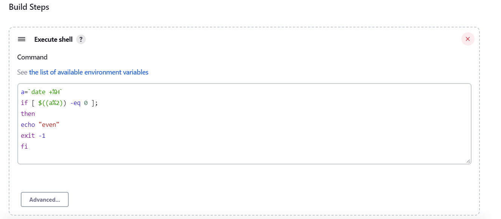
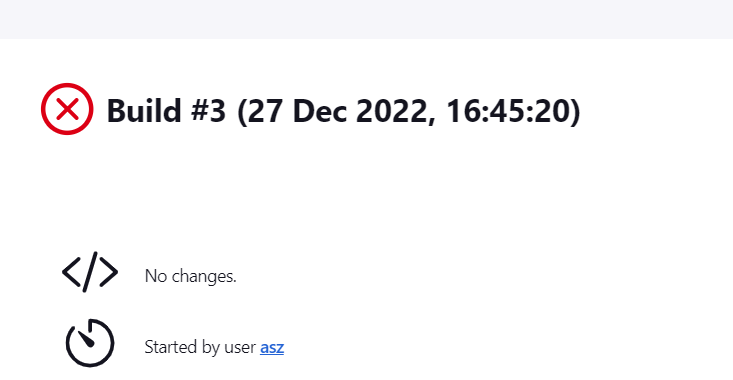
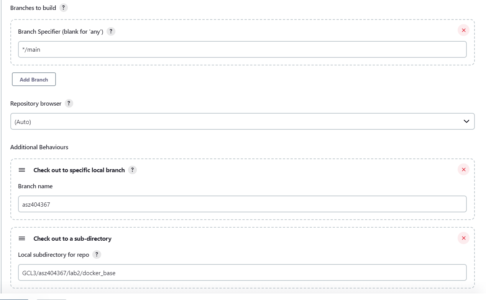

|    Imię Nazwisko   |                Temat               |
|:------------------:|:----------------------------------:|
| Andrzej Szafarczyk | Pipeline, Jenkins, izolacja etapów |

Aby móć wykonywać komendy dockerowe w nodach jeninsa musimy uruchomić obraz DockerInDocker(DIND)
Uruchuienie kontenera z dockerem za pomocą polecenia z dokumentacji

* Uruchamianie Dockera w Dockerze wymaga obecnie uprzywilejowanego dostępu do prawidłowego       działania. To wymaganie może zostać złagodzone w nowszych wersjach jądra Linuksa.
*  Network Alias "docker" pozwoli no osiągniećie kontenera z innnego kontenera w sieci jenkins posługując sie nazwą docker

Uruchomienie obrazu jenkinsa

Następnie należy znaleźć w logach kontenera hasło i użyc go doe pierwszego logowanie (docker logs jenkins-blueocean).

Gdyby nasz kontener został zniszczony, logi nie ulegną znisczeniu, gdyż używamy volume jenkins-data zamontowany w ścieżce /var/jenkins_home kontenera

Aby łatwiej odtworzyć utworzone kontenery, stworzono docker-compose file

### Blueocean a Jekins
Blue Ocean to nowe środowisko użytkownika dla Jenkins oparte na personalizowanym, nowoczesnym projekcie, który pozwala użytkownikom graficznie tworzyć, wizualizować i diagnozować potoki ciągłego dostarczania (CD)

# Konfiguracja wstępna i pierwsze uruchomienie
    
## 1. **Projekt, który wyświetla uname**

Utworzono freestyle project i w build steps dodano skyrpt, dzięki któremu wyświetlone zostanie uname
  

Następnie uruchomiono pipeline, co dało następujący efekt

## 2. **Projekt, który zwraca błąd, gdy... godzina jest nieparzysta**

Utworzono freestyle project i w build steps dodano skyrpt, który zostanie przerwany jeśli aktulana godzinajest parzysta

  

Przykładowe działanie

  

# **"Prawdziwy" projekt:**
    Projekt ma sklonować repozytorium, przejść na osobistą gałąź i zbudować jeden z Dockerfilow

Konfiguracja projektu:
W source code management podaje repozytorium, które jenknins ma dla mnie skonfigurować oraz mój branch

  
<!--    -->

<!-- Dalej podaje,aby po zrobieniu pulla zmienił branch na "asz404367" i przeszedł do odpowiedniej ścieżki

   -->

Dalej podaje, aby odpowiewdnie zmienił ścieżkę oraz zbudował znajdujący się tam Dockerfile

  
<!--    -->

### **Problemy, które pojawiły się podczas próby użycia docker deamona w pipeline:**

1. Docker not found:

      

    Dokonano zmiany w docker-compose.yml projekt działa, tak aby kontener się uruchomił w trybie privileged oraz stworzono dockerfile w którym pobierany jest docker oraz instalowany dodatkowy plugin "docker-workflow"

3. Invalid bind address
    
      

    Po wykomentowaniu zmiennej środowiskowej *DOCKER_TLS_CERTDIR* w koneterze z DIND udało się rozwiązać problem

4. Cannot connect to the Docker daemon at tcp://dind:2367. Is the docker daemon running?

      
    
    U mnie nie działała konfiguracja op[isana w dokumentacji jenkins. Po wykometowaniu zmiennych środowiskowych *DOCKER_CERT_PATH*, *DOCKER_TLS_VERIFY* z serwisu Jenkinsa oraz zmiany portu dind na 3675 mogłem się połączyć z konetenerem, w którym znajduje się docker. W serwisie dind musiałem jeszcze zmienic zmienną środowiskową *DOCKER_TLS_CERTDIR* na pusty string 

      

### **Wynik projektu, który buduje obraz dockerowy**

  

## **Spring boot pipeline**

Konfiguracja pipeline, wskazująca repozytorium, branch oraz plik, w którym opisano pipeline-stages

  

Konfiguracja ta wskazuje poprostu repozytorium,branch oraz ścieżkę do Jenkinsfile, w którym opisano kroki pipeline. 

Pipeline napisano metodą deklaratywną, znajduje się ona pod ścieżką GCL3/asz404367/lab3/Jenkinsfile

